# DESIGN_钉钉直播回放下载软件开发指南

## 整体架构设计

### 系统架构图

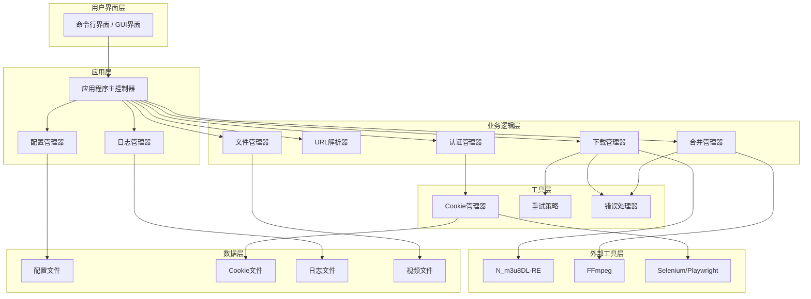

### 分层设计

#### 1. 用户界面层
**职责**: 提供用户交互界面，接收用户输入，展示执行结果

**组件**:
- 命令行界面（CLI）
- 图形用户界面（GUI，可选）

**接口**:
```python
class UserInterface:
    def get_user_input(self) -> Dict[str, Any]:
        """获取用户输入"""

    def display_progress(self, progress: float, message: str):
        """显示进度"""

    def display_result(self, success: bool, message: str):
        """显示结果"""

    def display_error(self, error: Exception):
        """显示错误"""
```

#### 2. 应用层
**职责**: 协调各模块工作，管理应用生命周期

**组件**:
- 应用程序主控制器（Application）
- 配置管理器（ConfigManager）
- 日志管理器（LoggerManager）

**接口**:
```python
class Application:
    def __init__(self, config: ConfigManager):
        """初始化应用程序"""

    def run(self, url: str, save_path: str) -> bool:
        """运行下载任务"""

    def shutdown(self):
        """关闭应用程序"""
```

#### 3. 业务逻辑层
**职责**: 实现核心业务逻辑，处理具体业务需求

**组件**:
- 认证管理器（AuthManager）
- URL解析器（DingTalkUrlParser）
- 下载管理器（M3u8Downloader）
- 合并管理器（VideoMerger）
- 文件管理器（FileManager）

**接口**:
```python
class AuthManager:
    def get_auth_headers(self) -> Dict[str, str]:
        """获取认证请求头"""

    def check_and_refresh(self) -> bool:
        """检查并刷新认证"""

class DingTalkUrlParser:
    def parse_url(self, url: str) -> Optional[Dict]:
        """解析钉钉URL"""

    def get_m3u8_url(self, uuid: str, quality: str) -> str:
        """获取m3u8地址"""

class M3u8Downloader:
    def download(self, url: str, save_dir: str, save_name: str) -> bool:
        """下载m3u8视频"""

class VideoMerger:
    def merge(self, input_file: str, output_file: str) -> bool:
        """合并视频文件"""

class FileManager:
    def generate_filename(self, title: str, date: datetime, duration: int) -> str:
        """生成文件名"""

    def generate_save_path(self, user: str, course: str, date: datetime) -> str:
        """生成保存路径"""
```

#### 4. 工具层
**职责**: 提供通用工具和辅助功能

**组件**:
- Cookie管理器（CookieManager）
- 重试策略（RetryStrategy）
- 错误处理器（ErrorHandler）

**接口**:
```python
class CookieManager:
    def load_cookies(self) -> bool:
        """加载Cookie"""

    def save_cookies(self) -> bool:
        """保存Cookie"""

    def get_cookie_string(self) -> str:
        """获取Cookie字符串"""

class RetryStrategy:
    def retry(self, func: Callable) -> Callable:
        """重试装饰器"""

class ErrorHandler:
    def handle_error(self, error: Exception) -> None:
        """处理错误"""

    def get_solution(self, error_code: str) -> str:
        """获取错误解决方案"""
```

#### 5. 外部工具层
**职责**: 集成外部工具，提供工具调用接口

**组件**:
- N_m3u8DL-RE调用器
- FFmpeg调用器
- Selenium/Playwright调用器

**接口**:
```python
class N_m3u8DLCaller:
    def execute(self, args: List[str]) -> bool:
        """执行N_m3u8DL-RE命令"""

class FFmpegCaller:
    def execute(self, args: List[str]) -> bool:
        """执行FFmpeg命令"""

class BrowserCaller:
    def get_cookies(self, url: str) -> Dict[str, str]:
        """从浏览器获取Cookie"""
```

#### 6. 数据层
**职责**: 管理数据存储和访问

**组件**:
- 配置文件（YAML）
- Cookie文件（JSON）
- 日志文件（文本）
- 视频文件（MP4/MKV）

## 核心组件设计

### 1. 认证管理器（AuthManager）

**职责**: 管理钉钉认证信息，提供认证请求头

**类图**:
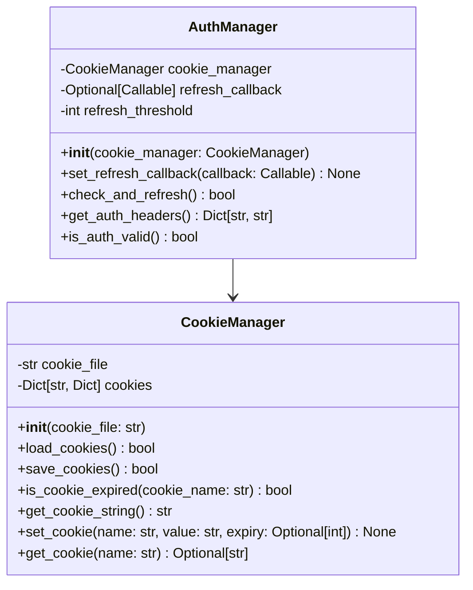

**接口契约**:
```python
class AuthManager:
    def __init__(self, cookie_manager: CookieManager):
        """初始化认证管理器

        Args:
            cookie_manager: Cookie管理器实例
        """

    def set_refresh_callback(self, callback: Callable) -> None:
        """设置Cookie刷新回调函数

        Args:
            callback: 刷新回调函数，返回bool表示是否成功
        """

    def check_and_refresh(self) -> bool:
        """检查Cookie是否过期，过期则刷新

        Returns:
            bool: Cookie有效或刷新成功返回True，否则返回False
        """

    def get_auth_headers(self) -> Dict[str, str]:
        """获取认证请求头

        Returns:
            Dict[str, str]: 包含Cookie、User-Agent等请求头的字典
        """

    def is_auth_valid(self) -> bool:
        """检查认证是否有效

        Returns:
            bool: 认证有效返回True，否则返回False
        """
```

### 2. URL解析器（DingTalkUrlParser）

**职责**: 解析钉钉直播回放URL，提取关键信息

**类图**:
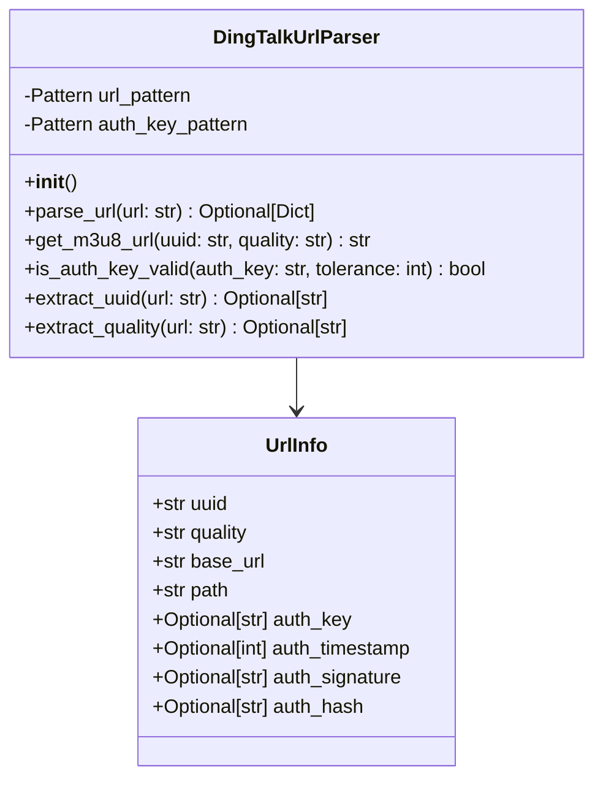

**接口契约**:
```python
class DingTalkUrlParser:
    def __init__(self):
        """初始化URL解析器"""

    def parse_url(self, url: str) -> Optional[Dict]:
        """解析钉钉直播回放URL

        Args:
            url: 钉钉直播回放URL

        Returns:
            Optional[Dict]: 解析结果字典，包含uuid、quality、auth_key等信息
                          解析失败返回None
        """

    def get_m3u8_url(self, uuid: str, quality: str = 'normal') -> str:
        """生成m3u8地址

        Args:
            uuid: 直播UUID
            quality: 视频质量（normal、hd、fhd等）

        Returns:
            str: m3u8地址
        """

    def is_auth_key_valid(self, auth_key: str, tolerance: int = 300) -> bool:
        """检查auth_key是否有效

        Args:
            auth_key: 认证密钥
            tolerance: 时间容差（秒），默认300秒

        Returns:
            bool: auth_key有效返回True，否则返回False
        """
```

### 3. 下载管理器（M3u8Downloader）

**职责**: 管理m3u8视频下载流程

**类图**:
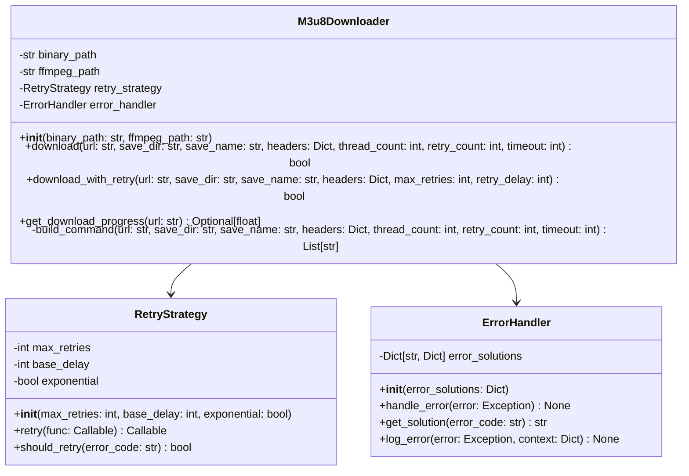

**接口契约**:
```python
class M3u8Downloader:
    def __init__(self, binary_path: str, ffmpeg_path: str):
        """初始化下载管理器

        Args:
            binary_path: N_m3u8DL-RE可执行文件路径
            ffmpeg_path: FFmpeg可执行文件路径
        """

    def download(
        self,
        url: str,
        save_dir: str,
        save_name: str,
        headers: Optional[Dict[str, str]] = None,
        thread_count: int = 3,
        retry_count: int = 5,
        timeout: int = 100
    ) -> bool:
        """下载m3u8视频

        Args:
            url: m3u8地址
            save_dir: 保存目录
            save_name: 保存文件名
            headers: 请求头
            thread_count: 下载线程数
            retry_count: 重试次数
            timeout: 超时时间（秒）

        Returns:
            bool: 下载成功返回True，失败返回False
        """

    def download_with_retry(
        self,
        url: str,
        save_dir: str,
        save_name: str,
        headers: Optional[Dict[str, str]] = None,
        max_retries: int = 3,
        retry_delay: int = 5
    ) -> bool:
        """带重试的下载

        Args:
            url: m3u8地址
            save_dir: 保存目录
            save_name: 保存文件名
            headers: 请求头
            max_retries: 最大重试次数
            retry_delay: 重试延迟（秒）

        Returns:
            bool: 下载成功返回True，失败返回False
        """
```

### 4. 合并管理器（VideoMerger）

**职责**: 管理视频文件合并流程

**类图**:
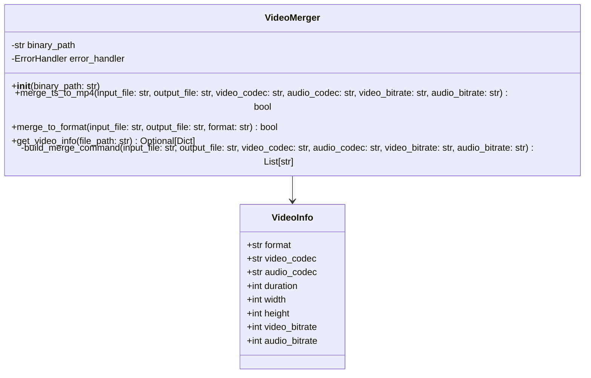

**接口契约**:
```python
class VideoMerger:
    def __init__(self, binary_path: str):
        """初始化合并管理器

        Args:
            binary_path: FFmpeg可执行文件路径
        """

    def merge_ts_to_mp4(
        self,
        input_file: str,
        output_file: str,
        video_codec: str = 'libx264',
        audio_codec: str = 'aac',
        video_bitrate: str = '2000k',
        audio_bitrate: str = '128k'
    ) -> bool:
        """合并TS文件为MP4

        Args:
            input_file: 输入文件路径
            output_file: 输出文件路径
            video_codec: 视频编码器
            audio_codec: 音频编码器
            video_bitrate: 视频码率
            audio_bitrate: 音频码率

        Returns:
            bool: 合并成功返回True，失败返回False
        """

    def get_video_info(self, file_path: str) -> Optional[Dict]:
        """获取视频信息

        Args:
            file_path: 视频文件路径

        Returns:
            Optional[Dict]: 视频信息字典，包含格式、编码器、分辨率等信息
                          获取失败返回None
        """
```

### 5. 文件管理器（FileManager）

**职责**: 管理文件命名、存储路径和文件操作

**类图**:
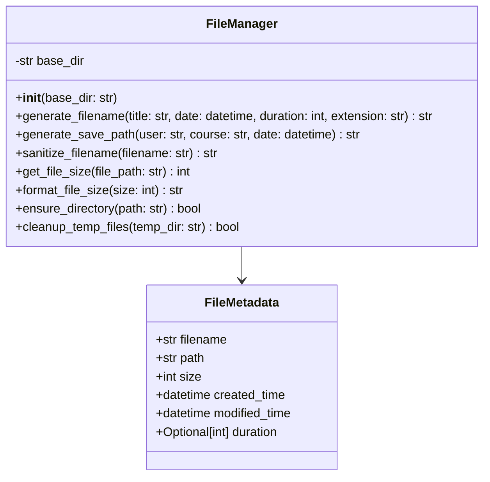

**接口契约**:
```python
class FileManager:
    def __init__(self, base_dir: str = "./downloads"):
        """初始化文件管理器

        Args:
            base_dir: 基础下载目录
        """

    def generate_filename(
        self,
        title: str,
        date: Optional[datetime] = None,
        duration: Optional[int] = None,
        extension: str = 'mp4'
    ) -> str:
        """生成文件名

        Args:
            title: 视频标题
            date: 视频日期
            duration: 视频时长（秒）
            extension: 文件扩展名

        Returns:
            str: 生成的文件名
        """

    def generate_save_path(
        self,
        user: str,
        course: str,
        date: Optional[datetime] = None
    ) -> str:
        """生成保存路径

        Args:
            user: 用户名
            course: 课程名
            date: 视频日期

        Returns:
            str: 保存路径
        """

    def sanitize_filename(self, filename: str) -> str:
        """清理文件名，移除非法字符

        Args:
            filename: 原始文件名

        Returns:
            str: 清理后的文件名
        """
```

## 模块依赖关系图

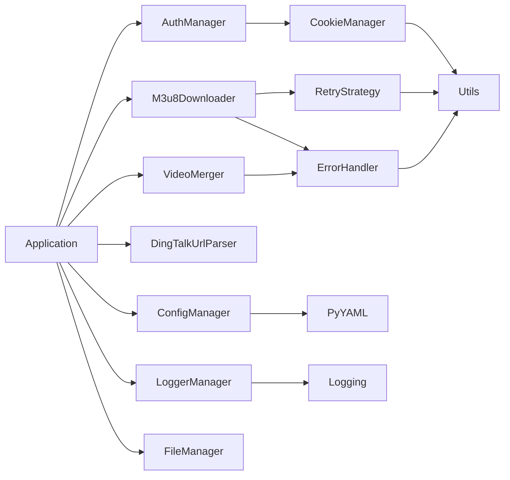

## 接口契约定义

### 1. 认证接口

```python
from abc import ABC, abstractmethod
from typing import Dict, Optional, Callable

class IAuthManager(ABC):
    """认证管理器接口"""

    @abstractmethod
    def get_auth_headers(self) -> Dict[str, str]:
        """获取认证请求头

        Returns:
            Dict[str, str]: 认证请求头
        """
        pass

    @abstractmethod
    def check_and_refresh(self) -> bool:
        """检查并刷新认证

        Returns:
            bool: 认证有效或刷新成功返回True
        """
        pass

    @abstractmethod
    def is_auth_valid(self) -> bool:
        """检查认证是否有效

        Returns:
            bool: 认证有效返回True
        """
        pass

    @abstractmethod
    def set_refresh_callback(self, callback: Callable) -> None:
        """设置刷新回调

        Args:
            callback: 刷新回调函数
        """
        pass
```

### 2. 解析接口

```python
from abc import ABC, abstractmethod
from typing import Dict, Optional

class IUrlParser(ABC):
    """URL解析器接口"""

    @abstractmethod
    def parse_url(self, url: str) -> Optional[Dict]:
        """解析URL

        Args:
            url: 待解析的URL

        Returns:
            Optional[Dict]: 解析结果
        """
        pass

    @abstractmethod
    def get_m3u8_url(self, uuid: str, quality: str) -> str:
        """获取m3u8地址

        Args:
            uuid: UUID
            quality: 视频质量

        Returns:
            str: m3u8地址
        """
        pass

    @abstractmethod
    def is_auth_key_valid(self, auth_key: str, tolerance: int) -> bool:
        """检查auth_key是否有效

        Args:
            auth_key: 认证密钥
            tolerance: 时间容差

        Returns:
            bool: 有效返回True
        """
        pass
```

### 3. 下载接口

```python
from abc import ABC, abstractmethod
from typing import Dict, Optional

class IDownloader(ABC):
    """下载器接口"""

    @abstractmethod
    def download(
        self,
        url: str,
        save_dir: str,
        save_name: str,
        headers: Optional[Dict[str, str]] = None,
        **kwargs
    ) -> bool:
        """下载文件

        Args:
            url: 下载地址
            save_dir: 保存目录
            save_name: 保存文件名
            headers: 请求头
            **kwargs: 其他参数

        Returns:
            bool: 下载成功返回True
        """
        pass

    @abstractmethod
    def get_download_progress(self, url: str) -> Optional[float]:
        """获取下载进度

        Args:
            url: 下载地址

        Returns:
            Optional[float]: 下载进度（0-1）
        """
        pass
```

### 4. 合并接口

```python
from abc import ABC, abstractmethod
from typing import Optional

class IMerger(ABC):
    """合并器接口"""

    @abstractmethod
    def merge(
        self,
        input_file: str,
        output_file: str,
        **kwargs
    ) -> bool:
        """合并文件

        Args:
            input_file: 输入文件
            output_file: 输出文件
            **kwargs: 其他参数

        Returns:
            bool: 合并成功返回True
        """
        pass

    @abstractmethod
    def get_video_info(self, file_path: str) -> Optional[Dict]:
        """获取视频信息

        Args:
            file_path: 视频文件路径

        Returns:
            Optional[Dict]: 视频信息
        """
        pass
```

### 5. 文件管理接口

```python
from abc import ABC, abstractmethod
from datetime import datetime
from typing import Optional

class IFileManager(ABC):
    """文件管理器接口"""

    @abstractmethod
    def generate_filename(
        self,
        title: str,
        date: Optional[datetime] = None,
        duration: Optional[int] = None,
        extension: str = 'mp4'
    ) -> str:
        """生成文件名

        Args:
            title: 标题
            date: 日期
            duration: 时长
            extension: 扩展名

        Returns:
            str: 文件名
        """
        pass

    @abstractmethod
    def generate_save_path(
        self,
        user: str,
        course: str,
        date: Optional[datetime] = None
    ) -> str:
        """生成保存路径

        Args:
            user: 用户名
            course: 课程名
            date: 日期

        Returns:
            str: 保存路径
        """
        pass

    @abstractmethod
    def sanitize_filename(self, filename: str) -> str:
        """清理文件名

        Args:
            filename: 文件名

        Returns:
            str: 清理后的文件名
        """
        pass
```

## 数据流向图

### 下载流程数据流

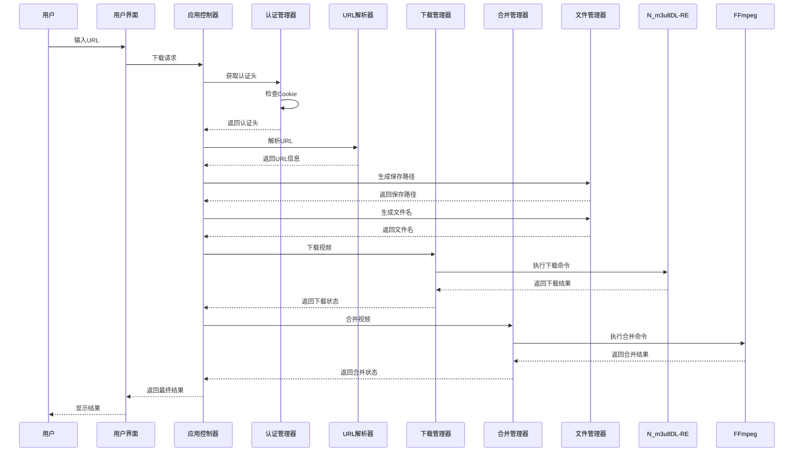

### Cookie刷新流程数据流

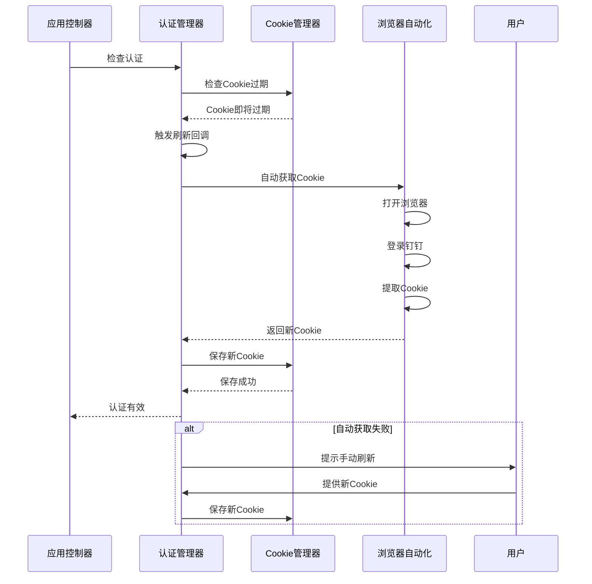

### 错误处理流程数据流

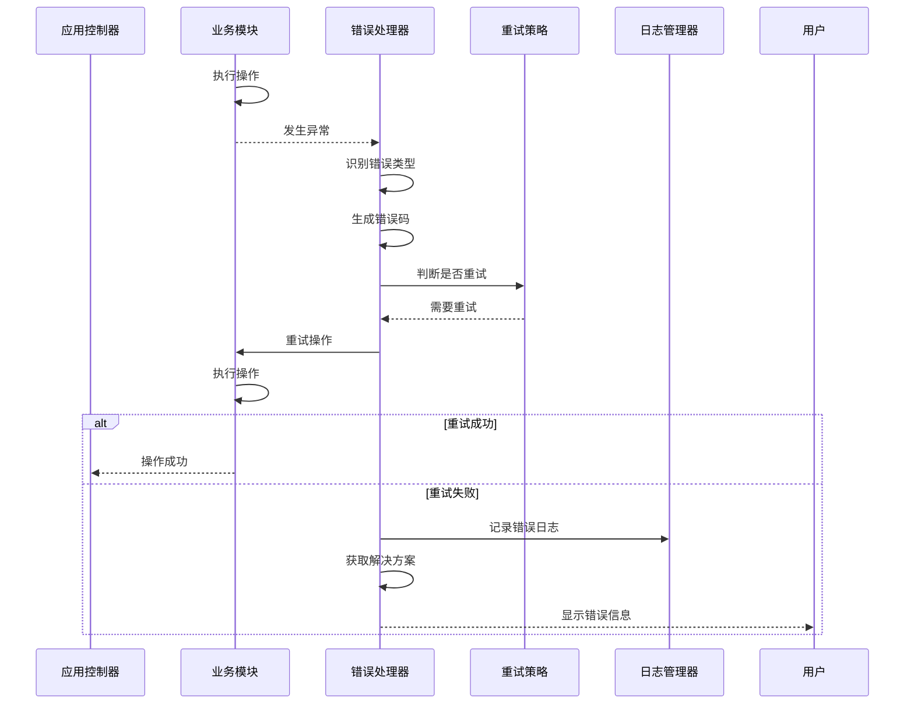

## 异常处理策略

### 异常层次结构

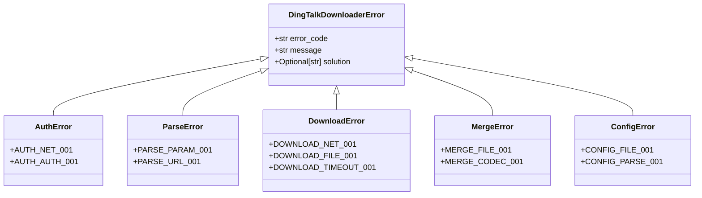

### 异常处理策略

#### 1. 网络错误处理
- **错误类型**: ConnectionError, TimeoutError
- **错误码**: NET_001
- **处理策略**:
  - 记录错误日志
  - 触发重试机制（指数退避）
  - 重试失败后提示用户检查网络

#### 2. 认证错误处理
- **错误类型**: AuthenticationError
- **错误码**: AUTH_001
- **处理策略**:
  - 记录错误日志
  - 不触发重试
  - 提示用户刷新Cookie

#### 3. 文件错误处理
- **错误类型**: FileNotFoundError, PermissionError, OSError
- **错误码**: FILE_001
- **处理策略**:
  - 记录错误日志
  - 检查磁盘空间
  - 检查文件权限
  - 提示用户解决

#### 4. 参数错误处理
- **错误类型**: ValueError, TypeError
- **错误码**: PARAM_001
- **处理策略**:
  - 记录错误日志
  - 不触发重试
  - 提示用户检查参数

#### 5. 超时错误处理
- **错误类型**: TimeoutError
- **错误码**: TIMEOUT_001
- **处理策略**:
  - 记录错误日志
  - 增加超时时间
  - 触发重试机制

### 错误恢复策略

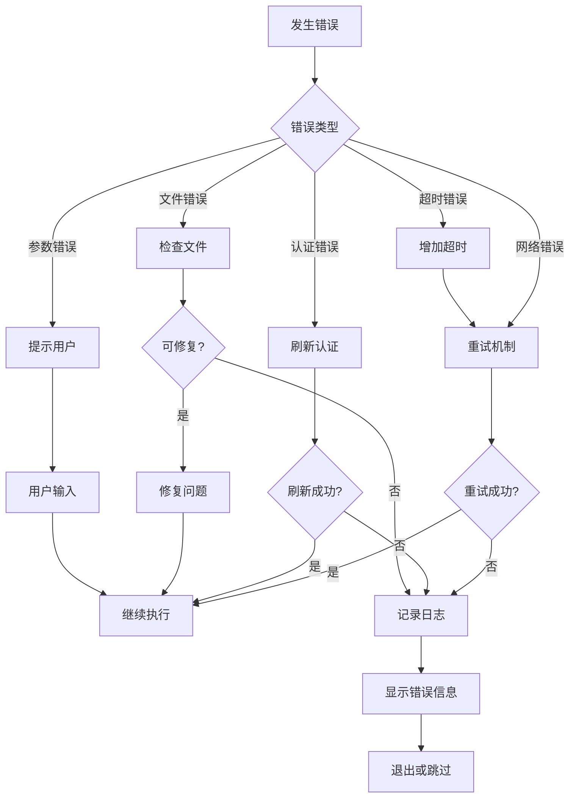

## 设计原则

### 1. 单一职责原则
每个模块只负责一个功能领域，确保模块职责清晰。

### 2. 开闭原则
对扩展开放，对修改关闭。通过接口和抽象类实现扩展性。

### 3. 依赖倒置原则
高层模块不依赖低层模块，都依赖于抽象接口。

### 4. 接口隔离原则
客户端不应依赖它不需要的接口，接口应细粒度。

### 5. 最小知识原则
模块间耦合度最小，只与必要的模块交互。

## 质量保证

### 1. 可测试性
- 所有模块都提供接口，便于单元测试
- 依赖注入，便于mock测试
- 清晰的输入输出契约

### 2. 可维护性
- 模块化设计，职责清晰
- 代码注释完善
- 遵循编码规范

### 3. 可扩展性
- 接口驱动，易于扩展
- 配置化，易于定制
- 插件化，易于集成

### 4. 可靠性
- 完善的错误处理
- 重试机制
- 日志记录
