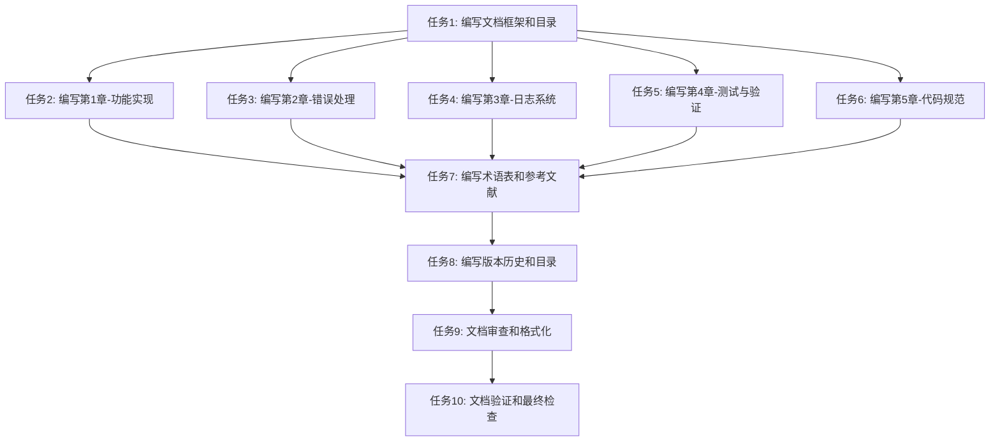

# TASK_钉钉直播回放下载软件开发指南

## 任务依赖图

## 原子任务列表

### 任务1: 编写文档框架和目录

#### 输入契约
- **前置依赖**: 无
- **输入数据**:
  - ALIGNMENT文档: `docs/tasks/20260116-钉钉直播回放下载软件开发指南/ALIGNMENT_钉钉直播回放下载软件开发指南.md`
  - CONSENSUS文档: `docs/tasks/20260116-钉钉直播回放下载软件开发指南/CONSENSUS_钉钉直播回放下载软件开发指南.md`
  - DESIGN文档: `docs/tasks/20260116-钉钉直播回放下载软件开发指南/DESIGN_钉钉直播回放下载软件开发指南.md`
- **环境依赖**:
  - Markdown编辑器
  - 文档存储目录: `docs/`

#### 输出契约
- **输出数据**:
  - 文档框架文件: `docs/钉钉直播回放下载软件开发指南.md`
  - 包含文档标题、作者、版本、日期等元信息
  - 包含完整的目录结构
  - 包含各章节的占位符
- **交付物**:
  - 完整的Markdown文档框架
  - 清晰的目录结构
  - 文档元信息
- **验收标准**:
  - 文档框架创建成功
  - 目录结构完整，包含所有5个核心章节
  - 文档元信息完整
  - Markdown格式正确

#### 实现约束
- **技术栈**: Markdown
- **接口规范**: 无
- **质量要求**:
  - 目录层级清晰，不超过3级
  - 章节编号规范
  - Markdown语法正确

#### 依赖关系
- **后置任务**: 任务2、任务3、任务4、任务5、任务6
- **并行任务**: 无

---

### 任务2: 编写第1章-功能实现

#### 输入契约
- **前置依赖**: 任务1完成
- **输入数据**:
  - 文档框架文件: `docs/钉钉直播回放下载软件开发指南.md`
  - ALIGNMENT文档中的功能实现需求
  - CONSENSUS文档中的技术方案
  - DESIGN文档中的接口定义
  - 钉钉视频下载记录: `docs/foundation/钉钉视频下载记录.md`
  - N_m3u8DL-RE文档: `docs/foundation/N_m3u8DL-RE.md`
  - ffmpeg文档: `docs/foundation/ffmpeg.md`
- **环境依赖**:
  - Markdown编辑器
  - Python 3.8+（用于验证代码示例）

#### 输出契约
- **输出数据**:
  - 完整的第1章内容
  - 包含7个小节：
    1. Cookie获取机制
    2. 钉钉直播回放链接解析
    3. 视频分片下载
    4. 视频合并技术
    5. 文件管理策略
    6. 配置管理
    7. 鉴权管理
  - 每个小节包含：
    - 详细说明
    - 代码示例（完整可运行）
    - 流程图（使用mermaid语法）
    - 配置说明和参数解释
- **交付物**:
  - 第1章完整内容
  - 所有代码示例经过验证
  - 所有流程图正确绘制
- **验收标准**:
  - 覆盖所有要求的功能点
  - 代码示例完整可运行
  - 流程图使用mermaid语法
  - 配置说明清晰详细
  - 内容与CONSENSUS文档中的技术方案一致

#### 实现约束
- **技术栈**: Markdown, Mermaid, Python
- **接口规范**: 无
- **质量要求**:
  - 代码示例包含中文注释
  - 代码行数超过20行时考虑聚合
  - 避免不必要的对象复制
  - 避免多层嵌套，提前返回

#### 依赖关系
- **后置任务**: 任务7
- **并行任务**: 任务3、任务4、任务5、任务6

---

### 任务3: 编写第2章-错误处理

#### 输入契约
- **前置依赖**: 任务1完成
- **输入数据**:
  - 文档框架文件: `docs/钉钉直播回放下载软件开发指南.md`
  - ALIGNMENT文档中的错误处理需求
  - CONSENSUS文档中的错误处理方案
  - DESIGN文档中的异常处理策略
- **环境依赖**:
  - Markdown编辑器
  - Python 3.8+（用于验证代码示例）

#### 输出契约
- **输出数据**:
  - 完整的第2章内容
  - 包含4个小节：
    1. 重试机制设计
    2. 下载错误处理
    3. 合并错误处理
    4. 错误码体系
  - 每个小节包含：
    - 详细说明
    - 代码示例（完整可运行）
    - 流程图（使用mermaid语法）
    - 错误码与解决方案映射表
- **交付物**:
  - 第2章完整内容
  - 所有代码示例经过验证
  - 所有流程图正确绘制
  - 完整的错误码体系
- **验收标准**:
  - 覆盖所有要求的错误处理场景
  - 代码示例完整可运行
  - 流程图使用mermaid语法
  - 错误码体系完整，包含模块标识、错误类型和错误编号
  - 错误码与解决方案映射关系清晰

#### 实现约束
- **技术栈**: Markdown, Mermaid, Python
- **接口规范**: 无
- **质量要求**:
  - 代码示例包含中文注释
  - 代码行数超过20行时考虑聚合
  - 避免不必要的对象复制
  - 避免多层嵌套，提前返回

#### 依赖关系
- **后置任务**: 任务7
- **并行任务**: 任务2、任务4、任务5、任务6

---

### 任务4: 编写第3章-日志系统

#### 输入契约
- **前置依赖**: 任务1完成
- **输入数据**:
  - 文档框架文件: `docs/钉钉直播回放下载软件开发指南.md`
  - ALIGNMENT文档中的日志系统需求
  - CONSENSUS文档中的日志系统方案
  - DESIGN文档中的日志管理方案
- **环境依赖**:
  - Markdown编辑器
  - Python 3.8+（用于验证代码示例）

#### 输出契约
- **输出数据**:
  - 完整的第3章内容
  - 包含3个小节：
    1. 日志分级策略
    2. 日志记录规范
    3. 日志管理方案
  - 每个小节包含：
    - 详细说明
    - 代码示例（完整可运行）
    - 流程图（使用mermaid语法）
    - 日志配置示例
- **交付物**:
  - 第3章完整内容
  - 所有代码示例经过验证
  - 所有流程图正确绘制
  - 完整的日志配置示例
- **验收标准**:
  - 覆盖所有要求的日志功能
  - 代码示例完整可运行
  - 流程图使用mermaid语法
  - 日志分级策略清晰（DEBUG/INFO/WARNING/ERROR/CRITICAL）
  - 日志记录规范完整，包含关键操作节点
  - 日志管理方案详细，包含轮转和存储管理

#### 实现约束
- **技术栈**: Markdown, Mermaid, Python
- **接口规范**: 无
- **质量要求**:
  - 代码示例包含中文注释
  - 代码行数超过20行时考虑聚合
  - 避免不必要的对象复制
  - 避免多层嵌套，提前返回

#### 依赖关系
- **后置任务**: 任务7
- **并行任务**: 任务2、任务3、任务5、任务6

---

### 任务5: 编写第4章-测试与验证

#### 输入契约
- **前置依赖**: 任务1完成
- **输入数据**:
  - 文档框架文件: `docs/钉钉直播回放下载软件开发指南.md`
  - ALIGNMENT文档中的测试与验证需求
  - CONSENSUS文档中的测试方案
  - DESIGN文档中的接口定义
- **环境依赖**:
  - Markdown编辑器
  - Python 3.8+
  - pytest框架

#### 输出契约
- **输出数据**:
  - 完整的第4章内容
  - 包含4个小节：
    1. 单元测试
    2. 集成测试
    3. 性能测试
    4. 异常测试
  - 每个小节包含：
    - 详细说明
    - 测试用例示例（完整可运行）
    - 流程图（使用mermaid语法）
    - 测试覆盖率要求
- **交付物**:
  - 第4章完整内容
  - 所有测试用例示例经过验证
  - 所有流程图正确绘制
  - 完整的测试覆盖率要求
- **验收标准**:
  - 覆盖所有要求的测试类型
  - 测试用例示例完整可运行
  - 流程图使用mermaid语法
  - 单元测试覆盖率不低于80%
  - 集成测试流程完整
  - 性能测试指标明确
  - 异常测试场景全面

#### 实现约束
- **技术栈**: Markdown, Mermaid, Python, pytest
- **接口规范**: 无
- **质量要求**:
  - 代码示例包含中文注释
  - 代码行数超过20行时考虑聚合
  - 避免不必要的对象复制
  - 避免多层嵌套，提前返回

#### 依赖关系
- **后置任务**: 任务7
- **并行任务**: 任务2、任务3、任务4、任务6

---

### 任务6: 编写第5章-代码规范

#### 输入契约
- **前置依赖**: 任务1完成
- **输入数据**:
  - 文档框架文件: `docs/钉钉直播回放下载软件开发指南.md`
  - ALIGNMENT文档中的代码规范需求
  - CONSENSUS文档中的代码规范方案
  - DESIGN文档中的设计原则
  - 用户编码规范: `.trae/rules/project_rules.md`
- **环境依赖**:
  - Markdown编辑器
  - Python 3.8+
  - 代码检查工具（black, isort, mypy, flake8, pylint）

#### 输出契约
- **输出数据**:
  - 完整的第5章内容
  - 包含4个小节：
    1. Python风格规范
    2. 模块化设计
    3. 命名规范
    4. 文档要求
  - 每个小节包含：
    - 详细说明
    - 代码示例（完整可运行）
    - 配置示例
    - 工具使用说明
- **交付物**:
  - 第5章完整内容
  - 所有代码示例经过验证
  - 完整的配置示例
  - 工具使用说明清晰
- **验收标准**:
  - 覆盖所有要求的代码规范内容
  - 代码示例完整可运行
  - 严格遵循PEP 8标准
  - 模块化设计原则清晰
  - 命名规范统一
  - 文档要求明确（Google风格或NumPy风格）

#### 实现约束
- **技术栈**: Markdown, Python
- **接口规范**: 无
- **质量要求**:
  - 代码示例包含中文注释
  - 代码行数超过20行时考虑聚合
  - 避免不必要的对象复制
  - 避免多层嵌套，提前返回

#### 依赖关系
- **后置任务**: 任务7
- **并行任务**: 任务2、任务3、任务4、任务5

---

### 任务7: 编写术语表和参考文献

#### 输入契约
- **前置依赖**: 任务2、任务3、任务4、任务5、任务6完成
- **输入数据**:
  - 完整的文档内容（第1-5章）
  - ALIGNMENT文档
  - CONSENSUS文档
  - DESIGN文档
  - 钉钉视频下载记录: `docs/foundation/钉钉视频下载记录.md`
  - N_m3u8DL-RE文档: `docs/foundation/N_m3u8DL-RE.md`
  - ffmpeg文档: `docs/foundation/ffmpeg.md`
- **环境依赖**:
  - Markdown编辑器

#### 输出契约
- **输出数据**:
  - 术语表章节
    - 包含文档中使用的所有专业术语
    - 每个术语包含名称、定义、示例
  - 参考文献章节
    - 包含所有参考的官方文档
    - 包含参考的技术文章
    - 包含参考的工具文档
- **交付物**:
  - 完整的术语表
  - 完整的参考文献
- **验收标准**:
  - 术语表包含文档中使用的所有专业术语
  - 每个术语定义清晰，包含示例
  - 参考文献完整，包含所有参考资源
  - 参考文献格式规范

#### 实现约束
- **技术栈**: Markdown
- **接口规范**: 无
- **质量要求**:
  - 术语按字母顺序排列
  - 参考文献按类型分类

#### 依赖关系
- **后置任务**: 任务8
- **并行任务**: 无

---

### 任务8: 编写版本历史和目录

#### 输入契约
- **前置依赖**: 任务7完成
- **输入数据**:
  - 完整的文档内容（第1-5章 + 术语表 + 参考文献）
  - 文档创建日期
  - 文档版本号
- **环境依赖**:
  - Markdown编辑器

#### 输出契约
- **输出数据**:
  - 版本历史章节
    - 包含版本号
    - 包含发布日期
    - 包含主要变更内容
    - 包含作者信息
  - 更新后的目录
    - 包含所有章节
    - 包含所有小节
    - 包含正确的页码链接
- **交付物**:
  - 完整的版本历史
  - 更新后的目录
- **验收标准**:
  - 版本历史完整，记录所有变更
  - 目录完整，包含所有章节和小节
  - 目录链接正确，可以跳转到对应章节

#### 实现约束
- **技术栈**: Markdown
- **接口规范**: 无
- **质量要求**:
  - 版本按时间倒序排列
  - 目录层级清晰，不超过3级

#### 依赖关系
- **后置任务**: 任务9
- **并行任务**: 无

---

### 任务9: 文档审查和格式化

#### 输入契约
- **前置依赖**: 任务8完成
- **输入数据**:
  - 完整的文档内容
  - Markdown格式规范
  - 文档编写规范
- **环境依赖**:
  - Markdown编辑器
  - Markdown检查工具（可选）

#### 输出契约
- **输出数据**:
  - 格式化后的文档
  - 审查报告
    - 包含发现的问题
    - 包含修复建议
    - 包含修复状态
- **交付物**:
  - 格式化后的文档
  - 审查报告
- **验收标准**:
  - Markdown格式正确
  - 代码块语法高亮正确
  - 流程图使用mermaid语法
  - 文档结构清晰，逻辑连贯
  - 语言表达准确，易于理解
  - 无错别字和语法错误

#### 实现约束
- **技术栈**: Markdown
- **接口规范**: 无
- **质量要求**:
  - 严格遵循Markdown语法
  - 代码块使用正确的语言标识
  - 流程图使用mermaid语法
  - 文档格式统一

#### 依赖关系
- **后置任务**: 任务10
- **并行任务**: 无

---

### 任务10: 文档验证和最终检查

#### 输入契约
- **前置依赖**: 任务9完成
- **输入数据**:
  - 格式化后的文档
  - 验收标准（来自CONSENSUS文档）
- **环境依赖**:
  - Markdown编辑器
  - Python 3.8+（用于验证代码示例）

#### 输出契约
- **输出数据**:
  - 验证报告
    - 包含完整性检查结果
    - 包含质量检查结果
    - 包含技术准确性检查结果
    - 包含可读性检查结果
    - 包含专业性检查结果
  - 最终文档
- **交付物**:
  - 验证报告
  - 最终文档
- **验收标准**:
  - 文档完整性：包含所有5个核心章节、目录、术语表、版本历史、参考文献
  - 文档质量：所有代码示例完整可运行，流程图使用mermaid语法，配置说明清晰详细
  - 技术准确性：代码示例经过实际验证，技术方案与现有项目架构对齐
  - 文档可读性：章节结构清晰，逻辑连贯，语言表达准确
  - 文档专业性：遵循专业技术文档编写规范，包含必要的代码注释和说明

#### 实现约束
- **技术栈**: Markdown, Python
- **接口规范**: 无
- **质量要求**:
  - 所有验收标准必须满足
  - 所有代码示例必须经过验证
  - 所有流程图必须正确绘制

#### 依赖关系
- **后置任务**: 无
- **并行任务**: 无

---

## 任务执行顺序

### 阶段1: 准备阶段
1. 任务1: 编写文档框架和目录

### 阶段2: 内容编写阶段（并行执行）
2. 任务2: 编写第1章-功能实现
3. 任务3: 编写第2章-错误处理
4. 任务4: 编写第3章-日志系统
5. 任务5: 编写第4章-测试与验证
6. 任务6: 编写第5章-代码规范

### 阶段3: 补充阶段
7. 任务7: 编写术语表和参考文献

### 阶段4: 完善阶段
8. 任务8: 编写版本历史和目录

### 阶段5: 质量保证阶段
9. 任务9: 文档审查和格式化
10. 任务10: 文档验证和最终检查

## 复杂度评估

### 低复杂度任务（预计1-2小时）
- 任务1: 编写文档框架和目录
- 任务7: 编写术语表和参考文献
- 任务8: 编写版本历史和目录

### 中等复杂度任务（预计2-4小时）
- 任务3: 编写第2章-错误处理
- 任务4: 编写第3章-日志系统
- 任务5: 编写第4章-测试与验证
- 任务6: 编写第5章-代码规范
- 任务9: 文档审查和格式化

### 高复杂度任务（预计4-6小时）
- 任务2: 编写第1章-功能实现
- 任务10: 文档验证和最终检查

## 总体时间估算

- 阶段1: 1-2小时
- 阶段2: 12-20小时（并行执行）
- 阶段3: 1-2小时
- 阶段4: 1-2小时
- 阶段5: 3-5小时

**总计**: 18-31小时（约2-4个工作日）
