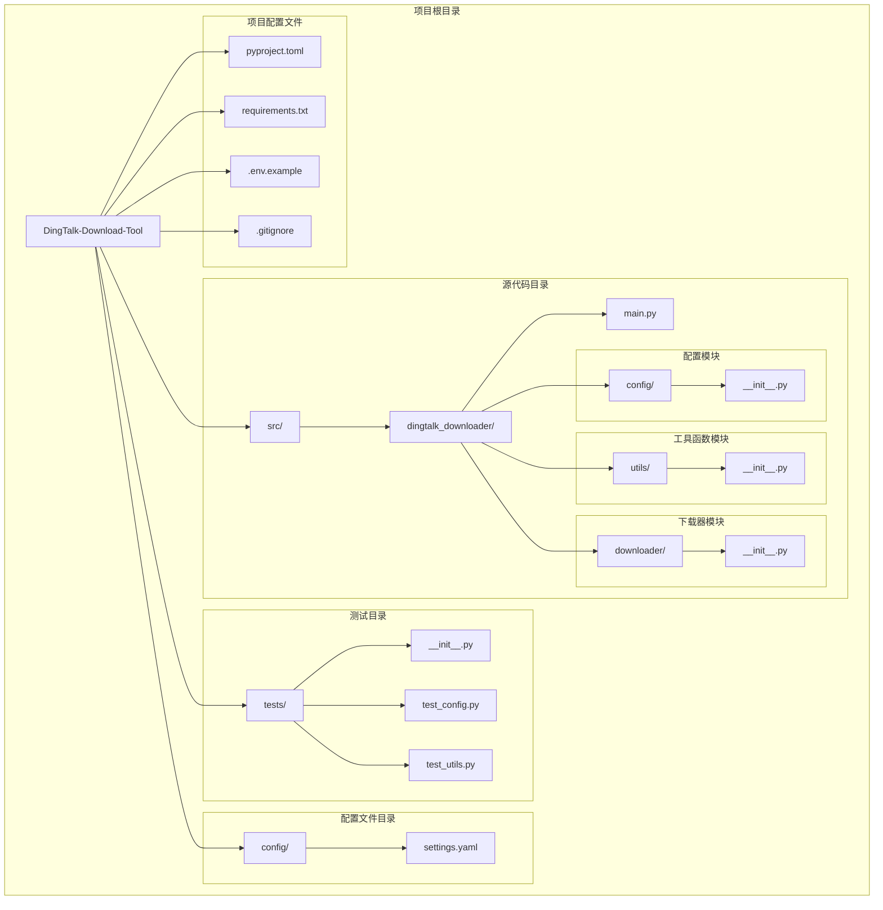
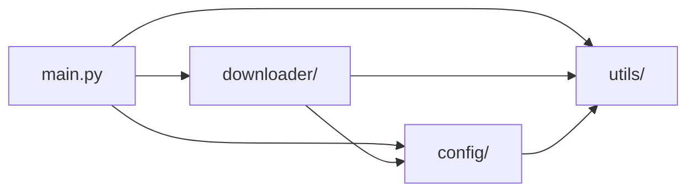
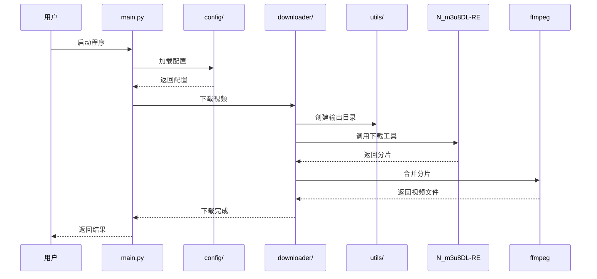

# DESIGN_项目初始化

## 整体架构图



## 分层设计

### 1. 源代码层 (src/)
- **职责**: 包含所有应用程序源代码
- **子模块**:
  - `dingtalk_downloader/`: 主包，包含所有业务逻辑
  - `dingtalk_downloader/config/`: 配置管理模块
  - `dingtalk_downloader/utils/`: 工具函数模块
  - `dingtalk_downloader/downloader/`: 下载器模块

### 2. 测试层 (tests/)
- **职责**: 包含所有测试代码
- **子模块**:
  - `test_config.py`: 配置模块测试
  - `test_utils.py`: 工具函数测试

### 3. 配置层 (config/)
- **职责**: 存储应用程序配置文件
- **文件**:
  - `settings.yaml`: 应用程序配置

### 4. 项目配置层 (根目录)
- **职责**: 项目级配置和元数据
- **文件**:
  - `pyproject.toml`: 项目配置和构建配置
  - `requirements.txt`: Python依赖列表
  - `.env.example`: 环境变量示例
  - `.gitignore`: Git忽略规则

## 核心组件

### 1. 主程序入口 (main.py)
- **职责**: 应用程序入口点
- **功能**: 命令行参数解析、程序启动

### 2. 配置模块 (config/)
- **职责**: 配置文件加载和管理
- **功能**: 读取YAML配置、环境变量管理

### 3. 工具函数模块 (utils/)
- **职责**: 提供通用工具函数
- **功能**: 日志记录、文件操作、字符串处理等

### 4. 下载器模块 (downloader/)
- **职责**: 视频下载功能
- **功能**: m3u8解析、分片下载、视频合并

## 模块依赖关系图



## 接口契约定义

### 配置模块接口
```python
class ConfigManager:
    def load_config(self, config_path: str) -> dict:
        """加载配置文件"""
        pass
    
    def get(self, key: str, default=None) -> Any:
        """获取配置项"""
        pass
```

### 工具函数模块接口
```python
def setup_logger(name: str, level: int = logging.INFO) -> logging.Logger:
    """设置日志记录器"""
    pass

def ensure_dir(path: str) -> None:
    """确保目录存在"""
    pass
```

### 下载器模块接口
```python
class DingTalkDownloader:
    def download(self, m3u8_url: str, output_path: str) -> bool:
        """下载视频"""
        pass
    
    def merge(self, segments: List[str], output_path: str) -> bool:
        """合并视频分片"""
        pass
```

## 数据流向图



## 异常处理策略

### 异常层次结构
```
Exception
├── DingTalkDownloaderError (基础异常类)
│   ├── ConfigError (配置错误)
│   ├── DownloadError (下载错误)
│   ├── MergeError (合并错误)
│   └── NetworkError (网络错误)
```

### 异常处理原则
1. 所有异常都继承自`DingTalkDownloaderError`
2. 使用日志记录异常信息
3. 向用户提供友好的错误提示
4. 关键操作使用try-except捕获异常

## 设计原则

### 1. 避免过度设计
- 当前任务仅创建项目结构，不实现具体功能
- 保持接口简洁，预留扩展空间

### 2. 与现有系统架构一致
- 遵循Python项目结构最佳实践
- 使用src/布局便于打包和分发

### 3. 复用现有组件和模式
- 使用标准库模块
- 遵循PEP 8编码规范
- 使用类型注解提高代码可读性

## 文件组织规范

### Python文件命名
- 模块文件: 使用小写字母和下划线 (如: `config_manager.py`)
- 测试文件: 以`test_`开头 (如: `test_config.py`)
- 包目录: 使用小写字母和下划线 (如: `dingtalk_downloader/`)

### 目录结构
```
DingTalk-Download-Tool/
├── src/dingtalk_downloader/      # 主包
├── tests/                         # 测试目录
├── config/                        # 配置文件目录
├── docs/                          # 文档目录（已存在）
└── .trae/                         # 项目规则（已存在）
```

### 初始化文件
- 每个Python包目录都包含`__init__.py`
- `__init__.py`文件可以为空或包含包级别的导入
