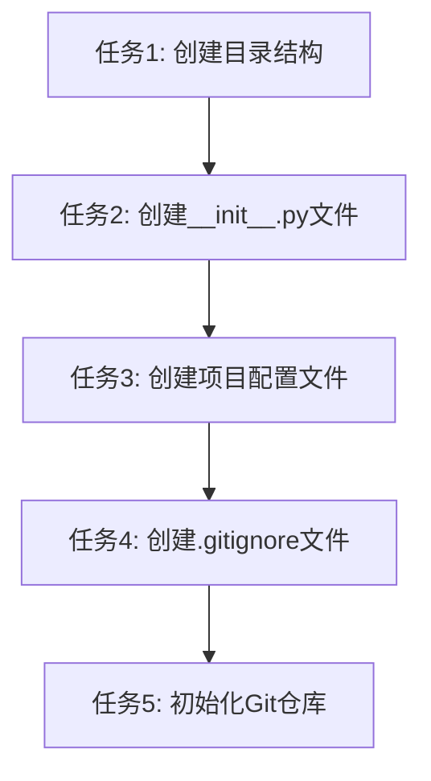

# TASK_项目初始化

## 任务依赖图

## 原子任务列表

### 任务1: 创建目录结构

**输入契约**:
- 前置依赖: 无
- 输入数据: 项目根目录路径
- 环境依赖: Windows 11, PowerShell 5.1

**输出契约**:
- 输出数据: 完整的项目目录结构
- 交付物:
  - src/dingtalk_downloader/
  - src/dingtalk_downloader/config/
  - src/dingtalk_downloader/utils/
  - src/dingtalk_downloader/downloader/
  - tests/
  - config/
- 验收标准: 所有目录创建成功

**实现约束**:
- 使用PowerShell命令创建目录
- 确保父目录存在

**依赖关系**:
- 后置任务: 任务2
- 并行任务: 无

---

### 任务2: 创建__init__.py文件

**输入契约**:
- 前置依赖: 任务1（目录结构创建完成）
- 输入数据: 所有Python包目录路径
- 环境依赖: 无

**输出契约**:
- 输出数据: 所有__init__.py文件
- 交付物:
  - src/dingtalk_downloader/__init__.py
  - src/dingtalk_downloader/config/__init__.py
  - src/dingtalk_downloader/utils/__init__.py
  - src/dingtalk_downloader/downloader/__init__.py
  - tests/__init__.py
- 验收标准: 所有__init__.py文件创建成功，内容为空或包含基本包信息

**实现约束**:
- 每个Python包目录都必须包含__init__.py
- 主包的__init__.py包含版本信息

**依赖关系**:
- 后置任务: 任务3
- 并行任务: 无

---

### 任务3: 创建项目配置文件

**输入契约**:
- 前置依赖: 任务2（__init__.py文件创建完成）
- 输入数据: 项目元数据
- 环境依赖: 无

**输出契约**:
- 输出数据: 项目配置文件
- 交付物:
  - pyproject.toml
  - requirements.txt
  - config/settings.yaml
  - .env.example
- 验收标准: 所有配置文件创建成功，内容符合规范

**实现约束**:
- pyproject.toml包含项目元数据和构建配置
- requirements.txt包含基础依赖
- settings.yaml为YAML格式
- .env.example包含环境变量模板

**依赖关系**:
- 后置任务: 任务4
- 并行任务: 无

---

### 任务4: 创建.gitignore文件

**输入契约**:
- 前置依赖: 任务3（项目配置文件创建完成）
- 输入数据: Python项目标准忽略规则
- 环境依赖: 无

**输出契约**:
- 输出数据: .gitignore文件
- 交付物: .gitignore
- 验收标准: .gitignore文件创建成功，包含所有必要的忽略规则

**实现约束**:
- 排除虚拟环境目录 (venv/, env/, .venv/)
- 排除Python缓存目录 (__pycache__/, *.pyc, *.pyo, *.pyd)
- 排除日志文件 (*.log)
- 排除环境变量文件 (.env)
- 排除IDE配置 (.vscode/, .idea/)
- 排除测试覆盖率报告 (.coverage, htmlcov/)
- 排除构建产物 (build/, dist/, *.egg-info/)
- 排除操作系统文件 (.DS_Store, Thumbs.db)

**依赖关系**:
- 后置任务: 任务5
- 并行任务: 无

---

### 任务5: 初始化Git仓库

**输入契约**:
- 前置依赖: 任务4（.gitignore文件创建完成）
- 输入数据: 项目根目录路径
- 环境依赖: Git已安装

**输出契约**:
- 输出数据: Git仓库
- 交付物: .git目录
- 验收标准: Git仓库初始化成功

**实现约束**:
- 使用git init命令初始化仓库
- 确保在项目根目录执行

**依赖关系**:
- 后置任务: 无
- 并行任务: 无

---

## 任务拆分原则

1. **复杂度可控**: 每个任务都是简单的文件或目录创建操作
2. **按功能模块分解**: 按照目录结构、配置文件、版本控制等维度拆分
3. **原子性和独立性**: 每个任务都可以独立完成和验证
4. **明确的验收标准**: 每个任务都有清晰的完成标准
5. **依赖关系清晰**: 任务之间有明确的先后顺序，无循环依赖

## 质量门控

- [ ] 任务覆盖完整需求
- [ ] 依赖关系无循环
- [ ] 每个任务都可独立验证
- [ ] 复杂度评估合理
