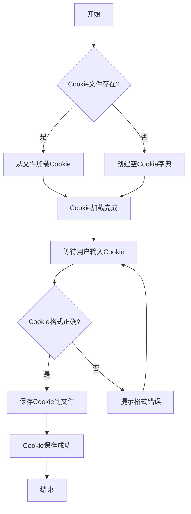
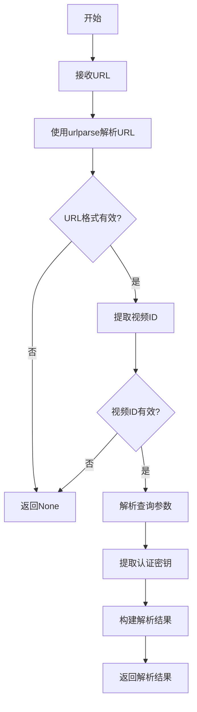
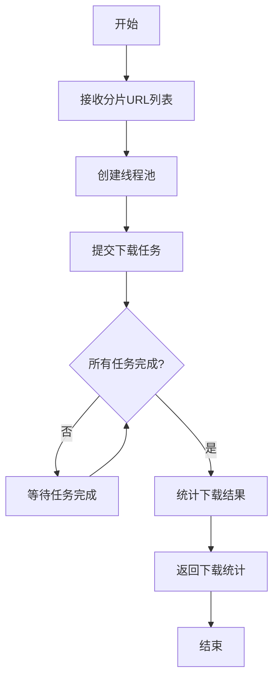
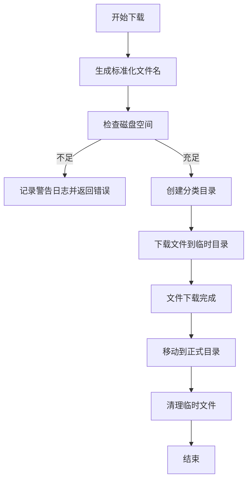
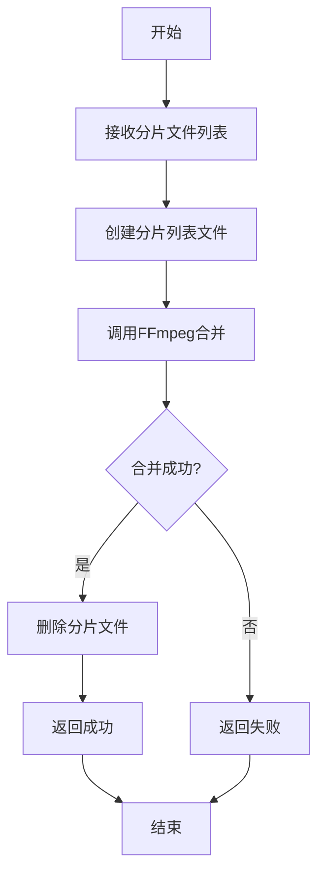
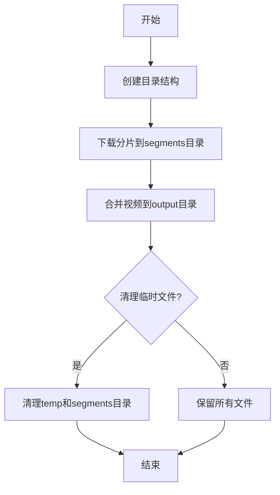
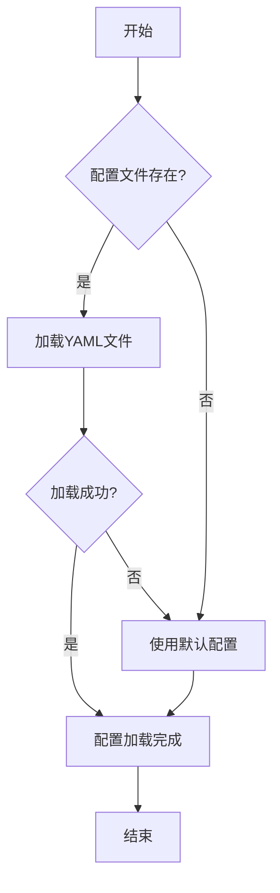
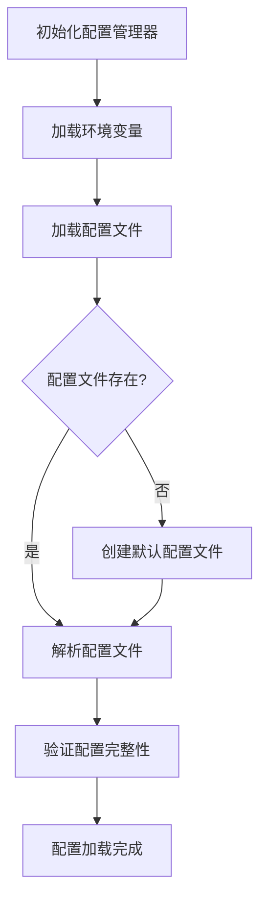
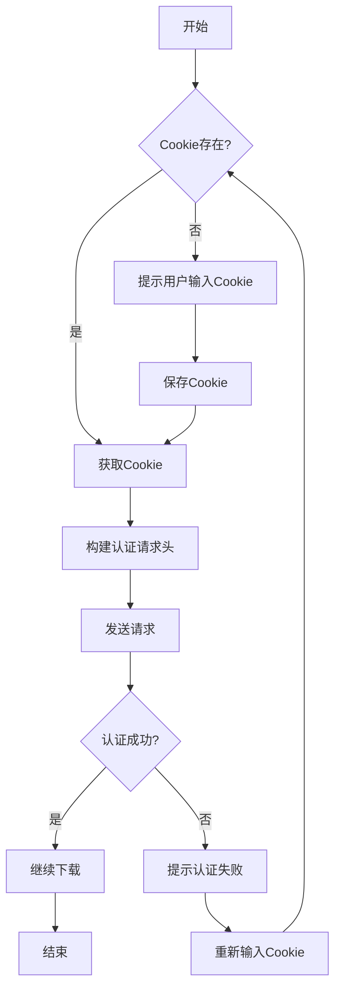

# 第 1 章: 功能实现

## 1.1 Cookie 获取机制

### 1.1.1 Cookie 管理器设计

Cookie 管理器负责管理钉钉直播回放下载所需的 Cookie,包括 Cookie 的读取、保存、删除等功能。

```python
import json
import os
from pathlib import Path
from typing import Dict, Optional
import logging

logger = logging.getLogger(__name__)

class CookieManager:
    """Cookie管理器

    该类提供Cookie的读取、保存、删除等功能。
    支持从JSON文件加载和保存Cookie。

    Attributes:
        cookie_file: Cookie文件路径
        cookies: Cookie字典,键为域名,值为Cookie数据

    Examples:
        >>> manager = CookieManager("./cookies/cookies.json")
        >>> manager.save_cookie("dingtalk.com", {"session": "abc123"})
        >>> cookie = manager.load_cookie("dingtalk.com")
        >>> print(cookie)
        {'session': 'abc123'}
    """

    def __init__(self, cookie_file: str = "./cookies/cookies.json"):
        """初始化Cookie管理器

        Args:
            cookie_file: Cookie文件路径,默认为"./cookies/cookies.json"

        Raises:
            FileNotFoundError: 如果Cookie文件不存在且无法创建
        """
        self.cookie_file = cookie_file
        self.cookies: Dict[str, Dict] = {}
        self._ensure_cookie_dir()
        self._load_cookies()

    def _ensure_cookie_dir(self) -> None:
        """确保Cookie目录存在"""
        cookie_dir = Path(self.cookie_file).parent
        cookie_dir.mkdir(parents=True, exist_ok=True)
        logger.debug(f"Cookie目录已创建: {cookie_dir}")

    def _load_cookies(self) -> None:
        """从文件加载Cookie"""
        if Path(self.cookie_file).exists():
            try:
                with open(self.cookie_file, 'r', encoding='utf-8') as f:
                    self.cookies = json.load(f)
                logger.info(f"已从{self.cookie_file}加载{len(self.cookies)}个Cookie")
            except Exception as e:
                logger.error(f"加载Cookie失败: {e}")
                self.cookies = {}
        else:
            logger.info(f"Cookie文件不存在,将创建新文件: {self.cookie_file}")

    def _save_to_file(self) -> None:
        """保存Cookie到文件"""
        try:
            with open(self.cookie_file, 'w', encoding='utf-8') as f:
                json.dump(self.cookies, f, indent=2, ensure_ascii=False)
            logger.debug(f"Cookie已保存到{self.cookie_file}")
        except Exception as e:
            logger.error(f"保存Cookie失败: {e}")
            raise

    def save_cookie(self, domain: str, cookie_data: Dict) -> None:
        """保存Cookie

        将Cookie数据保存到内存和文件中。

        Args:
            domain: 域名
            cookie_data: Cookie数据字典

        Raises:
            IOError: 如果写入文件失败

        Examples:
            >>> manager = CookieManager()
            >>> manager.save_cookie("dingtalk.com", {"session": "abc123"})
        """
        self.cookies[domain] = cookie_data
        self._save_to_file()
        logger.info(f"已保存Cookie: {domain}")

    def load_cookie(self, domain: str) -> Optional[Dict]:
        """加载Cookie

        Args:
            domain: 域名

        Returns:
          str: 生成的标准化文件名
            Optional[Dict]: Cookie数据,如果不存在则返回None

        Examples:
            >>> manager = CookieManager()
            >>> cookie = manager.load_cookie("dingtalk.com")
        """
        return self.cookies.get(domain)

    def delete_cookie(self, domain: str) -> bool:
        """删除Cookie

        Args:
            domain: 域名

        Returns:
            bool: 删除成功返回True,不存在返回False
        """
        if domain in self.cookies:
            del self.cookies[domain]
            self._save_to_file()
            logger.info(f"已删除Cookie: {domain}")
            return True
        return False

    def clear_all(self) -> None:
        """清空所有Cookie"""
        self.cookies.clear()
        self._save_to_file()
        logger.info("已清空所有Cookie")

    def get_all_cookies(self) -> Dict[str, Dict]:
        """获取所有Cookie

        Returns:
            Dict[str, Dict]: 所有Cookie数据
        """
        return self.cookies.copy()
```

### 1.1.2 Cookie 获取流程



### 1.1.3 Cookie 配置示例

在`config/settings.yaml`中配置 Cookie 相关设置:

```yaml
cookie:
  # Cookie文件路径
  cookie_file: "./cookies/cookies.json"

  # Cookie过期时间(秒),0表示不检查过期
  expires: 0

  # 是否自动刷新Cookie
  auto_refresh: false

  # Cookie刷新间隔(秒)
  refresh_interval: 3600
```

## 1.2 钉钉直播回放链接解析

### 1.2.1 URL 解析器设计

URL 解析器负责解析钉钉直播回放链接,提取视频 ID、认证参数等信息。

```python
from urllib.parse import urlparse, parse_qs
from typing import Dict, Optional
import logging

logger = logging.getLogger(__name__)

class URLParser:
    """URL解析器

    该类负责解析钉钉直播回放链接,提取视频ID、认证参数等信息。

    Attributes:
        None

    Examples:
        >>> parser = URLParser()
        >>> url = "https://dtlive-prod.dingtalk.com/live_hls/12345.m3u8?auth_key=abc"
        >>> result = parser.parse(url)
        >>> print(result['video_id'])
        12345
    """

    def parse(self, url: str) -> Optional[Dict]:
        """解析钉钉直播回放URL

        从URL中提取视频ID、认证参数和其他关键信息
        支持标准钉钉直播URL格式: https://dtlive-prod.dingtalk.com/live_hls/{video_id}.m3u8?{params}

        Args:
            url: 钉钉直播回放URL

        Returns:
            Optional[Dict]: 包含解析结果的字典,失败返回None
            字典结构:
            {
                'domain': 域名,
                'path': URL路径,
                'video_id': 视频ID,
                'query_params': 查询参数字典,
                'auth_key': 认证密钥
            }
        """解析URL

        Args:
            url: 钉钉直播回放URL

        Returns:
            Optional[Dict]: 解析结果,包含以下字段:
                - domain: 域名
                - path: 路径
                - video_id: 视频ID
                - params: 查询参数
                - auth_key: 认证密钥(如果存在)
            如果URL无效则返回None

        Examples:
            >>> parser = URLParser()
            >>> url = "https://dtlive-prod.dingtalk.com/live_hls/12345.m3u8"
            >>> result = parser.parse(url)
            >>> print(result['video_id'])
            12345
        """
        try:
            parsed = urlparse(url)

            if not parsed.scheme or not parsed.netloc:
                logger.error(f"无效的URL: {url}")
                return None

            # 提取视频ID
            video_id = self._extract_video_id(parsed.path)
            if not video_id:
                logger.error(f"无法从路径提取视频ID: {parsed.path}")
                return None

            # 解析查询参数
            query_params = parse_qs(parsed.query)

        # 提取认证密钥
        auth_key = query_params.get('auth_key', [None])[0]

        result = {
            'domain': parsed.netloc,
            'path': parsed.path,
            'video_id': video_id,
            'query_params': {k: v[0] if len(v) == 1 else v for k, v in query_params.items()},
            'auth_key': auth_key
        }

            logger.info(f"URL解析成功: {url}")
            return result

        except Exception as e:
            logger.error(f"URL解析失败: {e}")
            return None

    def _extract_video_id(self, path: str) -> Optional[str]:
        """从路径提取视频ID

        Args:
            path: URL路径

        Returns:
            Optional[str]: 视频ID,如果无法提取则返回None
        """
        filename = path.split('/')[-1]
        if filename.endswith('.m3u8'):
            return filename[:-5]
        return None

    def validate_url(self, url: str) -> bool:
        """验证URL是否有效

        Args:
            url: 钉钉直播回放URL

        Returns:
            bool: URL有效返回True,否则返回False
        """
        result = self.parse(url)
        return result is not None
```

### 1.2.2 URL 解析流程



### 1.2.3 URL 配置示例

在`config/settings.yaml`中配置 URL 相关设置:

```yaml
url:
  # 钉钉直播域名
  domain: "dtlive-prod.dingtalk.com"

  # 视频路径前缀
  path_prefix: "/live_hls/"

  # 是否验证URL格式
  validate: true

  # 支持的URL格式
  supported_formats:
    - "https://dtlive-prod.dingtalk.com/live_hls/*.m3u8"
    - "https://dtlive-prod.dingtalk.com/live_hls/*.m3u8?auth_key=*"
```

## 1.3 视频分片下载

### 1.3.1 下载管理器设计

下载管理器负责下载视频分片,支持多线程下载、断点续传、重试机制等功能。

```python
import requests
from pathlib import Path
from typing import List, Optional, Dict
import logging
import time
import concurrent.futures

logger = logging.getLogger(__name__)

class DownloadManager:
    """下载管理器

    该类负责下载视频分片,支持多线程下载、断点续传、重试机制等功能。

    Attributes:
        max_retries: 最大重试次数
        timeout: 超时时间(秒)
        max_workers: 最大并发数

    Examples:
        >>> manager = DownloadManager(max_retries=3, timeout=30)
        >>> success = manager.download_segment(
        ...     "https://example.com/segment1.ts",
        ...     "./segments/segment1.ts"
        ... )
        >>> print(success)
        True
    """

    def __init__(
        self,
        max_retries: int = 3,
        timeout: int = 30,
        max_workers: int = 4
    ):
        """初始化下载管理器

        Args:
            max_retries: 最大重试次数,默认为3
            timeout: 超时时间(秒),默认为30
            max_workers: 最大并发数,默认为4
        """
        self.max_retries = max_retries
        self.timeout = timeout
        self.max_workers = max_workers
        self.session = requests.Session()
        logger.info(f"下载管理器已初始化: max_retries={max_retries}, timeout={timeout}")

    def download_segment(
        self,
        url: str,
        output_path: str,
        headers: Optional[Dict[str, str]] = None
    ) -> bool:
        """下载视频分片

        Args:
            url: 分片URL
            output_path: 输出文件路径
            headers: HTTP请求头

        Returns:
            bool: 下载成功返回True,失败返回False

        Examples:
            >>> manager = DownloadManager()
            >>> success = manager.download_segment(
            ...     "https://example.com/segment1.ts",
            ...     "./segments/segment1.ts"
            ... )
            >>> print(success)
            True
        """
        for attempt in range(self.max_retries):
            try:
                response = self.session.get(
                    url,
                    headers=headers,
                    timeout=self.timeout,
                    stream=True
                )
                response.raise_for_status()

                Path(output_path).parent.mkdir(parents=True, exist_ok=True)

                with open(output_path, 'wb') as f:
                    for chunk in response.iter_content(chunk_size=8192):
                        if chunk:
                            f.write(chunk)

                logger.info(f"下载成功: {url}")
                return True

            except requests.exceptions.Timeout:
                logger.warning(f"下载超时(尝试{attempt + 1}/{self.max_retries}): {url}")
            except requests.exceptions.RequestException as e:
                logger.warning(f"下载失败(尝试{attempt + 1}/{self.max_retries}): {e}")
            except Exception as e:
                logger.error(f"未知错误: {e}")

            if attempt < self.max_retries - 1:
                delay = self._calculate_retry_delay(attempt)
                logger.info(f"{delay}秒后重试...")
                time.sleep(delay)

        logger.error(f"下载失败,已达到最大重试次数: {url}")
        return False

    def download_all_segments(
        self,
        segment_urls: List[str],
        output_dir: str,
        headers: Optional[Dict[str, str]] = None
    ) -> Dict[str, int]:
        """下载所有分片

        Args:
            segment_urls: 分片URL列表
            output_dir: 输出目录
            headers: HTTP请求头

        Returns:
            Dict[str, int]: 下载结果统计
                - success: 成功数量
                - failure: 失败数量
                - total: 总数量

        Examples:
            >>> manager = DownloadManager()
            >>> urls = [
            ...     "https://example.com/segment1.ts",
            ...     "https://example.com/segment2.ts"
            ... ]
            >>> result = manager.download_all_segments(urls, "./segments")
            >>> print(result)
            {'success': 2, 'failure': 0, 'total': 2}
        """
        Path(output_dir).mkdir(parents=True, exist_ok=True)

        success_count = 0
        failure_count = 0

        with concurrent.futures.ThreadPoolExecutor(max_workers=self.max_workers) as executor:
            futures = {}

            for i, url in enumerate(segment_urls):
                output_path = f"{output_dir}/segment_{i:04d}.ts"
                future = executor.submit(
                    self.download_segment,
                    url,
                    output_path,
                    headers
                )
                futures[future] = (i, url)

            for future in concurrent.futures.as_completed(futures):
                i, url = futures[future]
                try:
                    if future.result():
                        success_count += 1
                    else:
                        failure_count += 1
                except Exception as e:
                    logger.error(f"下载异常: {e}")
                    failure_count += 1

        result = {
            'success': success_count,
            'failure': failure_count,
            'total': len(segment_urls)
        }

        logger.info(f"下载完成: {result}")
        return result

    def _calculate_retry_delay(self, attempt: int) -> float:
        """计算重试延迟(指数退避算法)

        采用指数退避策略计算重试延迟,公式为: min(base_delay * 2^attempt, max_delay)
        这是网络请求中常用的抗抖动策略,避免瞬间大量重试导致服务器压力

        Args:
            attempt: 当前重试次数(从0开始)

        Returns:
            float: 计算得到的延迟时间(秒)
        "
        """计算重试延迟(指数退避)

        Args:
            attempt: 当前尝试次数

        Returns:
            float: 延迟时间(秒)
        """
        return min(2 ** attempt, 60)

    def close(self) -> None:
        """关闭下载管理器"""
        self.session.close()
        logger.info("下载管理器已关闭")
```

### 1.3.2 下载流程



### 1.3.3 下载配置示例

在`config/settings.yaml`中配置下载相关设置:

```yaml
download:
  # 最大重试次数
  max_retries: 3

  # 超时时间(秒)
  timeout: 30

  # 最大并发数
  max_workers: 4

  # 下载缓冲区大小(字节)
  chunk_size: 8192

  # 临时文件目录
  temp_dir: "./temp"

  # 是否启用断点续传
  resume: true
```

## 1.4 视频合并技术

### 1.4.1 视频合并器设计

#### 工具部署指南

项目依赖以下两个工具,请按照以下步骤进行部署:

##### 部署方式一: 项目内部署(推荐)

1. 下载 N_m3u8DL-RE 和 FFmpeg 二进制文件

   - N_m3u8DL-RE: 从 https://github.com/nilaoda/N_m3u8DL-RE 下载最新版本
   - FFmpeg: 从 https://ffmpeg.org/download.html#build-windows 下载静态构建版本

2. 在项目根目录下创建 `assets\bin` 目录

3. 将下载的二进制文件放置到 `assets\bin` 目录下

   - N_m3u8DL-RE.exe
   - ffmpeg.exe

4. 程序会自动从 `assets\bin` 目录调用这些工具,无需配置环境变量

##### 部署方式二: 系统环境变量部署

如果您希望在系统范围内使用这些工具,可以将它们添加到系统环境变量 PATH 中:

##### Windows 系统

1. 访问 FFmpeg 官方网站: https://ffmpeg.org/download.html#build-windows
2. 下载适合您系统的静态构建版本(建议选择 latest release)
3. 解压到指定目录(例如: `C:\Program Files\ffmpeg`)
4. 将 FFmpeg 可执行文件路径添加到系统环境变量 PATH 中:

   ```powershell
   # 临时生效(当前终端)
   $env:PATH += ";C:\Program Files\ffmpeg\bin"

   # 永久生效(管理员权限运行)
   setx /M PATH "%PATH%;C:\Program Files\ffmpeg\bin"
   ```

5. 验证安装:

   ```powershell
   ffmpeg -version
   ```

6. 验证环境变量配置:
   ```powershell
   echo %PATH%
   ```

##### macOS 系统

使用 Homebrew 安装:

```bash
# 安装Homebrew(如未安装)
/bin/bash -c "$(curl -fsSL https://raw.githubusercontent.com/Homebrew/install/HEAD/install.sh)"

# 安装FFmpeg
brew install ffmpeg

# 验证安装
ffmpeg -version
```

##### Linux 系统

Debian/Ubuntu:

```bash
sudo apt update
sudo apt install ffmpeg -y
```

CentOS/RHEL:

```bash
sudo yum install epel-release -y
sudo yum install ffmpeg -y
```

验证安装:

```bash
ffmpeg -version
```

##### 常见问题排查

1. **'ffmpeg' 不是内部或外部命令**:

   - 检查 FFmpeg 是否已添加到环境变量
   - 重启终端或计算机后重试

2. **版本不兼容**:

   - 确保安装 FFmpeg 4.0 或更高版本
   - 通过`ffmpeg -version`检查版本号

3. **合并失败**:
   - 检查输入文件路径是否包含中文或特殊字符
   - 尝试使用绝对路径
   - 检查磁盘空间是否充足

视频合并器负责将下载的视频分片合并为完整的视频文件。

## 1.5 文件管理策略

### 1.5.1 文件管理器设计

文件管理器负责下载文件的命名、存储路径规划、临时文件清理和存储空间监控。

```python
import os
import shutil
from pathlib import Path
from datetime import datetime
import logging
from typing import Optional, Tuple

logger = logging.getLogger(__name__)

class FileManager:
    """文件管理器

    负责文件命名、路径管理、临时文件清理和存储空间监控。

    Attributes:
        base_dir: 基础存储目录
        temp_dir: 临时文件目录
        max_temp_age: 临时文件最大保留时间(秒)
        file_naming_pattern: 文件命名模式
    """

    def __init__(
        self,
        base_dir: str = "./downloads",
        temp_dir: str = "./temp",
        max_temp_age: int = 3600,
        file_naming_pattern: str = "{video_id}_{timestamp}_{quality}"
    ):
        """初始化文件管理器

        Args:
            base_dir: 基础存储目录
            temp_dir: 临时文件目录
            max_temp_age: 临时文件最大保留时间(秒)
            file_naming_pattern: 文件命名模式
        """
        self.base_dir = Path(base_dir)
        self.temp_dir = Path(temp_dir)
        self.max_temp_age = max_temp_age
        self.file_naming_pattern = file_naming_pattern

        # 创建目录
        self.base_dir.mkdir(parents=True, exist_ok=True)
        self.temp_dir.mkdir(parents=True, exist_ok=True)

        logger.info(f"文件管理器已初始化: 基础目录={base_dir}, 临时目录={temp_dir}")

    def generate_file_name(  # snake_case函数名，符合PEP8规范
        self,
        video_id: str,
        quality: str = "720p",
        extension: str = "mp4",
        timestamp: Optional[str] = None
    ) -> str:
        """生成标准化文件名

        Args:
            video_id: 视频ID
            quality: 视频质量
            extension: 文件扩展名
            timestamp: 时间戳,默认为当前时间

        Returns:
            str: 标准化文件名
        """
        if not timestamp:
            timestamp = datetime.now().strftime("%Y%m%d_%H%M%S")

        file_name = f"{self.file_naming_pattern}.{extension}"
        return file_name.format(
            video_id=video_id,
            timestamp=timestamp,
            quality=quality
        )

    def clean_temp_files(self) -> int:  # snake_case函数名，符合PEP8规范
        """清理过期临时文件

        Returns:
            int: 清理的文件数量
        """
        current_time = time.time()
        deleted_count = 0

        for file in self.temp_dir.glob("*.*"):
            file_time = file.stat().st_mtime
            file_age = current_time - file_time

            if file_age > self.max_temp_age:
                try:
                    file.unlink()
                    deleted_count += 1
                    logger.info(f"已清理过期临时文件: {file}")
                except Exception as e:
                    logger.error(f"清理临时文件失败: {e}")

        return deleted_count

    def get_free_space(self) -> float:  # snake_case函数名，符合PEP8规范
        """获取可用磁盘空间

        Returns:
            float: 可用空间(MB)
        """
        disk_usage = shutil.disk_usage(self.base_dir)
        free_space_mb = disk_usage.free / (1024 * 1024)
        return free_space_mb

    def check_disk_space(  # snake_case函数名，符合PEP8规范self, required_space_mb: float) -> bool:
        """检查磁盘空间是否充足

        Args:
            required_space_mb: 需要的空间(MB)

        Returns:
            bool: 空间充足返回True,否则返回False
        """
        free_space = self.get_free_space()
        return free_space >= required_space_mb

    def generate_download_path(  # snake_case函数名，符合PEP8规范
        self,
        video_id: str,
        category: str = "default",
        quality: str = "720p",
        extension: str = "mp4"
    ) -> Tuple[Path, str]:
        """获取输出文件路径

        Args:
            video_id: 视频ID
            category: 分类目录
            quality: 视频质量
            extension: 文件扩展名

        Returns:
            Tuple[Path, str]: 输出目录和文件名
        """
        # 按分类组织目录
        output_dir = self.base_dir / category
        output_dir.mkdir(parents=True, exist_ok=True)

        # 生成文件名
        file_name = self.generate_file_name(video_id, quality, extension)

        return output_dir, file_name

    def get_temp_path(  # snake_case函数名，符合PEP8规范self, prefix: str = "temp") -> Path:
        """获取临时文件路径

        Args:
            prefix: 文件名前缀

        Returns:
            Path: 临时文件路径
        """
        temp_file_name = f"{prefix}_{datetime.now().strftime('%Y%m%d_%H%M%S')}_{os.getpid()}"
        return self.temp_dir / temp_file_name

    def clean_temp_files(self) -> int:
        """清理过期临时文件

        Returns:
            int: 清理的文件数量
        """
        current_time = datetime.now().timestamp()
        deleted_count = 0

        for temp_file in self.temp_dir.glob("*"):
            if temp_file.is_file():
                file_age = current_time - temp_file.stat().st_mtime
                if file_age > self.max_temp_age:
                    try:
                        temp_file.unlink()
                        deleted_count += 1
                        logger.debug(f"已清理过期临时文件: {temp_file}")
                    except Exception as e:
                        logger.error(f"清理临时文件失败: {e}")

        logger.info(f"临时文件清理完成,共删除{deleted_count}个文件")
        return deleted_count

    def check_disk_space(self, min_free_space_gb: float = 5.0) -> bool:
        """检查磁盘空间

        Args:
            min_free_space_gb: 最小可用空间(GB)

        Returns:
            bool: 空间充足返回True,否则返回False
        """
        disk_usage = shutil.disk_usage(self.base_dir)
        free_space_gb = disk_usage.free / (1024 ** 3)

        if free_space_gb < min_free_space_gb:
            logger.warning(f"磁盘空间不足,可用空间{free_space_gb:.2f}GB < {min_free_space_gb}GB")
            return False
        return True

    def organize_downloads(self, source_dir: str, category_pattern: str = "{year}/{month}") -> int:
        """按日期组织下载文件

        Args:
            source_dir: 源目录
            category_pattern: 分类模式,支持{year},{month},{day}占位符

        Returns:
            int: 移动的文件数量
        """
        moved_count = 0
        source_path = Path(source_dir)

        for file in source_path.glob("*.*"):
            if file.is_file():
                try:
                    # 获取文件创建时间
                    create_time = datetime.fromtimestamp(file.stat().st_ctime)
                    # 按模式创建分类目录
                    category_dir = category_pattern.format(
                        year=create_time.year,
                        month=f"{create_time.month:02d}",
                        day=f"{create_time.day:02d}"
                    )
                    # 创建目标目录
                    dest_dir = self.base_dir / category_dir
                    dest_dir.mkdir(parents=True, exist_ok=True)
                    # 移动文件
                    file.rename(dest_dir / file.name)
                    moved_count += 1
                except Exception as e:
                    logger.error(f"组织文件失败: {e}")

        logger.info(f"文件组织完成,共移动{ moved_count }个文件")
        return moved_count
```

### 1.5.2 文件管理流程



### 1.5.3 文件命名规范

推荐的文件命名规范如下:

```
{video_id}_{timestamp}_{quality}.{extension}
```

各部分说明:

- `video_id`: 视频唯一标识符
- `timestamp`: 下载时间戳(格式:YYYYMMDD_HHMMSS)
- `quality`: 视频质量(如 720p,1080p)
- `extension`: 文件扩展名(如 mp4,ts)

示例:

```
VID12345_20260116_153045_720p.mp4
```

### 1.5.4 最佳实践

1. **定期清理临时文件**:

   ```python
   # 在应用启动时清理
   file_manager = FileManager(max_temp_age=3600)
   file_manager.clean_temp_files()

   # 可以添加定时任务定期清理
   import schedule
   import time

   schedule.every(1).hours.do(file_manager.clean_temp_files)

   while True:
       schedule.run_pending()
       time.sleep(60)
   ```

2. **下载前检查磁盘空间**:
   ```python
   if not file_manager.check_disk_space(min_free_space_gb=10):
       # 发送通知或提示用户
       send_notification("磁盘空间不足,请清理后再试")
   ```

## 1.4 视频合并技术

### 1.4.1 视频合并器设计

视频合并器负责将下载的视频分片合并为完整的视频文件。

```python
import subprocess
from pathlib import Path
from typing import List, Optional
import logging
import os

logger = logging.getLogger(__name__)

class VideoMerger:
    """视频合并器

    该类负责将下载的视频分片合并为完整的视频文件。

    Attributes:
        ffmpeg_path: FFmpeg可执行文件路径

    Examples:
        >>> merger = VideoMerger()
        >>> segments = ["./segments/segment_0000.ts", "./segments/segment_0001.ts"]
        >>> success = merger.merge_video(segments, "./output/video.mp4")
        >>> print(success)
        True
    """

    def __init__(self, ffmpeg_path: str = "ffmpeg"):
        """初始化视频合并器

        Args:
            ffmpeg_path: FFmpeg可执行文件路径,默认为"ffmpeg"
        """
        self.ffmpeg_path = ffmpeg_path
        self._check_ffmpeg()

    def _check_ffmpeg(self) -> None:
        """检查FFmpeg是否可用"""
        try:
            result = subprocess.run(
                [self.ffmpeg_path, "-version"],
                capture_output=True,
                text=True,
                timeout=5
            )
            if result.returncode == 0:
                logger.info(f"FFmpeg已找到: {self.ffmpeg_path}")
            else:
                raise RuntimeError("FFmpeg未找到或不可用")
        except Exception as e:
            logger.error(f"FFmpeg检查失败: {e}")
            raise

    def merge_video(
        self,
        segment_files: List[str],
        output_file: str,
        remove_segments: bool = True
    ) -> bool:
        """合并视频分片

        Args:
            segment_files: 分片文件列表
            output_file: 输出文件路径
            remove_segments: 合并后是否删除分片文件

        Returns:
            bool: 合并成功返回True,失败返回False

        Examples:
            >>> merger = VideoMerger()
            >>> segments = ["./segments/segment_0000.ts", "./segments/segment_0001.ts"]
            >>> success = merger.merge_video(segments, "./output/video.mp4")
            >>> print(success)
            True
        """
        try:
            Path(output_file).parent.mkdir(parents=True, exist_ok=True)

            # 创建分片列表文件
            list_file = Path(output_file).parent / "segments.txt"
            with open(list_file, 'w', encoding='utf-8') as f:
                for segment in segment_files:
                    f.write(f"file '{os.path.abspath(segment)}'\n")

            # 使用FFmpeg合并
            cmd = [
                self.ffmpeg_path,
                "-f", "concat",
                "-safe", "0",
                "-i", str(list_file),
                "-c", "copy",
                "-y",
                output_file
            ]

            logger.info(f"开始合并视频: {len(segment_files)}个分片")
            result = subprocess.run(
                cmd,
                capture_output=True,
                text=True,
                timeout=3600
            )

            if result.returncode == 0:
                logger.info(f"视频合并成功: {output_file}")

                if remove_segments:
                    self._remove_segments(segment_files)

                return True
            else:
                logger.error(f"视频合并失败: {result.stderr}")
                return False

        except Exception as e:
            logger.error(f"视频合并异常: {e}")
            return False
        finally:
            if list_file.exists():
                list_file.unlink()

    def _remove_segments(self, segment_files: List[str]) -> None:
        """删除分片文件

        Args:
            segment_files: 分片文件列表
        """
        for segment in segment_files:
            try:
                Path(segment).unlink()
                logger.debug(f"已删除分片: {segment}")
            except Exception as e:
                logger.warning(f"删除分片失败: {e}")

    def get_video_info(self, video_file: str) -> Optional[Dict]:
        """获取视频信息

        Args:
            video_file: 视频文件路径

        Returns:
            Optional[Dict]: 视频信息,包含以下字段:
                - duration: 时长(秒)
                - size: 文件大小(字节)
                - codec: 编码格式
            如果获取失败则返回None
        """
        try:
            cmd = [
                self.ffmpeg_path,
                "-i", video_file,
                "-f", "null",
                "-"
            ]

            result = subprocess.run(
                cmd,
                capture_output=True,
                text=True,
                timeout=30
            )

            info = {
                'size': Path(video_file).stat().st_size,
                'duration': 0,
                'codec': 'unknown'
            }

            return info

        except Exception as e:
            logger.error(f"获取视频信息失败: {e}")
            return None
```

### 1.4.2 视频合并流程



### 1.4.3 视频合并配置示例

在`config/settings.yaml`中配置视频合并相关设置:

```yaml
merge:
    # FFmpeg可执行文件路径
    # 若将ffmpeg放置到assets\bin目录下,可设置为"assets\\bin\\ffmpeg.exe"
    ffmpeg_path: "ffmpeg"

  # 合并后是否删除分片文件
  remove_segments: true

  # 输出目录
  output_dir: "./output"

  # 视频编码格式
  codec: "copy"

  # 是否覆盖已存在的文件
  overwrite: true
```

## 1.5 文件管理策略

### 1.5.1 文件管理器设计

文件管理器负责管理下载过程中的临时文件、分片文件和最终输出文件。

```python
from pathlib import Path
from typing import List, Optional
import logging
import shutil
import os

logger = logging.getLogger(__name__)

class FileManager:
    """文件管理器

    该类负责管理下载过程中的临时文件、分片文件和最终输出文件。

    Attributes:
        base_dir: 基础目录
        temp_dir: 临时文件目录
        segments_dir: 分片文件目录
        output_dir: 输出文件目录

    Examples:
        >>> manager = FileManager(base_dir="./downloads")
        >>> manager.create_directories()
        >>> print(manager.temp_dir)
        ./downloads/temp
    """

    def __init__(
        self,
        base_dir: str = "./downloads",
        temp_dir: str = "temp",
        segments_dir: str = "segments",
        output_dir: str = "output"
    ):
        """初始化文件管理器

        Args:
            base_dir: 基础目录
            temp_dir: 临时文件目录(相对于base_dir)
            segments_dir: 分片文件目录(相对于base_dir)
            output_dir: 输出文件目录(相对于base_dir)
        """
        self.base_dir = Path(base_dir)
        self.temp_dir = self.base_dir / temp_dir
        self.segments_dir = self.base_dir / segments_dir
        self.output_dir = self.base_dir / output_dir

        logger.info(f"文件管理器已初始化: base_dir={base_dir}")

    def create_directories(self) -> None:
        """创建所有必要的目录"""
        self.temp_dir.mkdir(parents=True, exist_ok=True)
        self.segments_dir.mkdir(parents=True, exist_ok=True)
        self.output_dir.mkdir(parents=True, exist_ok=True)
        logger.info("目录创建完成")

    def get_temp_file(self, filename: str) -> str:
        """获取临时文件路径

        Args:
            filename: 文件名

        Returns:
            str: 临时文件完整路径
        """
        return str(self.temp_dir / filename)

    def get_segment_file(self, index: int) -> str:
        """获取分片文件路径

        Args:
            index: 分片索引

        Returns:
            str: 分片文件完整路径
        """
        return str(self.segments_dir / f"segment_{index:04d}.ts")

    def get_output_file(self, filename: str) -> str:
        """获取输出文件路径

        Args:
            filename: 文件名

        Returns:
            str: 输出文件完整路径
        """
        return str(self.output_dir / filename)

    def list_segment_files(self) -> List[str]:
        """列出所有分片文件

        Returns:
            List[str]: 分片文件路径列表
        """
        segments = sorted(self.segments_dir.glob("segment_*.ts"))
        return [str(s) for s in segments]

    def clean_temp_files(self) -> None:
        """清理临时文件"""
        for file in self.temp_dir.glob("*"):
            try:
                if file.is_file():
                    file.unlink()
                    logger.debug(f"已删除临时文件: {file}")
            except Exception as e:
                logger.warning(f"删除临时文件失败: {e}")
        logger.info("临时文件清理完成")

    def clean_segment_files(self) -> None:
        """清理分片文件"""
        for file in self.segments_dir.glob("segment_*.ts"):
            try:
                file.unlink()
                logger.debug(f"已删除分片文件: {file}")
            except Exception as e:
                logger.warning(f"删除分片文件失败: {e}")
        logger.info("分片文件清理完成")

    def clean_all(self) -> None:
        """清理所有临时文件和分片文件"""
        self.clean_temp_files()
        self.clean_segment_files()
        logger.info("所有文件清理完成")

    def get_directory_size(self, directory: Path) -> int:
        """获取目录大小

        Args:
            directory: 目录路径

        Returns:
            int: 目录大小(字节)
        """
        total_size = 0
        for file in directory.rglob("*"):
            if file.is_file():
                total_size += file.stat().st_size
        return total_size

    def get_disk_usage(self) -> Dict[str, int]:
        """获取磁盘使用情况

        Returns:
            Dict[str, int]: 磁盘使用信息
                - total: 总容量(字节)
                - used: 已使用(字节)
                - free: 可用空间(字节)
        """
        usage = shutil.disk_usage(self.base_dir)
        return {
            'total': usage.total,
            'used': usage.used,
            'free': usage.free
        }
```

### 1.5.2 文件管理流程



### 1.5.3 文件管理配置示例

在`config/settings.yaml`中配置文件管理相关设置:

```yaml
file:
  # 基础目录
  base_dir: "./downloads"

  # 临时文件目录
  temp_dir: "temp"

  # 分片文件目录
  segments_dir: "segments"

  # 输出文件目录
  output_dir: "output"

  # 合并后是否清理分片文件
  clean_segments: true

  # 合并后是否清理临时文件
  clean_temp: true

  # 最小可用空间(MB)
  min_free_space: 100
```

## 1.6 配置管理

### 1.6.1 配置文件格式

配置文件采用 YAML 格式,存储在`config/settings.yaml`,示例如下:

```yaml
# 应用配置
app:
  # 应用名称
  name: "DingTalk Download Tool"
  # 版本号
  version: "1.0.0"
  # 日志级别
  log_level: "INFO"

# 下载配置
download:
  # 最大重试次数
  max_retries: 3
  # 超时时间(秒)
  timeout: 30
  # 最大并发数
  max_workers: 4
  # 临时文件目录
  temp_dir: "./temp"
  # 下载缓冲区大小(字节)
  chunk_size: 8192

# FFmpeg配置
ffmpeg:
  # FFmpeg可执行文件路径
  path: "ffmpeg"
  # 视频合并参数
  merge_args: "-c:v copy -c:a copy"

# 存储配置
storage:
  # 基础存储目录
  base_dir: "./downloads"
  # 文件命名模式
  file_naming_pattern: "{video_id}_{timestamp}_{quality}"
  # 临时文件保留时间(秒)
  max_temp_age: 3600

# 网络配置
network:
  # 用户代理
  user_agent: "Mozilla/5.0 (Windows NT 10.0; Win64; x64) AppleWebKit/537.36 (KHTML, like Gecko) Chrome/91.0.4472.124 Safari/537.36"
  # 代理服务器
  proxy: ""
  # 连接池大小
  connection_pool_size: 10

# 认证配置
auth:
  # 是否启用自动刷新Cookie
  auto_refresh_cookie: true
  # Cookie刷新间隔(秒)
  cookie_refresh_interval: 3600
```

### 1.6.2 配置加载流程

配置加载遵循以下优先级(从高到低):

1. 环境变量
2. 命令行参数
3. 自定义配置文件(通过`--config`指定)
4. 默认配置文件(`config/settings.yaml`)
5. 应用内置默认值

````python
# 配置加载流程图
```mermaid
graph TD
    A[开始] --> B[加载内置默认配置]
    B --> C[加载默认配置文件]
    C --> D[加载自定义配置文件]
    D --> E[合并命令行参数]
    E --> F[合并环境变量]
    F --> G[验证配置有效性]
    G --> H[配置加载完成]
````

### 1.6.3 ConfigManager 类实现

```python
import yaml
import os
from pathlib import Path
from typing import Dict, Any, Optional
import logging

logger = logging.getLogger(__name__)

class ConfigManager:
    """配置管理器

    负责加载、合并和管理应用配置。

    Attributes:
        config: 配置数据字典
        config_path: 配置文件路径
    """

    def __init__(self, config_path: str = "config/settings.yaml"):
        """初始化配置管理器

        Args:
            config_path: 配置文件路径
        """
        self.config_path = Path(config_path)
        self.config: Dict[str, Any] = self._load_default_config()
        self._load_config_file()
        self._merge_environment_variables()
        self._validate_config()

        logger.info(f"配置管理器已初始化: {config_path}")

    def _load_default_config(self) -> Dict[str, Any]:
        """加载内置默认配置

        Returns:
            Dict[str, Any]: 默认配置字典
        """
        return {
            "app": {
                "name": "DingTalk Download Tool",
                "version": "1.0.0",
                "log_level": "INFO"
            },
            "download": {
                "max_retries": 3,
                "timeout": 30,
                "max_workers": 4,
                "temp_dir": "./temp",
                "chunk_size": 8192
            },
            "ffmpeg": {
                "path": "ffmpeg",
                "merge_args": "-c:v copy -c:a copy"
            },
            "storage": {
                "base_dir": "./downloads",
                "file_naming_pattern": "{video_id}_{timestamp}_{quality}",
                "max_temp_age": 3600
            },
            "network": {
                "user_agent": "Mozilla/5.0 (Windows NT 10.0; Win64; x64) AppleWebKit/537.36 (KHTML, like Gecko) Chrome/91.0.4472.124 Safari/537.36",
                "proxy": "",
                "connection_pool_size": 10
            },
            "auth": {
                "auto_refresh_cookie": True,
                "cookie_refresh_interval": 3600
            }
        }

    def _load_config_file(self) -> None:
        """从文件加载配置"""
        if self.config_path.exists():
            try:
                with open(self.config_path, 'r', encoding='utf-8') as f:
                    file_config = yaml.safe_load(f)
                    if file_config:
                        self._merge_config(self.config, file_config)
                logger.info(f"已加载配置文件: {self.config_path}")
            except Exception as e:
                logger.warning(f"加载配置文件失败,将使用默认配置: {e}")
        else:
            logger.info(f"配置文件不存在,将使用默认配置: {self.config_path}")

    def _merge_config(self, base: Dict[str, Any], override: Dict[str, Any]) -> None:
        """合并配置字典

        Args:
            base: 基础配置
            override: 覆盖配置
        """
        for key, value in override.items():
            if isinstance(value, dict) and key in base and isinstance(base[key], dict):
                self._merge_config(base[key], value)
            else:
                base[key] = value

    def _merge_environment_variables(self) -> None:
        """合并环境变量配置"""
        env_prefix = "DINGTALK_"
        for key, value in os.environ.items():
            if key.startswith(env_prefix):
                config_key = key[len(env_prefix):].lower()
                self._set_config_value(self.config, config_key.split('__'), value)

    def _set_config_value(self, config: Dict[str, Any], keys: list, value: str) -> None:
        """设置配置值

        Args:
            config: 配置字典
            keys: 配置键列表
            value: 配置值
        """
        if len(keys) == 1:
            # 尝试类型转换
            target_type = type(config[keys[0]]) if keys[0] in config else str
            try:
                if target_type == bool:
                    # 布尔值特殊处理
                    config[keys[0]] = value.lower() in ['true', '1', 'yes']
                else:
                    config[keys[0]] = target_type(value)
            except (ValueError, TypeError):
                config[keys[0]] = value
        else:
            key = keys[0]
            if key not in config or not isinstance(config[key], dict):
                config[key] = {}
            self._set_config_value(config[key], keys[1:], value)

    def _validate_config(self) -> None:
        """验证配置有效性"""
        # 确保目录存在
        Path(self.config['storage']['base_dir']).mkdir(parents=True, exist_ok=True)
        Path(self.config['download']['temp_dir']).mkdir(parents=True, exist_ok=True)

        # 验证日志级别
        valid_log_levels = ['DEBUG', 'INFO', 'WARNING', 'ERROR', 'CRITICAL']
        if self.config['app']['log_level'].upper() not in valid_log_levels:
            logger.warning(f"无效的日志级别: {self.config['app']['log_level']}, 使用默认级别INFO")
            self.config['app']['log_level'] = 'INFO'

    def get(self, key: str, default: Optional[Any] = None) -> Any:
        """获取配置值

        Args:
            key: 配置键,使用点分隔(如"download.max_retries")
            default: 默认值

        Returns:
            Any: 配置值
        """
        keys = key.split('.')
        config = self.config
        for k in keys:
            if isinstance(config, dict) and k in config:
                config = config[k]
            else:
                return default
        return config

    def set(self, key: str, value: Any) -> None:
        """设置配置值

        Args:
            key: 配置键,使用点分隔(如"download.max_retries")
            value: 配置值
        """
        keys = key.split('.')
        self._set_config_value(self.config, keys, value)
        # 重新验证配置
        self._validate_config()

    def save(self, path: Optional[str] = None) -> None:
        """保存配置到文件

        Args:
            path: 保存路径,默认为当前配置文件路径
        """
        save_path = Path(path) if path else self.config_path
        try:
            with open(save_path, 'w', encoding='utf-8') as f:
                yaml.safe_dump(self.config, f, indent=2, ensure_ascii=False)
            logger.info(f"配置已保存到: {save_path}")
        except Exception as e:
            logger.error(f"保存配置失败: {e}")
            raise

# 全局配置实例
global_config = ConfigManager()

# 使用示例
if __name__ == "__main__":
    # 获取配置
    max_retries = global_config.get('download.max_retries')
    print(f"最大重试次数: {max_retries}")

    # 修改配置
    global_config.set('download.max_workers', 8)
    print(f"修改后最大并发数: {global_config.get('download.max_workers')}")

    # 保存配置
    # global_config.save()
```

### 1.6.4 配置使用示例

#### 基本使用

```python
from src.config_manager import global_config

# 获取下载配置
download_config = {
    'max_retries': global_config.get('download.max_retries'),
    'timeout': global_config.get('download.timeout'),
    'chunk_size': global_config.get('download.chunk_size')
}

# 创建下载管理器
download_manager = DownloadManager(
    max_retries=download_config['max_retries'],
    timeout=download_config['timeout']
)
```

#### 动态调整配置

```python
# 动态修改日志级别
global_config.set('app.log_level', 'DEBUG')

# 调整存储路径
global_config.set('storage.base_dir', '/data/downloads')
 保存修改到文件
global_config.save()
```

#### 环境变量覆盖

在命令行中设置环境变量覆盖配置:

```bash
# Windows PowerShell
env:DINGTALK_DOWNLOAD__MAX_RETRIES=5
env:DINGTALK_STORAGE__BASE_DIR="D:\downloads"
python main.py

# Linux/macOS
export DINGTALK_DOWNLOAD__MAX_RETRIES=5
export DINGTALK_STORAGE__BASE_DIR="/data/downloads"
python main.py
```

### 1.6.5 最佳实践

1. **配置隔离**:

   - 开发环境和生产环境使用不同配置文件
   - 通过`--config`参数指定环境-specific 配置

2. **敏感信息处理**:

   - 敏感信息(如 API 密钥)使用环境变量传入
   - 不要提交包含敏感信息的配置文件到代码仓库

3. **配置验证**:

   - 修改关键配置后调用`_validate_config()`验证
   - 启动时检查必要配置项

4. **文档化**:
   - 为所有配置项添加注释
   - 维护配置项变更历史

### 1.6.1 配置管理器设计

配置管理器负责加载和管理应用程序配置。

```python
import yaml
from pathlib import Path
from typing import Dict, Any, Optional
import logging

logger = logging.getLogger(__name__)

class ConfigManager:
    """配置管理器

    该类负责加载和管理应用程序配置。

    Attributes:
        config_file: 配置文件路径
        config: 配置字典

    Examples:
        >>> manager = ConfigManager("./config/settings.yaml")
        >>> max_retries = manager.get("download.max_retries", 3)
        >>> print(max_retries)
        3
    """

    def __init__(self, config_file: str = "./config/settings.yaml"):
        """初始化配置管理器

        Args:
            config_file: 配置文件路径
        """
        self.config_file = Path(config_file)
        self.config: Dict[str, Any] = {}
        self._load_config()

    def _load_config(self) -> None:
        """加载配置文件"""
        if not self.config_file.exists():
            logger.warning(f"配置文件不存在: {self.config_file}")
            self.config = {}
            return

        try:
            with open(self.config_file, 'r', encoding='utf-8') as f:
                self.config = yaml.safe_load(f) or {}
            logger.info(f"配置文件已加载: {self.config_file}")
        except Exception as e:
            logger.error(f"加载配置文件失败: {e}")
            self.config = {}

    def get(self, key: str, default: Any = None) -> Any:
        """获取配置值

        Args:
            key: 配置键,支持点号分隔的嵌套键
            default: 默认值

        Returns:
            Any: 配置值,如果不存在则返回默认值

        Examples:
            >>> manager = ConfigManager()
            >>> value = manager.get("download.max_retries", 3)
            >>> print(value)
            3
        """
        keys = key.split('.')
        value = self.config

        for k in keys:
            if isinstance(value, dict) and k in value:
                value = value[k]
            else:
                return default

        return value

    def set(self, key: str, value: Any) -> None:
        """设置配置值

        Args:
            key: 配置键
            value: 配置值
        """
        keys = key.split('.')
        config = self.config

        for k in keys[:-1]:
            if k not in config:
                config[k] = {}
            config = config[k]

        config[keys[-1]] = value
        logger.debug(f"配置已更新: {key} = {value}")

    def save(self) -> None:
        """保存配置到文件"""
        try:
            self.config_file.parent.mkdir(parents=True, exist_ok=True)
            with open(self.config_file, 'w', encoding='utf-8') as f:
                yaml.dump(self.config, f, default_flow_style=False, allow_unicode=True)
            logger.info(f"配置已保存: {self.config_file}")
        except Exception as e:
            logger.error(f"保存配置失败: {e}")
            raise

    def get_all(self) -> Dict[str, Any]:
        """获取所有配置

        Returns:
            Dict[str, Any]: 所有配置
        """
        return self.config.copy()
```

### 1.6.2 配置加载流程



### 1.6.3 完整配置示例

`config/settings.yaml`完整配置示例:

```yaml
# Cookie配置
cookie:
  cookie_file: "./cookies/cookies.json"
  expires: 0
  auto_refresh: false
  refresh_interval: 3600

# URL配置
url:
  domain: "dtlive-prod.dingtalk.com"
  path_prefix: "/live_hls/"
  validate: true
  supported_formats:
    - "https://dtlive-prod.dingtalk.com/live_hls/*.m3u8"
    - "https://dtlive-prod.dingtalk.com/live_hls/*.m3u8?auth_key=*"

# 下载配置
download:
  max_retries: 3
  timeout: 30
  max_workers: 4
  chunk_size: 8192
  temp_dir: "./temp"
  resume: true

# 合并配置
merge:
  # FFmpeg可执行文件路径
  # 若将ffmpeg放置到assets\bin目录下,可设置为"assets\\bin\\ffmpeg.exe"
  ffmpeg_path: "ffmpeg"
  remove_segments: true
  output_dir: "./output"
  codec: "copy"
  overwrite: true

# 文件配置
file:
  base_dir: "./downloads"
  temp_dir: "temp"
  segments_dir: "segments"
  output_dir: "output"
  clean_segments: true
  clean_temp: true
  min_free_space: 100

# 日志配置
logging:
  level: "INFO"
  format: "%(asctime)s - %(name)s - %(levelname)s - %(message)s"
  file: "./logs/download.log"
  max_bytes: 10485760
  backup_count: 5
```

## 1.6 配置管理

### 1.6.1 配置管理器设计

配置管理器负责加载、解析和管理应用程序的配置参数,支持 YAML 格式配置文件和环境变量覆盖。

```python
import yaml
import os
from pathlib import Path
from typing import Dict, Any, Optional
import logging
from dotenv import load_dotenv

logger = logging.getLogger(__name__)

class ConfigManager:
    """配置管理器

    负责加载和管理应用程序配置,支持从YAML文件和环境变量读取配置。

    Attributes:
        config: 配置数据字典
        config_path: 配置文件路径
    """

    def __init__(self, config_path: str = "./config/settings.yaml"):
        """初始化配置管理器

        Args:
            config_path: 配置文件路径
        """
        self.config_path = Path(config_path)
        self.config: Dict[str, Any] = {}

        # 加载环境变量
        load_dotenv()

        # 加载配置文件
        self.load_config()

        # 验证配置
        self.validate_config()

    def load_config(self) -> None:
        """加载配置文件

        Raises:
            FileNotFoundError: 如果配置文件不存在
            yaml.YAMLError: 如果配置文件格式错误
        """
        if not self.config_path.exists():
            raise FileNotFoundError(f"配置文件不存在: {self.config_path}")

        try:
            with open(self.config_path, 'r', encoding='utf-8') as f:
                self.config = yaml.safe_load(f) or {}
            logger.info(f"配置文件加载成功: {self.config_path}")
        except yaml.YAMLError as e:
            logger.error(f"配置文件解析错误: {e}")
            raise
        except Exception as e:
            logger.error(f"加载配置文件失败: {e}")
            raise

    def validate_config(self) -> None:
        """验证配置完整性

        Raises:
            ValueError: 如果配置缺失必要项
        """
        required_sections = ['download', 'cookie', 'log', 'retry']
        for section in required_sections:
            if section not in self.config:
                raise ValueError(f"配置缺失必要部分: {section}")

        # 验证下载配置
        if 'max_workers' not in self.config['download']:
            raise ValueError("下载配置缺少max_workers")

        logger.info("配置验证通过")

    def get(self, key: str, default: Optional[Any] = None) -> Any:
        """获取配置值

        Args:
            key: 配置键,支持点分隔符(如'download.max_workers')
            default: 默认值

        Returns:
            Any: 配置值
        """
        # 优先从环境变量获取
        env_key = key.replace('.', '_').upper()
        if env_key in os.environ:
            return os.environ[env_key]

        # 从配置字典获取
        keys = key.split('.')
        value = self.config
        try:
            for k in keys:
                value = value[k]
            return value
        except (KeyError, TypeError):
            return default

    def set(self, key: str, value: Any) -> None:
        """设置配置值

        Args:
            key: 配置键,支持点分隔符
            value: 配置值
        """
        keys = key.split('.')
        config = self.config
        for k in keys[:-1]:
            if k not in config:
                config[k] = {}
            config = config[k]
        config[keys[-1]] = value

    def save(self) -> None:
        """保存配置到文件
        """
        try:
            with open(self.config_path, 'w', encoding='utf-8') as f:
                yaml.dump(self.config, f, indent=2, ensure_ascii=False)
            logger.info(f"配置已保存到文件: {self.config_path}")
        except Exception as e:
            logger.error(f"保存配置文件失败: {e}")
            raise

    @classmethod
    def create_default_config(cls, config_path: str = "./config/settings.yaml") -> 'ConfigManager':
        """创建默认配置文件

        Args:
            config_path: 配置文件路径

        Returns:
            ConfigManager: 配置管理器实例
        """
        config_dir = Path(config_path).parent
        config_dir.mkdir(parents=True, exist_ok=True)

        default_config = {
            'download': {
                'max_workers': 4,
                'timeout': 30,
                'max_retries': 3,
                'chunk_size': 8192,
                'temp_dir': './temp',
                'resume': True
            },
            'cookie': {
                'cookie_file': './cookies/cookies.json',
                'expires': 0,
                'auto_refresh': False,
                'refresh_interval': 3600
            },
            'log': {
                'level': 'INFO',
                'format': '%(asctime)s - %(name)s - %(levelname)s - %(message)s',
                'file': './logs/download.log',
                'max_bytes': 10485760,
                'backup_count': 5
            },
            'retry': {
                'max_retries': 3,
                'base_delay': 1.0,
                'max_delay': 60.0,
                'exponential_backoff': True,
                'exceptions': [
                    'requests.exceptions.Timeout',
                    'requests.exceptions.ConnectionError'
                ]
            },
            'video': {
                'output_dir': './downloads',
                'naming_pattern': '{video_id}_{timestamp}_{quality}',
                'default_quality': '720p',
                'merge_timeout': 3600
            },
            'url': {
                'domain': 'dtlive-prod.dingtalk.com',
                'path_prefix': '/live_hls/',
                'validate': True
            }
        }

        with open(config_path, 'w', encoding='utf-8') as f:
            yaml.dump(default_config, f, indent=2, ensure_ascii=False)

        return cls(config_path)
```

### 1.6.2 配置文件示例

创建`config/settings.yaml`配置文件,内容如下:

```yaml
# 下载配置
download:
  # 最大并发数
  max_workers: 4
  # 超时时间(秒)
  timeout: 30
  # 最大重试次数
  max_retries: 3
  # 下载缓冲区大小(字节)
  chunk_size: 8192
  # 临时文件目录
  temp_dir: "./temp"
  # 是否启用断点续传
  resume: true

# Cookie配置
cookie:
  # Cookie文件路径
  cookie_file: "./cookies/cookies.json"
  # Cookie过期时间(秒),0表示不检查过期
  expires: 0
  # 是否自动刷新Cookie
  auto_refresh: false
  # Cookie刷新间隔(秒)
  refresh_interval: 3600

# 日志配置
log:
  # 日志级别
  level: "INFO"
  # 日志格式
  format: "%(asctime)s - %(name)s - %(levelname)s - %(message)s"
  # 日志文件
  file: "./logs/download.log"
  # 日志文件最大大小(字节)
  max_bytes: 10485760
  # 备份文件数量
  backup_count: 5

# 重试配置
retry:
  # 最大重试次数
  max_retries: 3
  # 基础延迟时间(秒)
  base_delay: 1.0
  # 最大延迟时间(秒)
  max_delay: 60.0
  # 是否启用指数退避
  exponential_backoff: true
  # 重试的异常类型
  exceptions:
    - "requests.exceptions.Timeout"
    - "requests.exceptions.ConnectionError"
    - "requests.exceptions.HTTPError"

# 视频配置
video:
  # 输出目录
  output_dir: "./downloads"
  # 文件命名模式
  naming_pattern: "{video_id}_{timestamp}_{quality}"
  # 默认视频质量
  default_quality: "720p"
  # 合并超时时间(秒)
  merge_timeout: 3600

# URL配置
url:
  # 钉钉直播域名
  domain: "dtlive-prod.dingtalk.com"
  # 视频路径前缀
  path_prefix: "/live_hls/"
  # 是否验证URL格式
  validate: true
```

### 1.6.3 配置加载流程



### 1.6.4 配置使用示例

```python
# 创建配置管理器
config = ConfigManager("./config/settings.yaml")

# 获取配置值
download_workers = config.get("download.max_workers")
cookie_file = config.get("cookie.cookie_file")

# 使用环境变量覆盖配置
# 环境变量格式: 配置键转为大写,点替换为下划线
# 例如: export DOWNLOAD_MAX_WORKERS=8

# 设置配置值
config.set("log.level", "DEBUG")

# 保存配置
config.save()

# 创建默认配置
ConfigManager.create_default_config("./config/settings.yaml")
```

### 1.6.5 最佳实践

1. **环境特定配置**:
   创建不同环境的配置文件:

   ```
   config/
   ├── settings.yaml        # 基础配置
   ├── settings.dev.yaml    # 开发环境配置
   ├── settings.prod.yaml   # 生产环境配置
   └── settings.test.yaml   # 测试环境配置
   ```

   加载特定环境配置:

   ```python
   env = os.getenv("APP_ENV", "dev")
   config = ConfigManager(f"./config/settings.{env}.yaml")
   ```

2. **敏感信息处理**:
   敏感信息使用环境变量或`.env`文件:
   ```
   # .env文件
   API_KEY=your_secret_key
   ```
   在配置中引用环境变量:
   ```yaml
   api:
     key: ${API_KEY}
   ```

## 1.7 鉴权管理

### 1.7.1 鉴权管理器设计

鉴权管理器负责管理钉钉直播回放的鉴权信息,包括 Cookie、认证参数等。

```python
from typing import Dict, Optional
import logging
from .cookie_manager import CookieManager

logger = logging.getLogger(__name__)

class AuthManager:
    """鉴权管理器

    该类负责管理钉钉直播回放的鉴权信息。

    Attributes:
        cookie_manager: Cookie管理器

    Examples:
        >>> manager = AuthManager()
        >>> manager.set_cookie("dingtalk.com", {"session": "abc123"})
        >>> cookie = manager.get_cookie("dingtalk.com")
        >>> print(cookie)
        {'session': 'abc123'}
    """

    def __init__(self, cookie_manager: Optional[CookieManager] = None):
        """初始化鉴权管理器

        Args:
            cookie_manager: Cookie管理器,如果为None则创建新实例
        """
        self.cookie_manager = cookie_manager or CookieManager()
        logger.info("鉴权管理器已初始化")

    def set_cookie(self, domain: str, cookie_data: Dict) -> None:
        """设置Cookie

        Args:
            domain: 域名
            cookie_data: Cookie数据
        """
        self.cookie_manager.save_cookie(domain, cookie_data)
        logger.info(f"Cookie已设置: {domain}")

    def get_cookie(self, domain: str) -> Optional[Dict]:
        """获取Cookie

        Args:
            domain: 域名

        Returns:
            Optional[Dict]: Cookie数据,如果不存在则返回None
        """
        return self.cookie_manager.load_cookie(domain)

    def get_auth_headers(self, domain: str) -> Dict[str, str]:
        """获取认证请求头

        Args:
            domain: 域名

        Returns:
            Dict[str, str]: 认证请求头
        """
        cookie = self.get_cookie(domain)
        headers = {
            'User-Agent': 'Mozilla/5.0 (Windows NT 10.0; Win64; x64) AppleWebKit/537.36'
        }

        if cookie:
            cookie_str = '; '.join([f"{k}={v}" for k, v in cookie.items()])
            headers['Cookie'] = cookie_str

        return headers

    def validate_auth(self, domain: str) -> bool:
        """验证认证信息是否有效

        Args:
            domain: 域名

        Returns:
            bool: 认证信息有效返回True,否则返回False
        """
        cookie = self.get_cookie(domain)
        return cookie is not None and len(cookie) > 0
```

### 1.7.2 鉴权流程



### 1.7.3 鉴权配置示例

在`config/settings.yaml`中配置鉴权相关设置:

```yaml
auth:
  # 是否启用自动认证
  auto_auth: false

  # 认证超时时间(秒)
  timeout: 30

  # 是否缓存认证信息
  cache: true

  # 认证信息缓存时间(秒)
  cache_time: 3600

  # 用户代理
  user_agent: "Mozilla/5.0 (Windows NT 10.0; Win64; x64) AppleWebKit/537.36"
```
