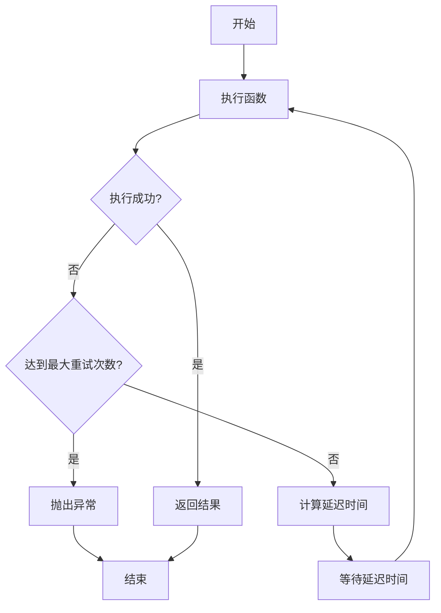
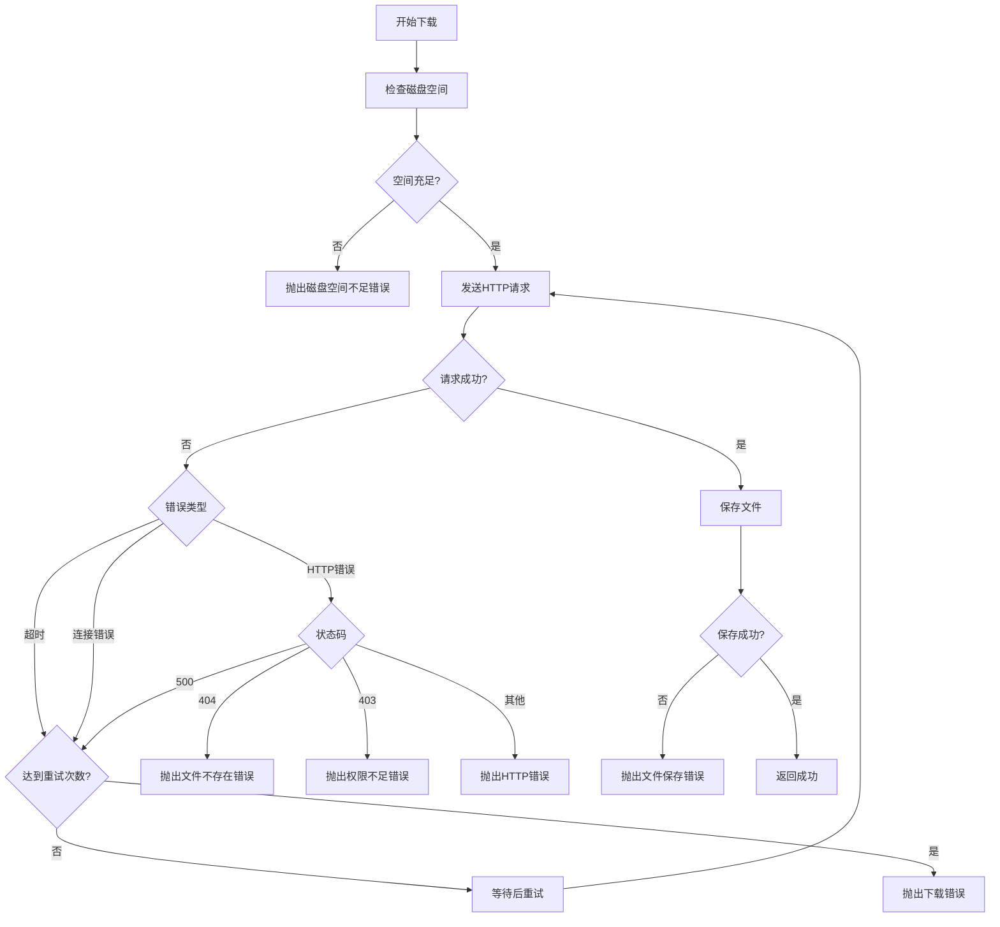
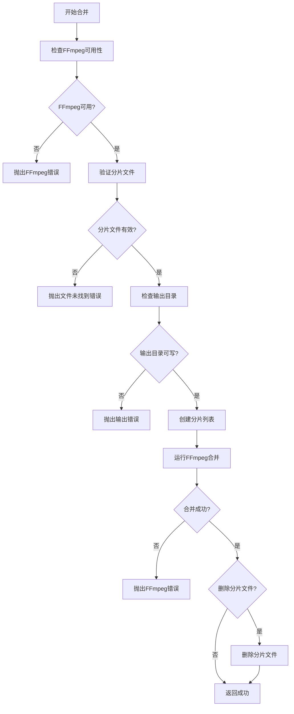

# 第 2 章: 错误处理

## 2.1 重试机制设计

### 2.1.1 重试策略

实现指数退避重试策略,避免服务器过载。

```python
import time
import logging
from typing import Callable, Optional, Any
from functools import wraps

logger = logging.getLogger(__name__)

def retry(
    max_retries: int = 3,
    base_delay: float = 1.0,
    max_delay: float = 60.0,
    exceptions: tuple = (Exception,)
):
    """"重试装饰器

    Args:
        max_retries: 最大重试次数
        base_delay: 基础延迟时间(秒)
        max_delay: 最大延迟时间(秒)
        exceptions: 需要重试的异常类型

    Examples:
        >>> @retry(max_retries=3, base_delay=1.0)
        ... def download_file(url: str) -> bool:
        ...     # 下载逻辑
        ...     return True
        >>> download_file("https://example.com/file.mp4")
    """
    def decorator(func: Callable) -> Callable:
        @wraps(func)
        def wrapper(*args, **kwargs) -> Optional[Any]:
            last_exception = None

            for attempt in range(max_retries):
                try:
                    return func(*args, **kwargs)
                except exceptions as e:
                    last_exception = e
                    if attempt < max_retries - 1:
                        delay = min(base_delay * (2 ** attempt), max_delay)
                        logger.warning(
                            f"{func.__name__}失败(尝试{attempt + 1}/{max_retries}),"
                            f"{delay}秒后重试: {e}"
                        )
                        time.sleep(delay)
                    else:
                        logger.error(
                            f"{func.__name__}失败,已达到最大重试次数: {e}"
                        )

            if last_exception:
                raise last_exception
            return None

        return wrapper
    return decorator


class RetryManager:
    """重试管理器

    该类提供灵活的重试机制,支持多种重试策略。

    Attributes:
        max_retries: 最大重试次数
        base_delay: 基础延迟时间(秒)
        max_delay: 最大延迟时间(秒)

    Examples:
        >>> manager = RetryManager(max_retries=3, base_delay=1.0)
        >>> result = manager.execute(
        ...     lambda: download_segment(url, output_path),
        ...     exceptions=(requests.exceptions.RequestException,)
        ... )
    """

    def __init__(
        self,
        max_retries: int = 3,
        base_delay: float = 1.0,
        max_delay: float = 60.0
    ):
        """初始化重试管理器

        Args:
            max_retries: 最大重试次数
            base_delay: 基础延迟时间(秒)
            max_delay: 最大延迟时间(秒)
        """
        self.max_retries = max_retries
        self.base_delay = base_delay
        self.max_delay = max_delay
        logger.info(
            f"重试管理器已初始化: max_retries={max_retries}, "
            f"base_delay={base_delay}, max_delay={max_delay}"
        )

    def execute(
        self,
        func: Callable,
        *args,
        exceptions: tuple = (Exception,),
        **kwargs
    ) -> Optional[Any]:
        """执行函数,支持重试

        Args:
            func: 要执行的函数
            args: 函数参数
            exceptions: 需要重试的异常类型
            kwargs: 函数关键字参数

        Returns:
            Optional[Any]: 函数返回值,如果全部失败则返回None

        Examples:
            >>> manager = RetryManager()
            >>> result = manager.execute(
            ...     lambda: download_segment(url, output_path),
            ...     exceptions=(requests.exceptions.RequestException,)
            ... )
        """
        last_exception = None

        for attempt in range(self.max_retries):
            try:
                return func(*args, **kwargs)
            except exceptions as e:
                last_exception = e
                if attempt < self.max_retries - 1:
                    delay = self._calculate_delay(attempt)
                    logger.warning(
                        f"执行失败(尝试{attempt + 1}/{self.max_retries}),"
                        f"{delay}秒后重试: {e}"
                    )
                    time.sleep(delay)
                else:
                    logger.error(
                        f"执行失败,已达到最大重试次数: {e}"
                    )

        if last_exception:
            raise last_exception
        return None

    def _calculate_delay(self, attempt: int) -> float:
        """计算重试延迟(指数退避)

        Args:
            attempt: 当前尝试次数

        Returns:
            float: 延迟时间(秒)
        """
        return min(self.base_delay * (2 ** attempt), self.max_delay)
```

### 2.1.2 重试流程

### RetryManager 使用示例

以下是 RetryManager 类的详细使用示例,展示如何在实际下载场景中应用重试机制:

````python
# 导入必要的模块
from src.retry_manager import RetryManager
import requests
from typing import Optional

# 创建重试管理器实例
retry_manager = RetryManager(
    max_retries=3,          # 最大重试次数
    base_delay=1.0,         # 基础延迟时间(秒)
    max_delay=60.0          # 最大延迟时间(秒)
)

# 定义需要重试的下载函数
def download_with_retry(url: str, output_path: str) -> bool:
    """带重试机制的下载函数

    Args:
        url: 下载URL
        output_path: 输出文件路径

    Returns:
        bool: 下载成功返回True,失败返回False
    ""
    def _download() -> bool:
        """内部下载实现"""
        try:
            response = requests.get(
                url,
                stream=True,
                timeout=30
            )
            response.raise_for_status()

            with open(output_path, 'wb') as f:
                for chunk in response.iter_content(chunk_size=8192):
                    if chunk:
                        f.write(chunk)

            return True
        except requests.exceptions.RequestException as e:
            print(f"下载失败: {e}")
            # 抛出异常让重试管理器捕获
            raise

    # 使用重试管理器执行下载
    try:
        return retry_manager.execute(
            func=_download,
            exceptions=(requests.exceptions.RequestException,)
        )
    except Exception as e:
        print(f"所有重试均失败: {e}")
        return False

# 使用示例
if __name__ == "__main__":
    url = "https://example.com/large_file.mp4"
    output_path = "./downloads/file.mp4"

    success = download_with_retry(url, output_path)
    if success:
        print("下载成功!")
    else:
        print("下载失败!")
```python

#### 参数说明

| 参数名      | 类型  | 默认值       | 说明                     |
| ----------- | ----- | ------------ | ------------------------ |
| max_retries | int   | 3            | 最大重试次数             |
| base_delay  | float | 1.0          | 基础延迟时间(秒)         |
| max_delay   | float | 60.0         | 最大延迟时间(秒)         |
| exceptions  | tuple | (Exception,) | 需要捕获并重试的异常类型 |

```

#### 高级用法

1. **自定义重试条件**:

```python
def should_retry(exc: Exception) -> bool:
    """自定义重试条件

    仅重试特定状态码的HTTP错误
    """
    if isinstance(exc, requests.exceptions.HTTPError):
        status_code = exc.response.status_code
        # 仅重试5xx状态码
        return 500 <= status_code < 600
    return True

# 使用自定义重试条件
result = retry_manager.execute(
    func=download_function,
    exceptions=(requests.exceptions.RequestException,),
    should_retry=should_retry
)
````

2. **结合日志系统**:

```python
import logging
logger = logging.getLogger(__name__)

def download_with_logging(url: str):
    def _download():
        logger.info(f"开始下载: {url}")
        # 下载实现...
        logger.info(f"下载成功: {url}")
        return True

    return retry_manager.execute(
        func=_download,
        exceptions=(requests.exceptions.RequestException,)
    )
```

### 2.1.2 重试流程



### 2.1.3 重试配置示例

在`config/settings.yaml`中配置重试相关设置:

```yaml
retry:
  # 最大重试次数
  max_retries: 3

  # 基础延迟时间(秒)
  base_delay: 1.0

  # 最大延迟时间(秒)
  max_delay: 60.0

  # 是否启用指数退避
  exponential_backoff: true

  # 重试的异常类型
  exceptions:
    - "requests.exceptions.Timeout"
    - "requests.exceptions.ConnectionError"
    - "requests.exceptions.HTTPError"
```

## 2.2 下载错误处理

### 2.2.1 下载异常定义

定义下载过程中的异常类型。

```python
class DownloadError(Exception):
    """下载错误基类"""
    pass


class DownloadTimeoutError(DownloadError):
    """下载超时错误"""
    pass


class DownloadConnectionError(DownloadError):
    """下载连接错误"""
    pass


class DownloadHTTPError(DownloadError):
    """下载HTTP错误"""

    def __init__(self, status_code: int, message: str = ""):
        """初始化HTTP错误

        Args:
            status_code: HTTP状态码
            message: 错误消息
        """
        self.status_code = status_code
        self.message = message
        super().__init__(f"HTTP {status_code}: {message}")


class DownloadFileError(DownloadError):
    """下载文件错误"""
    pass


class DownloadDiskFullError(DownloadError):
    """磁盘空间不足错误"""
    pass
```

### 2.2.2 下载错误处理器

```python
import requests
from pathlib import Path
import logging
from typing import Optional

logger = logging.getLogger(__name__)

class DownloadErrorHandler:
    """下载错误处理器

    该类负责处理下载过程中的各种错误。

    Attributes:
        max_retries: 最大重试次数
        timeout: 超时时间(秒)

    Examples:
        >>> handler = DownloadErrorHandler(max_retries=3, timeout=30)
        >>> try:
        ...     handler.handle_download(url, output_path)
        ... except DownloadError as e:
        ...     print(f"下载失败: {e}")
    """

    def __init__(self, max_retries: int = 3, timeout: int = 30):
        """初始化下载错误处理器

        Args:
            max_retries: 最大重试次数
            timeout: 超时时间(秒)
        """
        self.max_retries = max_retries
        self.timeout = timeout
        logger.info(f"下载错误处理器已初始化: max_retries={max_retries}")

    def handle_download(
        self,
        url: str,
        output_path: str,
        headers: Optional[dict] = None
    ) -> bool:
        """处理下载,包含错误处理和重试

        Args:
            url: 下载URL
            output_path: 输出文件路径
            headers: HTTP请求头

        Returns:
            bool: 下载成功返回True,失败返回False

        Raises:
            DownloadError: 下载错误
        """
        self._check_disk_space(output_path)

        for attempt in range(self.max_retries):
            try:
                response = requests.get(
                    url,
                    headers=headers,
                    timeout=self.timeout,
                    stream=True
                )
                response.raise_for_status()

                self._save_file(response, output_path)
                logger.info(f"下载成功: {url}")
                return True

            except requests.exceptions.Timeout:
                logger.warning(f"下载超时(尝试{attempt + 1}/{self.max_retries}): {url}")
                if attempt == self.max_retries - 1:
                    raise DownloadTimeoutError(f"下载超时: {url}")

            except requests.exceptions.ConnectionError as e:
                logger.warning(f"连接错误(尝试{attempt + 1}/{self.max_retries}): {e}")
                if attempt == self.max_retries - 1:
                    raise DownloadConnectionError(f"连接失败: {e}")

            except requests.exceptions.HTTPError as e:
                status_code = e.response.status_code
                logger.error(f"HTTP错误: {status_code}")

                if status_code == 404:
                    raise DownloadHTTPError(404, "文件不存在")
                elif status_code == 403:
                    raise DownloadHTTPError(403, "权限不足")
                elif status_code == 500:
                    if attempt < self.max_retries - 1:
                        continue
                    raise DownloadHTTPError(500, "服务器错误")
                else:
                    raise DownloadHTTPError(status_code, str(e))

            except IOError as e:
                logger.error(f"文件写入错误: {e}")
                if "No space left" in str(e):
                    raise DownloadDiskFullError("磁盘空间不足")
                raise DownloadFileError(f"文件写入失败: {e}")

            except Exception as e:
                logger.error(f"未知错误: {e}")
                raise DownloadError(f"下载失败: {e}")

        return False

    def _check_disk_space(self, output_path: str) -> None:
        """检查磁盘空间

        Args:
            output_path: 输出文件路径

        Raises:
            DownloadDiskFullError: 磁盘空间不足
        """
        import shutil
        output_dir = Path(output_path).parent

        if not output_dir.exists():
            return

        usage = shutil.disk_usage(output_dir)
        free_space_mb = usage.free / (1024 * 1024)

        if free_space_mb < 100:
            raise DownloadDiskFullError(
                f"磁盘空间不足,剩余空间: {free_space_mb:.2f}MB"
            )

    def _save_file(self, response: requests.Response, output_path: str) -> None:
        """保存文件

        Args:
            response: HTTP响应对象
            output_path: 输出文件路径

        Raises:
            DownloadFileError: 文件保存失败
        """
        try:
            Path(output_path).parent.mkdir(parents=True, exist_ok=True)

            with open(output_path, 'wb') as f:
                for chunk in response.iter_content(chunk_size=8192):
                    if chunk:
                        f.write(chunk)

        except Exception as e:
            raise DownloadFileError(f"文件保存失败: {e}")
```

### 2.2.3 下载错误处理流程



### 2.2.4 下载错误配置示例

在`config/settings.yaml`中配置下载错误处理相关设置:

```yaml
download_error:
  # 最大重试次数
  max_retries: 3

  # 超时时间(秒)
  timeout: 30

  # 最小可用空间(MB)
  min_free_space: 100

  # 是否检查磁盘空间
  check_disk_space: true

  # 错误码处理策略
  error_handling:
    404:
      action: "abort"
      message: "文件不存在"
    403:
      action: "abort"
      message: "权限不足"
    500:
      action: "retry"
      message: "服务器错误"
    502:
      action: "retry"
      message: "网关错误"
```

## 2.3 合并错误处理

### 2.3.1 合并异常定义

定义视频合并过程中的异常类型。

```python
class MergeError(Exception):
    """合并错误基类"""
    pass


class MergeFFmpegError(MergeError):
    """FFmpeg错误"""
    pass


class MergeFileNotFoundError(MergeError):
    """合并文件未找到错误"""
    pass


class MergeOutputError(MergeError):
    """合并输出错误"""
    pass
```

### 2.3.2 合并错误处理器

```python
import subprocess
from pathlib import Path
from typing import List
import logging

logger = logging.getLogger(__name__)

class MergeErrorHandler:
    """合并错误处理器

    该类负责处理视频合并过程中的各种错误。

    Attributes:
        ffmpeg_path: FFmpeg可执行文件路径

    Examples:
        >>> handler = MergeErrorHandler(ffmpeg_path="ffmpeg")
        >>> try:
        ...     handler.handle_merge(segments, output_file)
        ... except MergeError as e:
        ...     print(f"合并失败: {e}")
    """

    def __init__(self, ffmpeg_path: str = "ffmpeg"):
        """初始化合并错误处理器

        Args:
            ffmpeg_path: FFmpeg可执行文件路径
        """
        self.ffmpeg_path = ffmpeg_path
        self._check_ffmpeg()
        logger.info("合并错误处理器已初始化")

    def _check_ffmpeg(self) -> None:
        """检查FFmpeg是否可用

        Raises:
            MergeFFmpegError: FFmpeg未找到或不可用
        """
        try:
            result = subprocess.run(
                [self.ffmpeg_path, "-version"],
                capture_output=True,
                text=True,
                timeout=5
            )
            if result.returncode != 0:
                raise MergeFFmpegError("FFmpeg未找到或不可用")
        except Exception as e:
            raise MergeFFmpegError(f"FFmpeg检查失败: {e}")

    def handle_merge(
        self,
        segment_files: List[str],
        output_file: str,
        remove_segments: bool = True
    ) -> bool:
        """处理视频合并,包含错误处理

        Args:
            segment_files: 分片文件列表
            output_file: 输出文件路径
            remove_segments: 合并后是否删除分片文件

        Returns:
            bool: 合并成功返回True,失败返回False

        Raises:
            MergeError: 合并错误
        """
        self._validate_segments(segment_files)
        self._check_output_dir(output_file)

        try:
            list_file = self._create_segment_list(segment_files, output_file)
            self._run_ffmpeg_merge(list_file, output_file)

            if remove_segments:
                self._remove_segments(segment_files)

            logger.info(f"视频合并成功: {output_file}")
            return True

        except subprocess.TimeoutExpired:
            raise MergeFFmpegError("FFmpeg执行超时")

        except subprocess.CalledProcessError as e:
            error_msg = e.stderr.decode('utf-8', errors='ignore')
            logger.error(f"FFmpeg执行失败: {error_msg}")
            raise MergeFFmpegError(f"FFmpeg执行失败: {error_msg}")

        except IOError as e:
            raise MergeOutputError(f"输出文件创建失败: {e}")

        except Exception as e:
            raise MergeError(f"合并失败: {e}")

    def _validate_segments(self, segment_files: List[str]) -> None:
        """验证分片文件

        Args:
            segment_files: 分片文件列表

        Raises:
            MergeFileNotFoundError: 分片文件不存在
        """
        if not segment_files:
            raise MergeError("分片文件列表为空")

        for segment in segment_files:
            if not Path(segment).exists():
                raise MergeFileNotFoundError(f"分片文件不存在: {segment}")

            if Path(segment).stat().st_size == 0:
                raise MergeError(f"分片文件为空: {segment}")

    def _check_output_dir(self, output_file: str) -> None:
        """检查输出目录

        Args:
            output_file: 输出文件路径

        Raises:
            MergeOutputError: 输出目录不可写
        """
        output_dir = Path(output_file).parent
        output_dir.mkdir(parents=True, exist_ok=True)

        if not os.access(output_dir, os.W_OK):
            raise MergeOutputError(f"输出目录不可写: {output_dir}")

    def _create_segment_list(
        self,
        segment_files: List[str],
        output_file: str
    ) -> Path:
        """创建分片列表文件

        Args:
            segment_files: 分片文件列表
            output_file: 输出文件路径

        Returns:
            Path: 分片列表文件路径
        """
        list_file = Path(output_file).parent / "segments.txt"

        with open(list_file, 'w', encoding='utf-8') as f:
            for segment in segment_files:
                f.write(f"file '{Path(segment).absolute()}'\n")

        return list_file

    def _run_ffmpeg_merge(self, list_file: Path, output_file: str) -> None:
        """运行FFmpeg合并

        Args:
            list_file: 分片列表文件
            output_file: 输出文件路径

        Raises:
            MergeFFmpegError: FFmpeg执行失败
        """
        cmd = [
            self.ffmpeg_path,
            "-f", "concat",
            "-safe", "0",
            "-i", str(list_file),
            "-c", "copy",
            "-y",
            output_file
        ]

        logger.info(f"执行FFmpeg合并: {' '.join(cmd)}")

        result = subprocess.run(
            cmd,
            capture_output=True,
            text=True,
            timeout=3600
        )

        if result.returncode != 0:
            raise subprocess.CalledProcessError(
                result.returncode,
                cmd,
                result.stdout,
                result.stderr
            )

    def _remove_segments(self, segment_files: List[str]) -> None:
        """删除分片文件

        Args:
            segment_files: 分片文件列表
        """
        for segment in segment_files:
            try:
                Path(segment).unlink()
                logger.debug(f"已删除分片: {segment}")
            except Exception as e:
                logger.warning(f"删除分片失败: {e}")
```

### 2.3.3 合并错误处理流程



### 2.3.4 合并错误配置示例

在`config/settings.yaml`中配置合并错误处理相关设置:

```yaml
merge_error:
  # FFmpeg可执行文件路径
  ffmpeg_path: "ffmpeg"

  # FFmpeg超时时间(秒)
  ffmpeg_timeout: 3600

  # 是否验证分片文件
  validate_segments: true

  # 合并后是否删除分片文件
  remove_segments: true

  # 错误处理策略
  error_handling:
    ffmpeg_not_found:
      action: "abort"
      message: "FFmpeg未找到,请先安装FFmpeg"
    segment_not_found:
      action: "abort"
      message: "分片文件不存在"
    segment_empty:
      action: "abort"
      message: "分片文件为空"
    output_not_writable:
      action: "abort"
      message: "输出目录不可写"
```

## 2.4 错误码体系

### 2.4.1 错误码设计

设计统一的错误码体系,便于错误识别和处理。

```python
class ErrorCode:
    """错误码常量

    错误码格式: XXXYYZZZZ
    - XXX: 模块标识
      - 100: Cookie管理
      - 200: URL解析
      - 300: 下载管理
      - 400: 视频合并
      - 500: 文件管理
      - 600: 配置管理
      - 700: 鉴权管理
      - 900: 系统错误
    - YY: 错误类型
      - 01: 参数错误
      - 02: 文件错误
      - 03: 网络错误
      - 04: 权限错误
      - 05: 超时错误
      - 06: 格式错误
      - 07: 未知错误
    - ZZZZ: 错误编号
    """

    # Cookie管理错误 (100)
    COOKIE_NOT_FOUND = "10002001"
    COOKIE_INVALID = "10006001"
    COOKIE_EXPIRED = "10006002"
    COOKIE_SAVE_FAILED = "10002002"

    # URL解析错误 (200)
    URL_INVALID = "20006001"
    URL_PARSE_FAILED = "20007001"
    VIDEO_ID_NOT_FOUND = "20002001"

    # 下载管理错误 (300)
    DOWNLOAD_TIMEOUT = "30005001"
    DOWNLOAD_CONNECTION_ERROR = "30003001"
    DOWNLOAD_HTTP_ERROR = "30003002"
    DOWNLOAD_FILE_ERROR = "30002001"
    DOWNLOAD_DISK_FULL = "30002002"

    # 视频合并错误 (400)
    MERGE_FFMPEG_ERROR = "40007001"
    MERGE_FILE_NOT_FOUND = "40002001"
    MERGE_OUTPUT_ERROR = "40002002"
    MERGE_TIMEOUT = "40005001"

    # 文件管理错误 (500)
    FILE_NOT_FOUND = "50002001"
    FILE_READ_ERROR = "50002002"
    FILE_WRITE_ERROR = "50002003"
    DIR_CREATE_ERROR = "50002004"

    # 配置管理错误 (600)
    CONFIG_NOT_FOUND = "60002001"
    CONFIG_INVALID = "60006001"
    CONFIG_LOAD_FAILED = "60002002"
    CONFIG_SAVE_FAILED = "60002003"

    # 鉴权管理错误 (700)
    AUTH_FAILED = "70004001"
    AUTH_TOKEN_INVALID = "70006001"
    AUTH_TOKEN_EXPIRED = "70006002"

    # 系统错误 (900)
    SYSTEM_ERROR = "90007001"
    UNKNOWN_ERROR = "90007002"


class ErrorMessage:
    """错误消息映射"""

    MESSAGES = {
        ErrorCode.COOKIE_NOT_FOUND: "Cookie未找到",
        ErrorCode.COOKIE_INVALID: "Cookie格式无效",
        ErrorCode.COOKIE_EXPIRED: "Cookie已过期",
        ErrorCode.COOKIE_SAVE_FAILED: "Cookie保存失败",

        ErrorCode.URL_INVALID: "URL格式无效",
        ErrorCode.URL_PARSE_FAILED: "URL解析失败",
        ErrorCode.VIDEO_ID_NOT_FOUND: "无法提取视频ID",

        ErrorCode.DOWNLOAD_TIMEOUT: "下载超时",
        ErrorCode.DOWNLOAD_CONNECTION_ERROR: "连接错误",
        ErrorCode.DOWNLOAD_HTTP_ERROR: "HTTP错误",
        ErrorCode.DOWNLOAD_FILE_ERROR: "文件下载失败",
        ErrorCode.DOWNLOAD_DISK_FULL: "磁盘空间不足",

        ErrorCode.MERGE_FFMPEG_ERROR: "FFmpeg执行失败",
        ErrorCode.MERGE_FILE_NOT_FOUND: "分片文件未找到",
        ErrorCode.MERGE_OUTPUT_ERROR: "输出文件创建失败",
        ErrorCode.MERGE_TIMEOUT: "视频合并超时",

        ErrorCode.FILE_NOT_FOUND: "文件未找到",
        ErrorCode.FILE_READ_ERROR: "文件读取失败",
        ErrorCode.FILE_WRITE_ERROR: "文件写入失败",
        ErrorCode.DIR_CREATE_ERROR: "目录创建失败",

        ErrorCode.CONFIG_NOT_FOUND: "配置文件未找到",
        ErrorCode.CONFIG_INVALID: "配置格式无效",
        ErrorCode.CONFIG_LOAD_FAILED: "配置加载失败",
        ErrorCode.CONFIG_SAVE_FAILED: "配置保存失败",

        ErrorCode.AUTH_FAILED: "认证失败",
        ErrorCode.AUTH_TOKEN_INVALID: "认证令牌无效",
        ErrorCode.AUTH_TOKEN_EXPIRED: "认证令牌已过期",

        ErrorCode.SYSTEM_ERROR: "系统错误",
        ErrorCode.UNKNOWN_ERROR: "未知错误",
    }

    @classmethod
    def get_message(cls, error_code: str) -> str:
        """获取错误消息

        Args:
            error_code: 错误码

        Returns:
            str: 错误消息
        """
        return cls.MESSAGES.get(error_code, "未知错误")


class AppError(Exception):
    """应用程序错误基类

    Attributes:
        error_code: 错误码
        message: 错误消息
        details: 错误详情
    """

    def __init__(
        self,
        error_code: str,
        message: Optional[str] = None,
        details: Optional[dict] = None
    ):
        """初始化应用程序错误

        Args:
            error_code: 错误码
            message: 错误消息,如果为None则从ErrorMessage获取
            details: 错误详情
        """
        self.error_code = error_code
        self.message = message or ErrorMessage.get_message(error_code)
        self.details = details or {}
        super().__init__(self.message)

    def to_dict(self) -> dict:
        """转换为字典

        Returns:
            dict: 错误信息字典
        """
        return {
            'error_code': self.error_code,
            'message': self.message,
            'details': self.details
        }
```

### 2.4.2 错误码使用示例

```python
# 抛出错误
raise AppError(
    ErrorCode.DOWNLOAD_TIMEOUT,
    details={'url': 'https://example.com/video.m3u8', 'timeout': 30}
)

# 捕获错误
try:
    download_segment(url, output_path)
except AppError as e:
    print(f"错误码: {e.error_code}")
    print(f"错误消息: {e.message}")
    print(f"错误详情: {e.details}")

    # 转换为字典
    error_dict = e.to_dict()
    print(error_dict)
```

### 2.4.3 错误码与解决方案映射表

| 错误码   | 错误消息         | 解决方案                                      |
| -------- | ---------------- | --------------------------------------------- |
| 10002001 | Cookie 未找到    | 检查 Cookie 文件是否存在,或重新输入 Cookie    |
| 10006001 | Cookie 格式无效  | 检查 Cookie 格式是否正确,确保包含必要的字段   |
| 10006002 | Cookie 已过期    | 更新 Cookie,获取新的认证信息                  |
| 10002002 | Cookie 保存失败  | 检查文件权限,确保有写入权限                   |
| 20006001 | URL 格式无效     | 检查 URL 格式是否正确,确保包含协议和域名      |
| 20007001 | URL 解析失败     | 检查 URL 是否完整,确保没有特殊字符            |
| 20002001 | 无法提取视频 ID  | 检查 URL 路径是否正确,确保包含视频 ID         |
| 30005001 | 下载超时         | 增加超时时间,或检查网络连接                   |
| 30003001 | 连接错误         | 检查网络连接,确保可以访问服务器               |
| 30003002 | HTTP 错误        | 检查 HTTP 状态码,根据状态码采取相应措施       |
| 30002001 | 文件下载失败     | 检查磁盘空间,确保有足够的空间                 |
| 30002002 | 磁盘空间不足     | 清理磁盘空间,或更换下载目录                   |
| 40007001 | FFmpeg 执行失败  | 检查 FFmpeg 是否正确安装,查看 FFmpeg 错误日志 |
| 40002001 | 分片文件未找到   | 检查分片文件是否存在,确保下载成功             |
| 40002002 | 输出文件创建失败 | 检查输出目录权限,确保有写入权限               |
| 40005001 | 视频合并超时     | 增加超时时间,或检查视频文件大小               |
| 50002001 | 文件未找到       | 检查文件路径是否正确                          |
| 50002002 | 文件读取失败     | 检查文件权限,确保有读取权限                   |
| 50002003 | 文件写入失败     | 检查文件权限,确保有写入权限                   |
| 50002004 | 目录创建失败     | 检查目录权限,确保有创建权限                   |
| 60002001 | 配置文件未找到   | 检查配置文件路径是否正确                      |
| 60006001 | 配置格式无效     | 检查配置文件格式,确保是有效的 YAML            |
| 60002002 | 配置加载失败     | 检查配置文件内容,确保没有语法错误             |
| 60002003 | 配置保存失败     | 检查文件权限,确保有写入权限                   |
| 70004001 | 认证失败         | 检查 Cookie 是否有效,更新认证信息             |
| 70006001 | 认证令牌无效     | 检查认证令牌格式,确保正确                     |
| 70006002 | 认证令牌已过期   | 更新认证令牌,获取新的认证信息                 |
| 90007001 | 系统错误         | 检查系统日志,查看详细错误信息                 |
| 90007002 | 未知错误         | 联系技术支持,提供详细错误信息                 |

### 2.4.4 错误码配置示例

在`config/settings.yaml`中配置错误码相关设置:

```yaml
error:
  # 是否启用错误码
  enable_error_code: true

  # 是否记录错误详情
  log_error_details: true

  # 错误日志文件
  error_log_file: "./logs/error.log"

  # 是否发送错误报告
  send_error_report: false

  # 错误报告URL
  error_report_url: ""
```
