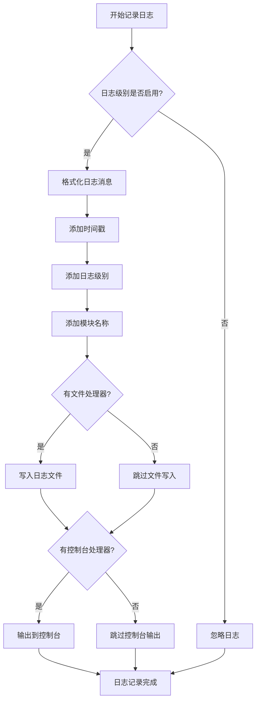
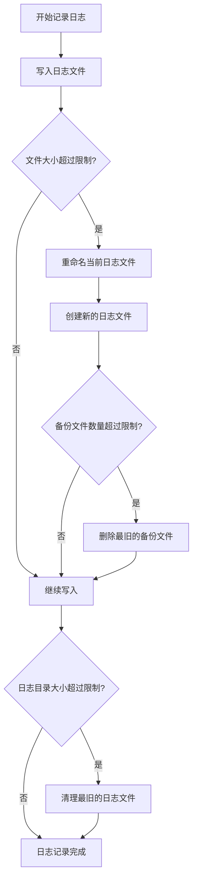

# 第3章: 日志系统

## 3.1 日志分级策略

### 3.1.1 日志级别定义

定义清晰的日志级别,便于日志管理和问题排查。

```python
import logging
from enum import Enum
from typing import Optional

class LogLevel(Enum):
    """日志级别枚举
    
    Attributes:
        DEBUG: 调试信息,详细的诊断信息
        INFO: 一般信息,确认程序按预期运行
        WARNING: 警告信息,表示发生了意外情况
        ERROR: 错误信息,由于更严重的问题,程序未能执行某些功能
        CRITICAL: 严重错误,表示程序本身可能无法继续运行
    """
    DEBUG = logging.DEBUG
    INFO = logging.INFO
    WARNING = logging.WARNING
    ERROR = logging.ERROR
    CRITICAL = logging.CRITICAL


class LogLevelConfig:
    """日志级别配置
    
    定义不同场景下的日志级别。
    """
    
    # 开发环境日志级别
    DEVELOPMENT = LogLevel.DEBUG
    
    # 生产环境日志级别
    PRODUCTION = LogLevel.INFO
    
    # 测试环境日志级别
    TESTING = LogLevel.DEBUG
    
    # 调试模式日志级别
    DEBUG_MODE = LogLevel.DEBUG
```

### 3.1.2 日志级别使用规范

```python
import logging

logger = logging.getLogger(__name__)

# DEBUG级别: 详细的诊断信息,通常只在开发时使用
logger.debug("开始下载分片: segment_0001.ts")
logger.debug(f"下载进度: {50}%")
logger.debug(f"Cookie内容: {cookie_data}")

# INFO级别: 一般信息,确认程序按预期运行
logger.info("下载管理器已初始化")
logger.info("下载成功: https://example.com/video.m3u8")
logger.info("视频合并完成: output.mp4")

# WARNING级别: 警告信息,表示发生了意外情况,但程序仍可继续运行
logger.warning("下载速度较慢: 100KB/s")
logger.warning("Cookie即将过期,请及时更新")
logger.warning("磁盘空间不足,剩余空间: 500MB")

# ERROR级别: 错误信息,由于更严重的问题,程序未能执行某些功能
logger.error("下载失败: 连接超时")
logger.error("视频合并失败: FFmpeg执行错误")
logger.error("文件写入失败: 权限不足")

# CRITICAL级别: 严重错误,表示程序本身可能无法继续运行
logger.critical("系统内存不足,程序即将崩溃")
logger.critical("关键配置文件丢失,无法启动程序")
logger.critical("数据库连接失败,程序无法继续运行")
```

### 3.1.3 日志级别配置

在`config/settings.yaml`中配置日志级别:

```yaml
logging:
  # 全局日志级别
  level: "INFO"
  
  # 不同模块的日志级别
  module_levels:
    cookie_manager: "DEBUG"
    url_parser: "INFO"
    download_manager: "INFO"
    video_merger: "INFO"
    file_manager: "DEBUG"
    
  # 环境特定配置
  environments:
    development:
      level: "DEBUG"
    production:
      level: "INFO"
    testing:
      level: "DEBUG"
```

## 3.2 日志记录规范

### 3.2.1 日志格式定义

定义统一的日志格式,便于日志解析和分析。

```python
import logging
from typing import Optional

class LogFormatter:
    """日志格式化器
    
    定义统一的日志格式。
    """
    
    # 标准日志格式
    STANDARD_FORMAT = "%(asctime)s - %(name)s - %(levelname)s - %(message)s"
    
    # 详细日志格式(包含文件名和行号)
    DETAILED_FORMAT = "%(asctime)s - %(name)s - %(levelname)s - %(filename)s:%(lineno)d - %(message)s"
    
    # JSON日志格式(用于日志分析系统)
    JSON_FORMAT = "%(asctime)s|%(name)s|%(levelname)s|%(filename)s|%(lineno)d|%(message)s"
    
    # 简洁日志格式(用于控制台输出)
    SIMPLE_FORMAT = "%(levelname)s - %(message)s"


class LogConfig:
    """日志配置
    
    配置日志系统的各个方面。
    """
    
    def __init__(
        self,
        level: str = "INFO",
        format_type: str = "standard",
        log_file: Optional[str] = None,
        max_bytes: int = 10 * 1024 * 1024,
        backup_count: int = 5
    ):
        """初始化日志配置
        
        Args:
            level: 日志级别
            format_type: 日志格式类型(standard/detailed/json/simple)
            log_file: 日志文件路径
            max_bytes: 日志文件最大大小(字节)
            backup_count: 备份文件数量
        """
        self.level = level
        self.format_type = format_type
        self.log_file = log_file
        self.max_bytes = max_bytes
        self.backup_count = backup_count
    
    def get_format(self) -> str:
        """获取日志格式
        
        Returns:
            str: 日志格式字符串
        """
        formats = {
            'standard': LogFormatter.STANDARD_FORMAT,
            'detailed': LogFormatter.DETAILED_FORMAT,
            'json': LogFormatter.JSON_FORMAT,
            'simple': LogFormatter.SIMPLE_FORMAT
        }
        return formats.get(self.format_type, LogFormatter.STANDARD_FORMAT)
```

### 3.2.2 日志记录器实现

```python
import logging
from logging.handlers import RotatingFileHandler
from pathlib import Path
from typing import Optional
import sys

class Logger:
    """日志记录器
    
    提供统一的日志记录接口。
    
    Attributes:
        name: 日志记录器名称
        level: 日志级别
        log_file: 日志文件路径
    
    Examples:
        >>> logger = Logger(__name__, level="INFO", log_file="./logs/app.log")
        >>> logger.info("程序启动")
        >>> logger.error("发生错误")
    """
    
    def __init__(
        self,
        name: str,
        level: str = "INFO",
        log_file: Optional[str] = None,
        format_type: str = "standard"
    ):
        """初始化日志记录器
        
        Args:
            name: 日志记录器名称
            level: 日志级别
            log_file: 日志文件路径
            format_type: 日志格式类型
        """
        self.logger = logging.getLogger(name)
        self.logger.setLevel(getattr(logging, level.upper()))
        
        # 避免重复添加处理器
        if not self.logger.handlers:
            self._setup_handlers(log_file, format_type)
    
    def _setup_handlers(
        self,
        log_file: Optional[str],
        format_type: str
    ) -> None:
        """设置日志处理器
        
        Args:
            log_file: 日志文件路径
            format_type: 日志格式类型
        """
        formatter = logging.Formatter(LogConfig(format_type=format_type).get_format())
        
        # 控制台处理器
        console_handler = logging.StreamHandler(sys.stdout)
        console_handler.setFormatter(formatter)
        self.logger.addHandler(console_handler)
        
        # 文件处理器
        if log_file:
            Path(log_file).parent.mkdir(parents=True, exist_ok=True)
            file_handler = RotatingFileHandler(
                log_file,
                maxBytes=10 * 1024 * 1024,
                backupCount=5,
                encoding='utf-8'
            )
            file_handler.setFormatter(formatter)
            self.logger.addHandler(file_handler)
    
    def debug(self, message: str) -> None:
        """记录DEBUG级别日志
        
        Args:
            message: 日志消息
        """
        self.logger.debug(message)
    
    def info(self, message: str) -> None:
        """记录INFO级别日志
        
        Args:
            message: 日志消息
        """
        self.logger.info(message)
    
    def warning(self, message: str) -> None:
        """记录WARNING级别日志
        
        Args:
            message: 日志消息
        """
        self.logger.warning(message)
    
    def error(self, message: str, exc_info: bool = False) -> None:
        """记录ERROR级别日志
        
        Args:
            message: 日志消息
            exc_info: 是否包含异常信息
        """
        self.logger.error(message, exc_info=exc_info)
    
    def critical(self, message: str, exc_info: bool = False) -> None:
        """记录CRITICAL级别日志
        
        Args:
            message: 日志消息
            exc_info: 是否包含异常信息
        """
        self.logger.critical(message, exc_info=exc_info)
    
    def exception(self, message: str) -> None:
        """记录异常日志(自动包含异常信息)
        
        Args:
            message: 日志消息
        """
        self.logger.exception(message)


def get_logger(name: str) -> Logger:
    """获取日志记录器
    
    Args:
        name: 日志记录器名称
    
    Returns:
        Logger: 日志记录器实例
    
    Examples:
        >>> logger = get_logger(__name__)
        >>> logger.info("程序启动")
    """
    return Logger(name)
```

### 3.2.3 日志记录规范

```python
import logging

logger = get_logger(__name__)

# 1. 记录关键操作节点
logger.info("开始下载视频: https://example.com/video.m3u8")
logger.info("下载进度: 50/100")
logger.info("视频合并完成: output.mp4")

# 2. 记录错误和异常
try:
    download_segment(url, output_path)
except Exception as e:
    logger.error(f"下载失败: {e}", exc_info=True)

# 3. 记录警告信息
if disk_space < 100:
    logger.warning(f"磁盘空间不足,剩余空间: {disk_space}MB")

# 4. 记录调试信息(仅在开发环境)
logger.debug(f"下载参数: url={url}, timeout={timeout}")

# 5. 记录性能指标
import time
start_time = time.time()
download_segment(url, output_path)
duration = time.time() - start_time
logger.info(f"下载耗时: {duration:.2f}秒")

# 6. 记录业务逻辑
logger.info(f"用户 {user_id} 开始下载视频 {video_id}")
logger.info(f"下载成功: {video_id}, 文件大小: {file_size}MB")

# 7. 记录配置变更
logger.info(f"配置已更新: max_retries={new_value}")

# 8. 记录系统状态
logger.info(f"系统状态: CPU={cpu_usage}%, 内存={memory_usage}MB")
```

### 3.2.4 日志记录流程



## 3.3 日志管理方案

### 3.3.1 日志轮转

使用RotatingFileHandler实现日志轮转,避免日志文件过大。

```python
import logging
from logging.handlers import RotatingFileHandler
from pathlib import Path

class LogRotator:
    """日志轮转管理器
    
    管理日志文件的轮转和清理。
    
    Attributes:
        log_file: 日志文件路径
        max_bytes: 日志文件最大大小(字节)
        backup_count: 备份文件数量
    
    Examples:
        >>> rotator = LogRotator("./logs/app.log", max_bytes=10*1024*1024, backup_count=5)
        >>> rotator.setup_rotating_handler(logger)
    """
    
    def __init__(
        self,
        log_file: str,
        max_bytes: int = 10 * 1024 * 1024,
        backup_count: int = 5
    ):
        """初始化日志轮转管理器
        
        Args:
            log_file: 日志文件路径
            max_bytes: 日志文件最大大小(字节)
            backup_count: 备份文件数量
        """
        self.log_file = log_file
        self.max_bytes = max_bytes
        self.backup_count = backup_count
        
        # 确保日志目录存在
        Path(log_file).parent.mkdir(parents=True, exist_ok=True)
    
    def setup_rotating_handler(
        self,
        logger: logging.Logger,
        formatter: logging.Formatter
    ) -> None:
        """设置轮转文件处理器
        
        Args:
            logger: 日志记录器
            formatter: 日志格式化器
        """
        handler = RotatingFileHandler(
            self.log_file,
            maxBytes=self.max_bytes,
            backupCount=self.backup_count,
            encoding='utf-8'
        )
        handler.setFormatter(formatter)
        logger.addHandler(handler)
    
    def get_log_files(self) -> list:
        """获取所有日志文件
        
        Returns:
            list: 日志文件路径列表
        """
        log_dir = Path(self.log_file).parent
        log_pattern = Path(self.log_file).name
        
        log_files = sorted(
            log_dir.glob(f"{log_pattern}*"),
            key=lambda x: x.stat().st_mtime,
            reverse=True
        )
        
        return [str(f) for f in log_files]
    
    def clean_old_logs(self, keep_days: int = 30) -> None:
        """清理旧日志文件
        
        Args:
            keep_days: 保留天数
        """
        import time
        
        log_files = self.get_log_files()
        current_time = time.time()
        
        for log_file in log_files[1:]:  # 跳过当前日志文件
            file_time = Path(log_file).stat().st_mtime
            age_days = (current_time - file_time) / (24 * 60 * 60)
            
            if age_days > keep_days:
                try:
                    Path(log_file).unlink()
                    logger.info(f"已删除旧日志文件: {log_file}")
                except Exception as e:
                    logger.error(f"删除日志文件失败: {e}")
```

### 3.3.2 日志存储管理

```python
import os
import shutil
from pathlib import Path
from typing import List
import logging

logger = logging.getLogger(__name__)

class LogManager:
    """日志管理器
    
    管理日志的存储、清理和归档。
    
    Attributes:
        log_dir: 日志目录
        max_size: 日志目录最大大小(MB)
        max_age: 日志文件最大保留天数
    
    Examples:
        >>> manager = LogManager("./logs", max_size=100, max_age=30)
        >>> manager.clean_logs()
    """
    
    def __init__(
        self,
        log_dir: str,
        max_size: int = 100,
        max_age: int = 30
    ):
        """初始化日志管理器
        
        Args:
            log_dir: 日志目录
            max_size: 日志目录最大大小(MB)
            max_age: 日志文件最大保留天数
        """
        self.log_dir = Path(log_dir)
        self.max_size = max_size * 1024 * 1024  # 转换为字节
        self.max_age = max_age
        
        self.log_dir.mkdir(parents=True, exist_ok=True)
        logger.info(f"日志管理器已初始化: log_dir={log_dir}")
    
    def get_log_size(self) -> int:
        """获取日志目录大小
        
        Returns:
            int: 日志目录大小(字节)
        """
        total_size = 0
        for file in self.log_dir.rglob("*.log"):
            total_size += file.stat().st_size
        return total_size
    
    def get_log_files(self) -> List[Path]:
        """获取所有日志文件
        
        Returns:
            List[Path]: 日志文件列表
        """
        return sorted(
            self.log_dir.rglob("*.log"),
            key=lambda x: x.stat().st_mtime,
            reverse=True
        )
    
    def clean_logs(self) -> None:
        """清理日志文件
        
        清理超过最大大小或超过最大保留天数的日志文件。
        """
        import time
        
        current_time = time.time()
        log_files = self.get_log_files()
        
        # 清理超过最大保留天数的日志
        for log_file in log_files:
            age_days = (current_time - log_file.stat().st_mtime) / (24 * 60 * 60)
            
            if age_days > self.max_age:
                try:
                    log_file.unlink()
                    logger.info(f"已删除过期日志文件: {log_file}")
                except Exception as e:
                    logger.error(f"删除日志文件失败: {e}")
        
        # 如果日志目录大小超过限制,删除最旧的日志
        while self.get_log_size() > self.max_size:
            log_files = self.get_log_files()
            
            if not log_files:
                break
            
            oldest_log = log_files[-1]
            try:
                oldest_log.unlink()
                logger.info(f"已删除最旧的日志文件: {oldest_log}")
            except Exception as e:
                logger.error(f"删除日志文件失败: {e}")
                break
    
    def archive_logs(self, archive_dir: str) -> None:
        """归档日志文件
        
        Args:
            archive_dir: 归档目录
        """
        import zipfile
        from datetime import datetime
        
        archive_path = Path(archive_dir)
        archive_path.mkdir(parents=True, exist_ok=True)
        
        timestamp = datetime.now().strftime("%Y%m%d_%H%M%S")
        archive_file = archive_path / f"logs_{timestamp}.zip"
        
        log_files = self.get_log_files()
        
        with zipfile.ZipFile(archive_file, 'w', zipfile.ZIP_DEFLATED) as zipf:
            for log_file in log_files:
                zipf.write(log_file, log_file.name)
        
        logger.info(f"日志已归档到: {archive_file}")
        
        # 归档后删除原日志文件
        for log_file in log_files:
            try:
                log_file.unlink()
            except Exception as e:
                logger.error(f"删除日志文件失败: {e}")
    
    def get_log_stats(self) -> dict:
        """获取日志统计信息
        
        Returns:
            dict: 日志统计信息
        """
        log_files = self.get_log_files()
        total_size = self.get_log_size()
        
        return {
            'log_count': len(log_files),
            'total_size': total_size,
            'total_size_mb': total_size / (1024 * 1024),
            'oldest_log': log_files[-1].name if log_files else None,
            'newest_log': log_files[0].name if log_files else None
        }
```

### 3.3.3 日志配置示例

在`config/settings.yaml`中配置日志系统:

```yaml
logging:
  # 全局日志级别
  level: "INFO"
  
  # 日志格式
  format: "%(asctime)s - %(name)s - %(levelname)s - %(message)s"
  
  # 日志文件
  file: "./logs/download.log"
  
  # 日志文件最大大小(字节)
  max_bytes: 10485760
  
  # 备份文件数量
  backup_count: 5
  
  # 日志目录配置
  log_dir: "./logs"
  
  # 日志目录最大大小(MB)
  max_log_size: 100
  
  # 日志文件最大保留天数
  max_log_age: 30
  
  # 是否启用日志归档
  enable_archive: true
  
  # 归档目录
  archive_dir: "./logs/archive"
  
  # 不同模块的日志级别
  module_levels:
    cookie_manager: "DEBUG"
    url_parser: "INFO"
    download_manager: "INFO"
    video_merger: "INFO"
    file_manager: "DEBUG"
    config_manager: "INFO"
    auth_manager: "INFO"
  
  # 控制台日志配置
  console:
    enabled: true
    level: "INFO"
    format: "%(levelname)s - %(message)s"
```

### 3.3.4 日志管理流程



### 3.3.5 日志最佳实践

```python
import logging

logger = get_logger(__name__)

# 1. 使用适当的日志级别
logger.debug("调试信息")      # 仅在开发环境使用
logger.info("一般信息")       # 确认程序按预期运行
logger.warning("警告信息")    # 表示发生了意外情况
logger.error("错误信息")      # 程序未能执行某些功能
logger.critical("严重错误")  # 程序可能无法继续运行

# 2. 记录关键操作节点
logger.info("程序启动")
logger.info("开始下载视频")
logger.info("下载完成")
logger.info("程序退出")

# 3. 记录错误和异常
try:
    download_segment(url, output_path)
except Exception as e:
    logger.error(f"下载失败: {e}", exc_info=True)

# 4. 记录性能指标
import time
start_time = time.time()
download_segment(url, output_path)
duration = time.time() - start_time
logger.info(f"下载耗时: {duration:.2f}秒")

# 5. 记录业务逻辑
logger.info(f"用户 {user_id} 开始下载视频 {video_id}")
logger.info(f"下载成功: {video_id}, 文件大小: {file_size}MB")

# 6. 避免记录敏感信息
# 不好的示例
logger.info(f"用户密码: {password}")

# 好的示例
logger.info(f"用户登录成功: {username}")

# 7. 使用结构化日志
logger.info("下载完成", extra={
    'video_id': video_id,
    'file_size': file_size,
    'duration': duration
})

# 8. 定期清理日志
log_manager = LogManager("./logs", max_size=100, max_age=30)
log_manager.clean_logs()
```
