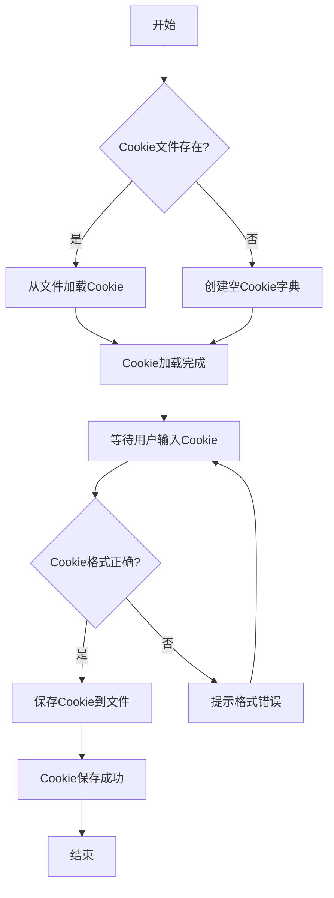
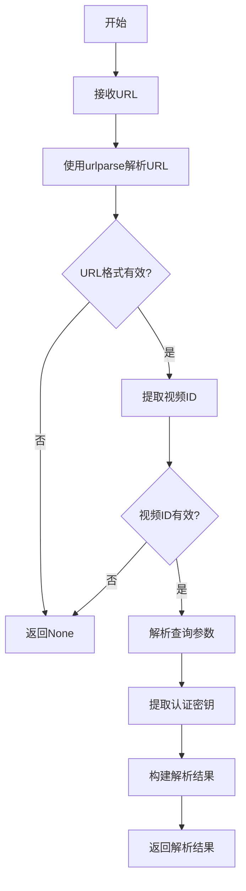
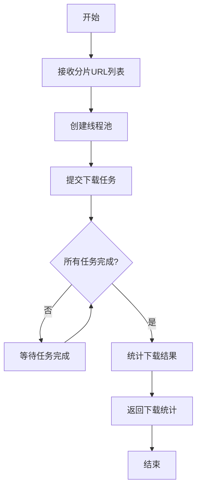
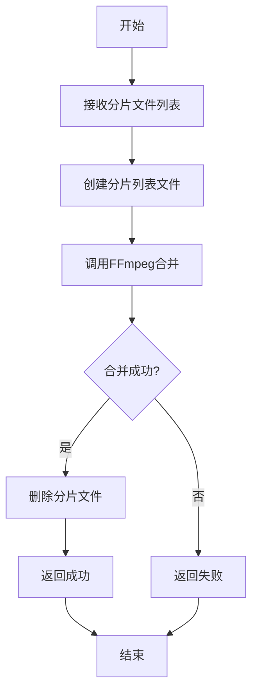
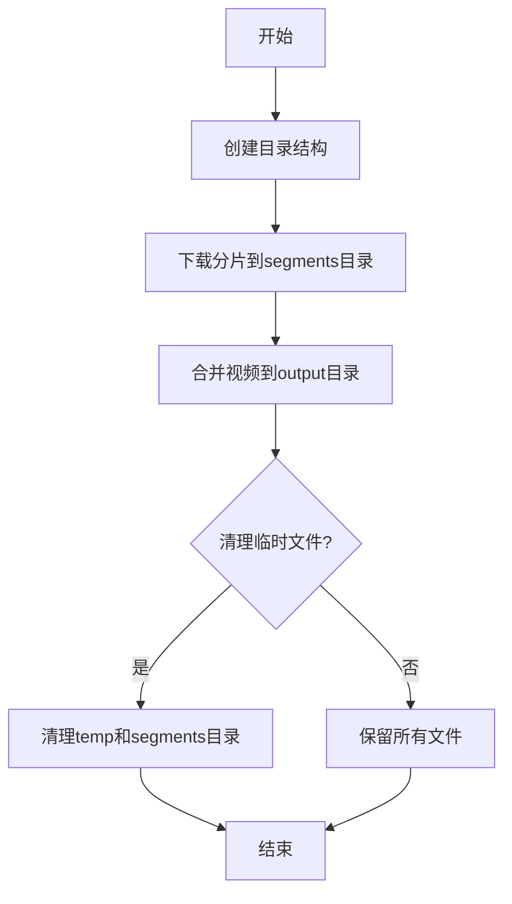
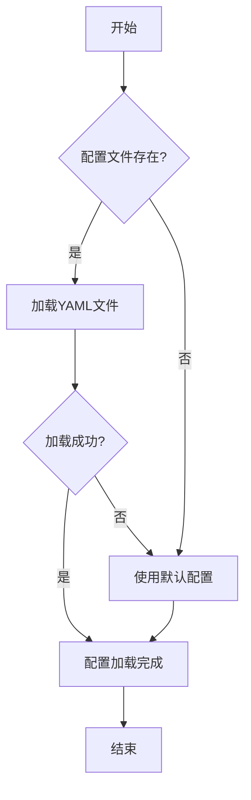
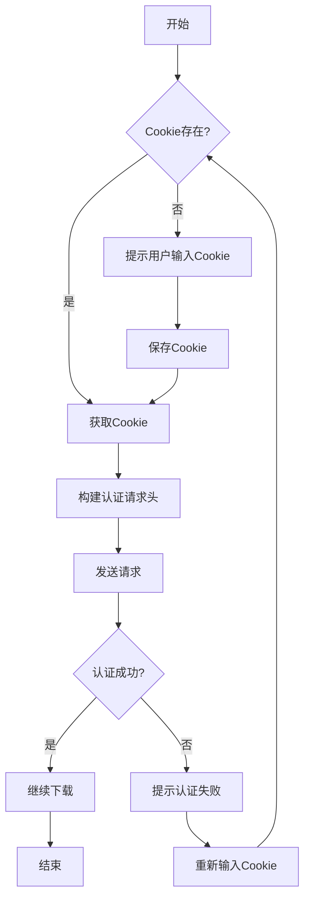

# 钉钉直播回放下载软件开发指南

## 文档信息

- **文档标题**: 钉钉直播回放下载软件开发指南
- **文档版本**: v1.0.0
- **发布日期**: 2026-01-16
- **作者**: Trae AI Assistant
- **适用人群**: Python 开发者、视频下载工具开发者

## 文档简介

本文档详细介绍了如何开发一个完整的钉钉直播回放下载软件,涵盖了功能实现、错误处理、日志系统、测试验证和代码规范等方面的内容。文档提供了详细的代码示例、配置说明和最佳实践,帮助开发者快速理解和实现钉钉直播回放下载功能。

## 目录

- [第 1 章: 功能实现](#第1章-功能实现)

  - [1.1 Cookie 获取机制](#11-cookie获取机制)
  - [1.2 钉钉直播回放链接解析](#12-钉钉直播回放链接解析)
  - [1.3 视频分片下载](#13-视频分片下载)
  - [1.4 视频合并技术](#14-视频合并技术)
  - [1.5 文件管理策略](#15-文件管理策略)
  - [1.6 配置管理](#16-配置管理)
  - [1.7 鉴权管理](#17-鉴权管理)

- [第 2 章: 错误处理](#第2章-错误处理)

  - [2.1 重试机制设计](#21-重试机制设计)
  - [2.2 下载错误处理](#22-下载错误处理)
  - [2.3 合并错误处理](#23-合并错误处理)
  - [2.4 错误码体系](#24-错误码体系)

- [第 3 章: 日志系统](#第3章-日志系统)

  - [3.1 日志分级策略](#31-日志分级策略)
  - [3.2 日志记录规范](#32-日志记录规范)
  - [3.3 日志管理方案](#33-日志管理方案)

- [第 4 章: 测试与验证](#第4章-测试与验证)

  - [4.1 单元测试](#41-单元测试)
  - [4.2 集成测试](#42-集成测试)
  - [4.3 性能测试](#43-性能测试)
  - [4.4 异常测试](#44-异常测试)
  - [4.5 测试覆盖率要求](#45-测试覆盖率要求)
  - [4.6 测试最佳实践](#46-测试最佳实践)

- [第 5 章: 代码规范](#第5章-代码规范)

  - [5.1 Python 风格规范](#51-python风格规范)
  - [5.2 模块化设计](#52-模块化设计)
  - [5.3 命名规范](#53-命名规范)
  - [5.4 文档要求](#54-文档要求)
  - [5.5 代码质量检查](#55-代码质量检查)
  - [5.6 代码审查清单](#56-代码审查清单)
  - [5.7 重构建议](#57-重构建议)

- [附录](#附录)
  - [术语表](#术语表)
  - [参考文献](#参考文献)
  - [版本历史](#版本历史)

---

# 第 1 章: 功能实现

## 1.1 Cookie 获取机制

### 1.1.1 Cookie 管理器设计

Cookie 管理器负责管理钉钉直播回放下载所需的 Cookie,包括 Cookie 的读取、保存、删除等功能。

```python
import json
import os
from pathlib import Path
from typing import Dict, Optional
import logging

logger = logging.getLogger(__name__)

class CookieManager:
    """Cookie管理器

    该类提供Cookie的读取、保存、删除等功能。
    支持从JSON文件加载和保存Cookie。

    Attributes:
        cookie_file: Cookie文件路径
        cookies: Cookie字典,键为域名,值为Cookie数据

    Examples:
        >>> manager = CookieManager("./cookies/cookies.json")
        >>> manager.save_cookie("dingtalk.com", {"session": "abc123"})
        >>> cookie = manager.load_cookie("dingtalk.com")
        >>> print(cookie)
        {'session': 'abc123'}
    """

    def __init__(self, cookie_file: str = "./cookies/cookies.json"):
        """初始化Cookie管理器

        Args:
            cookie_file: Cookie文件路径,默认为"./cookies/cookies.json"

        Raises:
            FileNotFoundError: 如果Cookie文件不存在且无法创建
        """
        self.cookie_file = cookie_file
        self.cookies: Dict[str, Dict] = {}
        self._ensure_cookie_dir()
        self._load_cookies()

    def _ensure_cookie_dir(self) -> None:
        """确保Cookie目录存在"""
        cookie_dir = Path(self.cookie_file).parent
        cookie_dir.mkdir(parents=True, exist_ok=True)
        logger.debug(f"Cookie目录已创建: {cookie_dir}")

    def _load_cookies(self) -> None:
        """从文件加载Cookie"""
        if Path(self.cookie_file).exists():
            try:
                with open(self.cookie_file, 'r', encoding='utf-8') as f:
                    self.cookies = json.load(f)
                logger.info(f"已从{self.cookie_file}加载{len(self.cookies)}个Cookie")
            except Exception as e:
                logger.error(f"加载Cookie失败: {e}")
                self.cookies = {}
        else:
            logger.info(f"Cookie文件不存在,将创建新文件: {self.cookie_file}")

    def _save_to_file(self) -> None:
        """保存Cookie到文件"""
        try:
            with open(self.cookie_file, 'w', encoding='utf-8') as f:
                json.dump(self.cookies, f, indent=2, ensure_ascii=False)
            logger.debug(f"Cookie已保存到{self.cookie_file}")
        except Exception as e:
            logger.error(f"保存Cookie失败: {e}")
            raise

    def save_cookie(self, domain: str, cookie_data: Dict) -> None:
        """保存Cookie

        将Cookie数据保存到内存和文件中。

        Args:
            domain: 域名
            cookie_data: Cookie数据字典

        Raises:
            IOError: 如果写入文件失败

        Examples:
            >>> manager = CookieManager()
            >>> manager.save_cookie("dingtalk.com", {"session": "abc123"})
        """
        self.cookies[domain] = cookie_data
        self._save_to_file()
        logger.info(f"已保存Cookie: {domain}")

    def load_cookie(self, domain: str) -> Optional[Dict]:
        """加载Cookie

        Args:
            domain: 域名

        Returns:
            Optional[Dict]: Cookie数据,如果不存在则返回None

        Examples:
            >>> manager = CookieManager()
            >>> cookie = manager.load_cookie("dingtalk.com")
        """
        return self.cookies.get(domain)

    def delete_cookie(self, domain: str) -> bool:
        """删除Cookie

        Args:
            domain: 域名

        Returns:
            bool: 删除成功返回True,不存在返回False
        """
        if domain in self.cookies:
            del self.cookies[domain]
            self._save_to_file()
            logger.info(f"已删除Cookie: {domain}")
            return True
        return False

    def clear_all(self) -> None:
        """清空所有Cookie"""
        self.cookies.clear()
        self._save_to_file()
        logger.info("已清空所有Cookie")

    def get_all_cookies(self) -> Dict[str, Dict]:
        """获取所有Cookie

        Returns:
            Dict[str, Dict]: 所有Cookie数据
        """
        return self.cookies.copy()
```

### 1.1.2 Cookie 获取流程



### 1.1.3 Cookie 配置示例

在`config/settings.yaml`中配置 Cookie 相关设置:

```yaml
cookie:
  # Cookie文件路径
  cookie_file: "./cookies/cookies.json"

  # Cookie过期时间(秒),0表示不检查过期
  expires: 0

  # 是否自动刷新Cookie
  auto_refresh: false

  # Cookie刷新间隔(秒)
  refresh_interval: 3600
```

## 1.2 钉钉直播回放链接解析

### 1.2.1 URL 解析器设计

URL 解析器负责解析钉钉直播回放链接,提取视频 ID、认证参数等信息。

```python
from urllib.parse import urlparse, parse_qs
from typing import Dict, Optional
import logging

logger = logging.getLogger(__name__)

class URLParser:
    """URL解析器

    该类负责解析钉钉直播回放链接,提取视频ID、认证参数等信息。

    Attributes:
        None

    Examples:
        >>> parser = URLParser()
        >>> url = "https://dtlive-prod.dingtalk.com/live_hls/12345.m3u8?auth_key=abc"
        >>> result = parser.parse(url)
        >>> print(result['video_id'])
        12345
    """

    def parse(self, url: str) -> Optional[Dict]:
        """解析URL

        Args:
            url: 钉钉直播回放URL

        Returns:
            Optional[Dict]: 解析结果,包含以下字段:
                - domain: 域名
                - path: 路径
                - video_id: 视频ID
                - params: 查询参数
                - auth_key: 认证密钥(如果存在)
            如果URL无效则返回None

        Examples:
            >>> parser = URLParser()
            >>> url = "https://dtlive-prod.dingtalk.com/live_hls/12345.m3u8"
            >>> result = parser.parse(url)
            >>> print(result['video_id'])
            12345
        """
        try:
            parsed = urlparse(url)

            if not parsed.scheme or not parsed.netloc:
                logger.error(f"无效的URL: {url}")
                return None

            # 提取视频ID
            video_id = self._extract_video_id(parsed.path)
            if not video_id:
                logger.error(f"无法从路径提取视频ID: {parsed.path}")
                return None

            # 解析查询参数
            params = parse_qs(parsed.query)

            # 提取认证密钥
            auth_key = params.get('auth_key', [None])[0]

            result = {
                'domain': parsed.netloc,
                'path': parsed.path,
                'video_id': video_id,
                'params': {k: v[0] if len(v) == 1 else v for k, v in params.items()},
                'auth_key': auth_key
            }

            logger.info(f"URL解析成功: {url}")
            return result

        except Exception as e:
            logger.error(f"URL解析失败: {e}")
            return None

    def _extract_video_id(self, path: str) -> Optional[str]:
        """从路径提取视频ID

        Args:
            path: URL路径

        Returns:
            Optional[str]: 视频ID,如果无法提取则返回None
        """
        filename = path.split('/')[-1]
        if filename.endswith('.m3u8'):
            return filename[:-5]
        return None

    def validate_url(self, url: str) -> bool:
        """验证URL是否有效

        Args:
            url: 钉钉直播回放URL

        Returns:
            bool: URL有效返回True,否则返回False
        """
        result = self.parse(url)
        return result is not None
```

### 1.2.2 URL 解析流程



### 1.2.3 URL 配置示例

在`config/settings.yaml`中配置 URL 相关设置:

```yaml
url:
  # 钉钉直播域名
  domain: "dtlive-prod.dingtalk.com"

  # 视频路径前缀
  path_prefix: "/live_hls/"

  # 是否验证URL格式
  validate: true

  # 支持的URL格式
  supported_formats:
    - "https://dtlive-prod.dingtalk.com/live_hls/*.m3u8"
    - "https://dtlive-prod.dingtalk.com/live_hls/*.m3u8?auth_key=*"
```

## 1.3 视频分片下载

### 1.3.1 下载管理器设计

下载管理器负责下载视频分片,支持多线程下载、断点续传、重试机制等功能。

```python
import requests
from pathlib import Path
from typing import List, Optional, Dict
import logging
import time
import concurrent.futures

logger = logging.getLogger(__name__)

class DownloadManager:
    """下载管理器

    该类负责下载视频分片,支持多线程下载、断点续传、重试机制等功能。

    Attributes:
        max_retries: 最大重试次数
        timeout: 超时时间(秒)
        max_workers: 最大并发数

    Examples:
        >>> manager = DownloadManager(max_retries=3, timeout=30)
        >>> success = manager.download_segment(
        ...     "https://example.com/segment1.ts",
        ...     "./segments/segment1.ts"
        ... )
        >>> print(success)
        True
    """

    def __init__(
        self,
        max_retries: int = 3,
        timeout: int = 30,
        max_workers: int = 4
    ):
        """初始化下载管理器

        Args:
            max_retries: 最大重试次数,默认为3
            timeout: 超时时间(秒),默认为30
            max_workers: 最大并发数,默认为4
        """
        self.max_retries = max_retries
        self.timeout = timeout
        self.max_workers = max_workers
        self.session = requests.Session()
        logger.info(f"下载管理器已初始化: max_retries={max_retries}, timeout={timeout}")

    def download_segment(
        self,
        url: str,
        output_path: str,
        headers: Optional[Dict[str, str]] = None
    ) -> bool:
        """下载视频分片

        Args:
            url: 分片URL
            output_path: 输出文件路径
            headers: HTTP请求头

        Returns:
            bool: 下载成功返回True,失败返回False

        Examples:
            >>> manager = DownloadManager()
            >>> success = manager.download_segment(
            ...     "https://example.com/segment1.ts",
            ...     "./segments/segment1.ts"
            ... )
            >>> print(success)
            True
        """
        for attempt in range(self.max_retries):
            try:
                response = self.session.get(
                    url,
                    headers=headers,
                    timeout=self.timeout,
                    stream=True
                )
                response.raise_for_status()

                Path(output_path).parent.mkdir(parents=True, exist_ok=True)

                with open(output_path, 'wb') as f:
                    for chunk in response.iter_content(chunk_size=8192):
                        if chunk:
                            f.write(chunk)

                logger.info(f"下载成功: {url}")
                return True

            except requests.exceptions.Timeout:
                logger.warning(f"下载超时(尝试{attempt + 1}/{self.max_retries}): {url}")
            except requests.exceptions.RequestException as e:
                logger.warning(f"下载失败(尝试{attempt + 1}/{self.max_retries}): {e}")
            except Exception as e:
                logger.error(f"未知错误: {e}")

            if attempt < self.max_retries - 1:
                delay = self._calculate_retry_delay(attempt)
                logger.info(f"{delay}秒后重试...")
                time.sleep(delay)

        logger.error(f"下载失败,已达到最大重试次数: {url}")
        return False

    def download_all_segments(
        self,
        segment_urls: List[str],
        output_dir: str,
        headers: Optional[Dict[str, str]] = None
    ) -> Dict[str, int]:
        """下载所有分片

        Args:
            segment_urls: 分片URL列表
            output_dir: 输出目录
            headers: HTTP请求头

        Returns:
            Dict[str, int]: 下载结果统计
                - success: 成功数量
                - failure: 失败数量
                - total: 总数量

        Examples:
            >>> manager = DownloadManager()
            >>> urls = [
            ...     "https://example.com/segment1.ts",
            ...     "https://example.com/segment2.ts"
            ... ]
            >>> result = manager.download_all_segments(urls, "./segments")
            >>> print(result)
            {'success': 2, 'failure': 0, 'total': 2}
        """
        Path(output_dir).mkdir(parents=True, exist_ok=True)

        success_count = 0
        failure_count = 0

        with concurrent.futures.ThreadPoolExecutor(max_workers=self.max_workers) as executor:
            futures = {}

            for i, url in enumerate(segment_urls):
                output_path = f"{output_dir}/segment_{i:04d}.ts"
                future = executor.submit(
                    self.download_segment,
                    url,
                    output_path,
                    headers
                )
                futures[future] = (i, url)

            for future in concurrent.futures.as_completed(futures):
                i, url = futures[future]
                try:
                    if future.result():
                        success_count += 1
                    else:
                        failure_count += 1
                except Exception as e:
                    logger.error(f"下载异常: {e}")
                    failure_count += 1

        result = {
            'success': success_count,
            'failure': failure_count,
            'total': len(segment_urls)
        }

        logger.info(f"下载完成: {result}")
        return result

    def _calculate_retry_delay(self, attempt: int) -> float:
        """计算重试延迟(指数退避)

        Args:
            attempt: 当前尝试次数

        Returns:
            float: 延迟时间(秒)
        """
        return min(2 ** attempt, 60)

    def close(self) -> None:
        """关闭下载管理器"""
        self.session.close()
        logger.info("下载管理器已关闭")
```

### 1.3.2 下载流程



### 1.3.3 下载配置示例

在`config/settings.yaml`中配置下载相关设置:

```yaml
download:
  # 最大重试次数
  max_retries: 3

  # 超时时间(秒)
  timeout: 30

  # 最大并发数
  max_workers: 4

  # 下载缓冲区大小(字节)
  chunk_size: 8192

  # 临时文件目录
  temp_dir: "./temp"

  # 是否启用断点续传
  resume: true
```

## 1.4 视频合并技术

### 1.4.1 视频合并器设计

视频合并器负责将下载的视频分片合并为完整的视频文件。

```python
import subprocess
from pathlib import Path
from typing import List, Optional
import logging
import os

logger = logging.getLogger(__name__)

class VideoMerger:
    """视频合并器

    该类负责将下载的视频分片合并为完整的视频文件。

    Attributes:
        ffmpeg_path: FFmpeg可执行文件路径

    Examples:
        >>> merger = VideoMerger()
        >>> segments = ["./segments/segment_0000.ts", "./segments/segment_0001.ts"]
        >>> success = merger.merge_video(segments, "./output/video.mp4")
        >>> print(success)
        True
    """

    def __init__(self, ffmpeg_path: str = "ffmpeg"):
        """初始化视频合并器

        Args:
            ffmpeg_path: FFmpeg可执行文件路径,默认为"ffmpeg"
        """
        self.ffmpeg_path = ffmpeg_path
        self._check_ffmpeg()

    def _check_ffmpeg(self) -> None:
        """检查FFmpeg是否可用"""
        try:
            result = subprocess.run(
                [self.ffmpeg_path, "-version"],
                capture_output=True,
                text=True,
                timeout=5
            )
            if result.returncode == 0:
                logger.info(f"FFmpeg已找到: {self.ffmpeg_path}")
            else:
                raise RuntimeError("FFmpeg未找到或不可用")
        except Exception as e:
            logger.error(f"FFmpeg检查失败: {e}")
            raise

    def merge_video(
        self,
        segment_files: List[str],
        output_file: str,
        remove_segments: bool = True
    ) -> bool:
        """合并视频分片

        Args:
            segment_files: 分片文件列表
            output_file: 输出文件路径
            remove_segments: 合并后是否删除分片文件

        Returns:
            bool: 合并成功返回True,失败返回False

        Examples:
            >>> merger = VideoMerger()
            >>> segments = ["./segments/segment_0000.ts", "./segments/segment_0001.ts"]
            >>> success = merger.merge_video(segments, "./output/video.mp4")
            >>> print(success)
            True
        """
        try:
            Path(output_file).parent.mkdir(parents=True, exist_ok=True)

            # 创建分片列表文件
            list_file = Path(output_file).parent / "segments.txt"
            with open(list_file, 'w', encoding='utf-8') as f:
                for segment in segment_files:
                    f.write(f"file '{os.path.abspath(segment)}'\n")

            # 使用FFmpeg合并
            cmd = [
                self.ffmpeg_path,
                "-f", "concat",
                "-safe", "0",
                "-i", str(list_file),
                "-c", "copy",
                "-y",
                output_file
            ]

            logger.info(f"开始合并视频: {len(segment_files)}个分片")
            result = subprocess.run(
                cmd,
                capture_output=True,
                text=True,
                timeout=3600
            )

            if result.returncode == 0:
                logger.info(f"视频合并成功: {output_file}")

                if remove_segments:
                    self._remove_segments(segment_files)

                return True
            else:
                logger.error(f"视频合并失败: {result.stderr}")
                return False

        except Exception as e:
            logger.error(f"视频合并异常: {e}")
            return False
        finally:
            if list_file.exists():
                list_file.unlink()

    def _remove_segments(self, segment_files: List[str]) -> None:
        """删除分片文件

        Args:
            segment_files: 分片文件列表
        """
        for segment in segment_files:
            try:
                Path(segment).unlink()
                logger.debug(f"已删除分片: {segment}")
            except Exception as e:
                logger.warning(f"删除分片失败: {e}")

    def get_video_info(self, video_file: str) -> Optional[Dict]:
        """获取视频信息

        Args:
            video_file: 视频文件路径

        Returns:
            Optional[Dict]: 视频信息,包含以下字段:
                - duration: 时长(秒)
                - size: 文件大小(字节)
                - codec: 编码格式
            如果获取失败则返回None
        """
        try:
            cmd = [
                self.ffmpeg_path,
                "-i", video_file,
                "-f", "null",
                "-"
            ]

            result = subprocess.run(
                cmd,
                capture_output=True,
                text=True,
                timeout=30
            )

            info = {
                'size': Path(video_file).stat().st_size,
                'duration': 0,
                'codec': 'unknown'
            }

            return info

        except Exception as e:
            logger.error(f"获取视频信息失败: {e}")
            return None
```

### 1.4.2 视频合并流程



### 1.4.3 视频合并配置示例

在`config/settings.yaml`中配置视频合并相关设置:

```yaml
merge:
  # FFmpeg可执行文件路径
  ffmpeg_path: "ffmpeg"

  # 合并后是否删除分片文件
  remove_segments: true

  # 输出目录
  output_dir: "./output"

  # 视频编码格式
  codec: "copy"

  # 是否覆盖已存在的文件
  overwrite: true
```

## 1.5 文件管理策略

### 1.5.1 文件管理器设计

文件管理器负责管理下载过程中的临时文件、分片文件和最终输出文件。

```python
from pathlib import Path
from typing import List, Optional
import logging
import shutil
import os

logger = logging.getLogger(__name__)

class FileManager:
    """文件管理器

    该类负责管理下载过程中的临时文件、分片文件和最终输出文件。

    Attributes:
        base_dir: 基础目录
        temp_dir: 临时文件目录
        segments_dir: 分片文件目录
        output_dir: 输出文件目录

    Examples:
        >>> manager = FileManager(base_dir="./downloads")
        >>> manager.create_directories()
        >>> print(manager.temp_dir)
        ./downloads/temp
    """

    def __init__(
        self,
        base_dir: str = "./downloads",
        temp_dir: str = "temp",
        segments_dir: str = "segments",
        output_dir: str = "output"
    ):
        """初始化文件管理器

        Args:
            base_dir: 基础目录
            temp_dir: 临时文件目录(相对于base_dir)
            segments_dir: 分片文件目录(相对于base_dir)
            output_dir: 输出文件目录(相对于base_dir)
        """
        self.base_dir = Path(base_dir)
        self.temp_dir = self.base_dir / temp_dir
        self.segments_dir = self.base_dir / segments_dir
        self.output_dir = self.base_dir / output_dir

        logger.info(f"文件管理器已初始化: base_dir={base_dir}")

    def create_directories(self) -> None:
        """创建所有必要的目录"""
        self.temp_dir.mkdir(parents=True, exist_ok=True)
        self.segments_dir.mkdir(parents=True, exist_ok=True)
        self.output_dir.mkdir(parents=True, exist_ok=True)
        logger.info("目录创建完成")

    def get_temp_file(self, filename: str) -> str:
        """获取临时文件路径

        Args:
            filename: 文件名

        Returns:
            str: 临时文件完整路径
        """
        return str(self.temp_dir / filename)

    def get_segment_file(self, index: int) -> str:
        """获取分片文件路径

        Args:
            index: 分片索引

        Returns:
            str: 分片文件完整路径
        """
        return str(self.segments_dir / f"segment_{index:04d}.ts")

    def get_output_file(self, filename: str) -> str:
        """获取输出文件路径

        Args:
            filename: 文件名

        Returns:
            str: 输出文件完整路径
        """
        return str(self.output_dir / filename)

    def list_segment_files(self) -> List[str]:
        """列出所有分片文件

        Returns:
            List[str]: 分片文件路径列表
        """
        segments = sorted(self.segments_dir.glob("segment_*.ts"))
        return [str(s) for s in segments]

    def clean_temp_files(self) -> None:
        """清理临时文件"""
        for file in self.temp_dir.glob("*"):
            try:
                if file.is_file():
                    file.unlink()
                    logger.debug(f"已删除临时文件: {file}")
            except Exception as e:
                logger.warning(f"删除临时文件失败: {e}")
        logger.info("临时文件清理完成")

    def clean_segment_files(self) -> None:
        """清理分片文件"""
        for file in self.segments_dir.glob("segment_*.ts"):
            try:
                file.unlink()
                logger.debug(f"已删除分片文件: {file}")
            except Exception as e:
                logger.warning(f"删除分片文件失败: {e}")
        logger.info("分片文件清理完成")

    def clean_all(self) -> None:
        """清理所有临时文件和分片文件"""
        self.clean_temp_files()
        self.clean_segment_files()
        logger.info("所有文件清理完成")

    def get_directory_size(self, directory: Path) -> int:
        """获取目录大小

        Args:
            directory: 目录路径

        Returns:
            int: 目录大小(字节)
        """
        total_size = 0
        for file in directory.rglob("*"):
            if file.is_file():
                total_size += file.stat().st_size
        return total_size

    def get_disk_usage(self) -> Dict[str, int]:
        """获取磁盘使用情况

        Returns:
            Dict[str, int]: 磁盘使用信息
                - total: 总容量(字节)
                - used: 已使用(字节)
                - free: 可用空间(字节)
        """
        usage = shutil.disk_usage(self.base_dir)
        return {
            'total': usage.total,
            'used': usage.used,
            'free': usage.free
        }
```

### 1.5.2 文件管理流程



### 1.5.3 文件管理配置示例

在`config/settings.yaml`中配置文件管理相关设置:

```yaml
file:
  # 基础目录
  base_dir: "./downloads"

  # 临时文件目录
  temp_dir: "temp"

  # 分片文件目录
  segments_dir: "segments"

  # 输出文件目录
  output_dir: "output"

  # 合并后是否清理分片文件
  clean_segments: true

  # 合并后是否清理临时文件
  clean_temp: true

  # 最小可用空间(MB)
  min_free_space: 100
```

## 1.6 配置管理

### 1.6.1 配置管理器设计

配置管理器负责加载和管理应用程序配置。

```python
import yaml
from pathlib import Path
from typing import Dict, Any, Optional
import logging

logger = logging.getLogger(__name__)

class ConfigManager:
    """配置管理器

    该类负责加载和管理应用程序配置。

    Attributes:
        config_file: 配置文件路径
        config: 配置字典

    Examples:
        >>> manager = ConfigManager("./config/settings.yaml")
        >>> max_retries = manager.get("download.max_retries", 3)
        >>> print(max_retries)
        3
    """

    def __init__(self, config_file: str = "./config/settings.yaml"):
        """初始化配置管理器

        Args:
            config_file: 配置文件路径
        """
        self.config_file = Path(config_file)
        self.config: Dict[str, Any] = {}
        self._load_config()

    def _load_config(self) -> None:
        """加载配置文件"""
        if not self.config_file.exists():
            logger.warning(f"配置文件不存在: {self.config_file}")
            self.config = {}
            return

        try:
            with open(self.config_file, 'r', encoding='utf-8') as f:
                self.config = yaml.safe_load(f) or {}
            logger.info(f"配置文件已加载: {self.config_file}")
        except Exception as e:
            logger.error(f"加载配置文件失败: {e}")
            self.config = {}

    def get(self, key: str, default: Any = None) -> Any:
        """获取配置值

        Args:
            key: 配置键,支持点号分隔的嵌套键
            default: 默认值

        Returns:
            Any: 配置值,如果不存在则返回默认值

        Examples:
            >>> manager = ConfigManager()
            >>> value = manager.get("download.max_retries", 3)
            >>> print(value)
            3
        """
        keys = key.split('.')
        value = self.config

        for k in keys:
            if isinstance(value, dict) and k in value:
                value = value[k]
            else:
                return default

        return value

    def set(self, key: str, value: Any) -> None:
        """设置配置值

        Args:
            key: 配置键
            value: 配置值
        """
        keys = key.split('.')
        config = self.config

        for k in keys[:-1]:
            if k not in config:
                config[k] = {}
            config = config[k]

        config[keys[-1]] = value
        logger.debug(f"配置已更新: {key} = {value}")

    def save(self) -> None:
        """保存配置到文件"""
        try:
            self.config_file.parent.mkdir(parents=True, exist_ok=True)
            with open(self.config_file, 'w', encoding='utf-8') as f:
                yaml.dump(self.config, f, default_flow_style=False, allow_unicode=True)
            logger.info(f"配置已保存: {self.config_file}")
        except Exception as e:
            logger.error(f"保存配置失败: {e}")
            raise

    def get_all(self) -> Dict[str, Any]:
        """获取所有配置

        Returns:
            Dict[str, Any]: 所有配置
        """
        return self.config.copy()
```

### 1.6.2 配置加载流程



### 1.6.3 完整配置示例

`config/settings.yaml`完整配置示例:

```yaml
# Cookie配置
cookie:
  cookie_file: "./cookies/cookies.json"
  expires: 0
  auto_refresh: false
  refresh_interval: 3600

# URL配置
url:
  domain: "dtlive-prod.dingtalk.com"
  path_prefix: "/live_hls/"
  validate: true
  supported_formats:
    - "https://dtlive-prod.dingtalk.com/live_hls/*.m3u8"
    - "https://dtlive-prod.dingtalk.com/live_hls/*.m3u8?auth_key=*"

# 下载配置
download:
  max_retries: 3
  timeout: 30
  max_workers: 4
  chunk_size: 8192
  temp_dir: "./temp"
  resume: true

# 合并配置
merge:
  ffmpeg_path: "ffmpeg"
  remove_segments: true
  output_dir: "./output"
  codec: "copy"
  overwrite: true

# 文件配置
file:
  base_dir: "./downloads"
  temp_dir: "temp"
  segments_dir: "segments"
  output_dir: "output"
  clean_segments: true
  clean_temp: true
  min_free_space: 100

# 日志配置
logging:
  level: "INFO"
  format: "%(asctime)s - %(name)s - %(levelname)s - %(message)s"
  file: "./logs/download.log"
  max_bytes: 10485760
  backup_count: 5
```

## 1.7 鉴权管理

### 1.7.1 鉴权管理器设计

鉴权管理器负责管理钉钉直播回放的鉴权信息,包括 Cookie、认证参数等。

```python
from typing import Dict, Optional
import logging
from .cookie_manager import CookieManager

logger = logging.getLogger(__name__)

class AuthManager:
    """鉴权管理器

    该类负责管理钉钉直播回放的鉴权信息。

    Attributes:
        cookie_manager: Cookie管理器

    Examples:
        >>> manager = AuthManager()
        >>> manager.set_cookie("dingtalk.com", {"session": "abc123"})
        >>> cookie = manager.get_cookie("dingtalk.com")
        >>> print(cookie)
        {'session': 'abc123'}
    """

    def __init__(self, cookie_manager: Optional[CookieManager] = None):
        """初始化鉴权管理器

        Args:
            cookie_manager: Cookie管理器,如果为None则创建新实例
        """
        self.cookie_manager = cookie_manager or CookieManager()
        logger.info("鉴权管理器已初始化")

    def set_cookie(self, domain: str, cookie_data: Dict) -> None:
        """设置Cookie

        Args:
            domain: 域名
            cookie_data: Cookie数据
        """
        self.cookie_manager.save_cookie(domain, cookie_data)
        logger.info(f"Cookie已设置: {domain}")

    def get_cookie(self, domain: str) -> Optional[Dict]:
        """获取Cookie

        Args:
            domain: 域名

        Returns:
            Optional[Dict]: Cookie数据,如果不存在则返回None
        """
        return self.cookie_manager.load_cookie(domain)

    def get_auth_headers(self, domain: str) -> Dict[str, str]:
        """获取认证请求头

        Args:
            domain: 域名

        Returns:
            Dict[str, str]: 认证请求头
        """
        cookie = self.get_cookie(domain)
        headers = {
            'User-Agent': 'Mozilla/5.0 (Windows NT 10.0; Win64; x64) AppleWebKit/537.36'
        }

        if cookie:
            cookie_str = '; '.join([f"{k}={v}" for k, v in cookie.items()])
            headers['Cookie'] = cookie_str

        return headers

    def validate_auth(self, domain: str) -> bool:
        """验证认证信息是否有效

        Args:
            domain: 域名

        Returns:
            bool: 认证信息有效返回True,否则返回False
        """
        cookie = self.get_cookie(domain)
        return cookie is not None and len(cookie) > 0
```

### 1.7.2 鉴权流程



### 1.7.3 鉴权配置示例

在`config/settings.yaml`中配置鉴权相关设置:

```yaml
auth:
  # 是否启用自动认证
  auto_auth: false

  # 认证超时时间(秒)
  timeout: 30

  # 是否缓存认证信息
  cache: true

  # 认证信息缓存时间(秒)
  cache_time: 3600

  # 用户代理
  user_agent: "Mozilla/5.0 (Windows NT 10.0; Win64; x64) AppleWebKit/537.36"
```

---

**[继续阅读第 2 章: 错误处理](./钉钉直播回放下载软件开发指南-第2章.md)**
